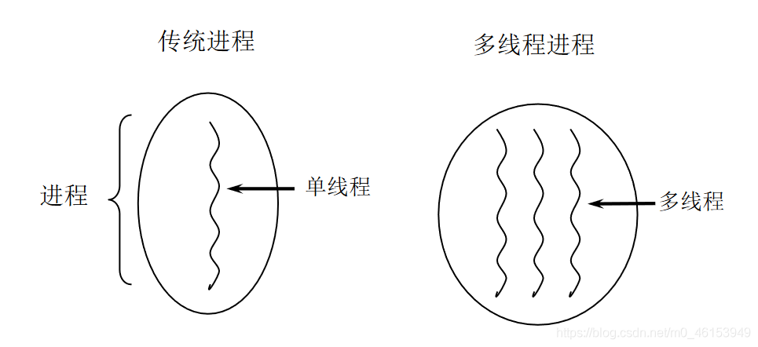
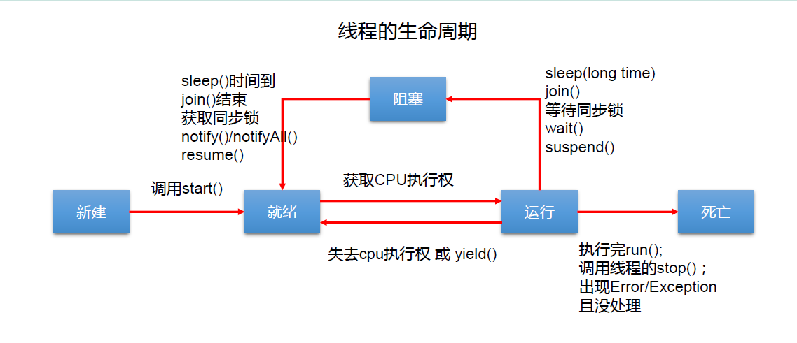
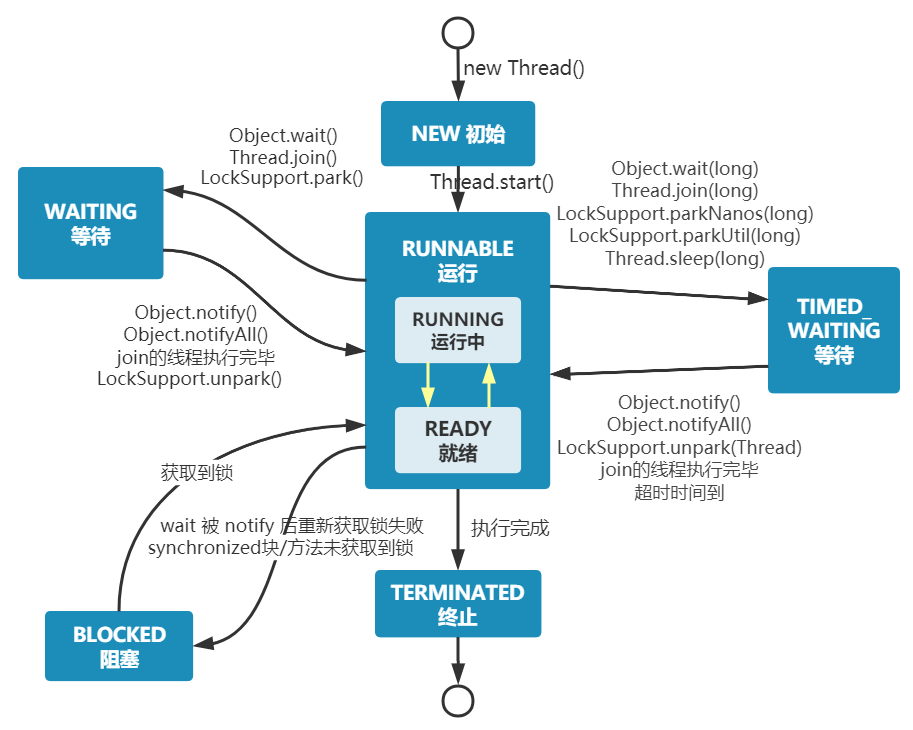
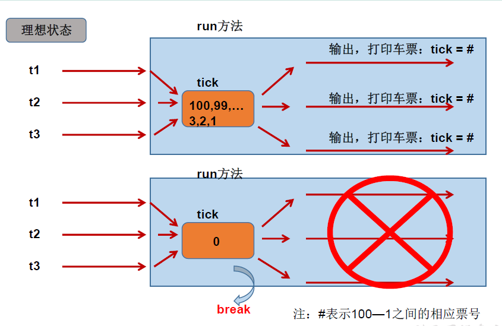
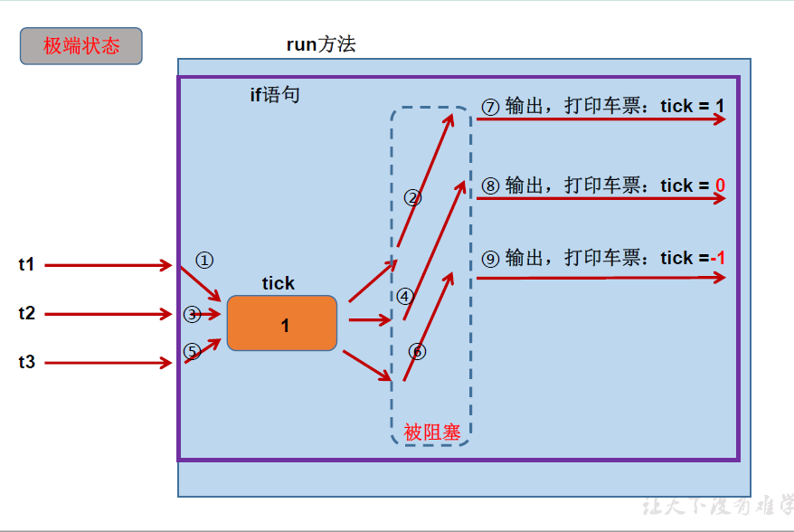
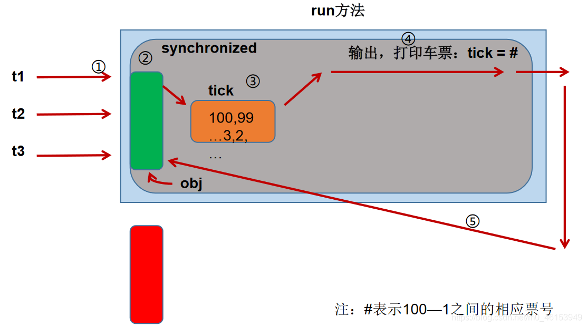

## 基本概念：程序、进程、 线程

1. 程序、进程、线程
- `程序(program)`：是为完成特定任务、用某种语言编写的一组指令的集合。即指`一段静态的代码`，静态对象。

- `进程(process)`：是程序的一次执行过程，或是`正在运行的一个程序`。是一个动态的过程，有它自身的产生、存在和消亡的过程——`生命周期`。
  
  - 如：运行中的 QQ ，运行中的 MP3 播放器
  - 程序是静态的，进程是动态的
  - `进程作为资源分配的单位`，系统在运行时会为每个进程分配不同的内存区域。(方法区和堆)

- `线程(thread)`：进程可进一步细化为线程，是`一个程序内部的一条执行路径`。
  
  - 若一个进程同一时间`并行`执行多个线程，就是支持多线程的
  - `线程作为调度和执行的单位，每个线程拥有独立的运行栈和程序计数器(pc)`，线程切换的开销小
  - `一个进程中的多个线程共享相同的内存单元/内存地址空间→它们从同一堆中分配对象，可以访问相同的变量和对象`。这就使得线程间通信更简便、高效。但多个线程操作共享的系统资源可能就会带来安全的隐患。

### 进程与线程

 

1. 单核 CPU 和多核 CPU 的理解
- 单核 CPU，其实是一种假的多线程，因为在一个时间单元内，也只能执行一个线程的任务。例如：虽然有多车道，但是收费站只有一个工作人员在收费，只有收了费才能通过，那么 CPU 就好比收费人员。如果有某个人不想交钱，那么收费人员可以把他“挂起”(晾着他，等他想通了，准备好了钱，再去收费)。 但是因为 CPU 时间单元特别短，因此感觉不出来。

- 如果是多核的话，才能更好的发挥多线程的效率。（现在的服务器都是多核的）

- 一个 Java 应用程序 java.exe ，其实至少有三个线程：① main() 主线程，② gc()垃圾回收线程，③异常处理线程。当然如果发生异常，会影响主线程 。
2. 并行与并发
- 并行：多个CPU同时执行多个任务。比如：多个人同时做不同的事      。

- 并发：一个CPU(采用时间片同时执行多个任务）。比如：秒杀、多个人做同一件事。

### 使用多线程的优点

1. 背景：

以单核 CPU 为例， 只使用单个线程先后完成多个任务（调用多个方法），肯定比用多个线程来完成用的时间更短，为何仍需多线程呢？

2. 多线程程序的优点：

1.提高应用程序的响应。对图形化界面更有意义，可增强用户体验。

2.提高计算机系统 CPU 的利用率。

3.改善程序结构。将既长又复杂的进程分为多个线程，独立运行，利于理解和修改

### 何时需要多线程

- 程序需要同时执行两个或多个任务。

- 程序需要实现一些需要等待的任务时，如用户输入、文件读写操作、网络操作、搜索等。

- 需要一些后台运行的程序时。
4. ### 补充：线程的分类

Java中的线程分为两类：一种是守护线程，一种是用户线程。

它们在几乎每个方面都是相同的，唯一的区别是判断JVM何时离开。

守护线程是用来服务用户线程的，通过在start()方法前调用thread.setDaemon(true) 可以把一个用户线程变成一个守护线程。

Java垃圾回收就是一个典型的守护线程。

若JVM中都是守护线程，当前JVM将退出 。

形象理解： 兔死狗烹，鸟尽弓藏

## 线程的创建和使用

### 一、 线程的创建和启动

- Java 语言的 JVM 允许程序运行多个线程，它通过 java.lang.Thread 类来体现 。

- Thread类的特性：
  
  - 每个线程都是通过某个特定 Thread 对象的 run() 方法来完成操作的，经常把 run() 方法的主体称为线程体。
  - 通过该 Thread 对象的 start() 方法来启动这个线程，而非直接调用 run()

### 二 、Thread类

| 构造器                                  | 说明                                  |
| ------------------------------------ | ----------------------------------- |
| Thread()                             | 创建新的Thread对象                        |
| Thread(String threadname)            | 创建线程并指定线程实例名                        |
| Thread(Runnable target)              | 指定创建线程的目标对象，它实现了Runnable接口中的run()方法 |
| Thread(Runnable target, String name) | 创建新的Thread对象                        |

### 三、 API中创建线程的两种方式

JDK 1.5 之前创建新执行线程有两种方法：

- 继承 Thread 类的方式
- 实现 Runnable 接口的方式

#### 方式一： 继承 Thread 类

操作步骤：

1. 定义一个子类继承 Thread 类。
2. 子类中重写Thread类中的run()方法。——>将此线程执行的操作写在run()方法中。
3. 创建 Thread 子类对象，即创建了线程对象。
4. 调用Thread 子类对象的start()方法，作用：①启动线程 ②调用run()方法

```java
/**
 * 多线程的创建，方式一：继承于Thread类
 * 1.创建一个继承于Thread类的子类
 * 2.重写Thread的run()方法 ---> 将此线程的方法声明在run()中
 * 3.创建Thread类的子对象
 * 4.通过此对象调用start()
 *
 * 例子:遍历100以内的所有的偶数
 */

//1.创建一个继承于Thread类的子类
class MyThread extends Thread{
    //重写Thread类的run()
    @Override
    public void run() {
        for(int i = 1;i < 100;i++){
            if(i % 2 == 0){
                System.out.println(i);
            }
        }
    }
}

public class ThreadTest {
    public static void main(String[] args) {
        //3.创建Thread类的子对象
        MyThread t1 = new MyThread();

        //4.通过此对象调用start():①启动当前线程 ②调用当前线程的run()
        t1.start();

        //如下操作仍在main线程中执行的
        for(int i = 1;i < 100;i++){
            if(i % 2 == 0){
                System.out.println(i + "***main()***");
            }
        }
    }
}
```

##### 创建过程中的两个问题说明

注意点：

1. 如果自己手动调用run()方法，那么就只是普通方法，没有启动多线程模式。
2. run()方法由JVM调用，什么时候调用，执行的过程控制都有操作系统的CPU调度决定 。
3. 想要启动多线程，必须调用start()方法。
4. 一个线程对象只能调用一次start()方法启动，如果重复调用了，则将抛出异常“IllegalThreadStateException”     。

```java
//1.创建一个继承于Thread类的子类
class MyThread extends Thread{
    //重写Thread类的run()
    @Override
    public void run() {
        for(int i = 1;i < 100;i++){
            if(i % 2 == 0){
                System.out.println(Thread.currentThread().getName() + ":" + i);
            }
        }
    }
}

public class ThreadTest {
    public static void main(String[] args) {
        //3.创建Thread类的子对象
        MyThread t1 = new MyThread();

        //4.通过此对象调用start():①启动当前线程 ②调用当前线程的run()
        t1.start();
        //问题1:我们不能通过直接调用run()的方式启动线程。
//        t1.run();

        //问题2:再启动一个线程，遍历100以内的偶数。不可以还让已经start()的线程去执行。会报IllegalThreadStateException
//        t1.start();
        //我们需要重现创建一个线程的对象，去start().
        MyThread t2 = new MyThread();
        t2.start();

        //如下操作仍在main线程中执行的
        for(int i = 1;i < 100;i++){
            if(i % 2 == 0){
                System.out.println(Thread.currentThread().getName() + ":" + i + "***main()***");
            }
        }
    }
}
```

##### 练习1

```java
/**
 * 练习:创建两个分线程，其中一个遍历100以内的偶数，另一个遍历100以内的奇数
 */
public class ThreadDemo {
    public static void main(String[] args) {
        MyThread m1 = new MyThread();
        m1.start();

        MyThread2 m2 = new MyThread2();
        m2.start();
    }
}
class MyThread extends Thread{
    @Override
    public void run() {
        for(int i = 0;i < 100;i++){
            if(i % 2 == 0){
                System.out.println(Thread.currentThread().getName() + ":" + i);
            }
        }
    }
}
class MyThread2 extends Thread{
    @Override
    public void run() {
        for(int i = 0;i < 100;i++){
            if(i % 2 != 0){
                System.out.println(Thread.currentThread().getName() + ":" + i);
            }
        }
    }
}
```

##### 拓展：创建Thread类的匿名子类方式

格式：

```java
new Thread(){
    //重写run()方法
}.start();
```

```java
/**
 * 练习:创建两个分线程，其中一个遍历100以内的偶数，另一个遍历100以内的奇数
 */
package com.atguigu.exer;

/**
 * @author Sora
 * @create 2022-02-28 20:57
 */
public class ThreadDemo {
    public static void main(String[] args) {
        //1.创建Thread的非匿名子类的非匿名对象
//        MyThread1 myThread1 = new MyThread1();
//        MyThread2 myThread2 = new MyThread2();
//        myThread1.start();
//        myThread2.start();

        //2.创建Thread的非匿名子类的匿名对象
//        new MyThread1().start();
//        new MyThread2().start();

        //3.创建Thread的匿名子类的非匿名对象
//        Thread thread1 = new Thread(){
//            @Override
//            public void run() {
//                for (int i = 0; i < 100; i++) {
//                    if (i % 2 == 0){
//                        System.out.println(Thread.currentThread().getName() + ":" + i);
//                    }
//                }
//            }
//        };
//        Thread thread2 = new Thread(){
//            @Override
//            public void run() {
//                for (int i = 0; i < 100; i++) {
//                    if (i % 2 != 0){
//                        System.out.println(Thread.currentThread().getName() + ":" + i);
//                    }
//                }
//            }
//        };
//        thread1.start();
//        thread2.start();

        //4.创建匿名子类的匿名对象
        new Thread(){
            @Override
            public void run() {
                for (int i = 0; i < 100; i++) {
                    if (i % 2 == 0){
                        System.out.println(Thread.currentThread().getName() + ":" + i);
                    }
                }
            }
        }.start();
        new Thread(){
            @Override
            public void run() {
                for (int i = 0; i < 100; i++) {
                    if (i % 2 != 0){
                        System.out.println(Thread.currentThread().getName() + ":" + i);
                    }
                }
            }
        }.start();
    }

}
class MyThread1 extends Thread{
    @Override
    public void run() {
        for (int i = 0; i < 100; i++) {
            if (i % 2 == 0){
                System.out.println(Thread.currentThread().getName() + ":" + i);
            }
        }
    }
}

class MyThread2 extends Thread{
    @Override
    public void run() {
        for (int i = 0; i < 100; i++) {
            if (i % 2 != 0){
                System.out.println(Thread.currentThread().getName() + ":" + i);
            }
        }
    }
}
```

##### 练习2 方式一

> 1、多窗口卖票

```java
/**
 * 例子：创建三个c窗口卖票，总票数为100张
 *
 * 存在线程的安全问题，待解决。
 */
class Windows extends Thread{

    private static int ticket = 100;//创建了三个线程对象，不是同一个ticket，因此需要声明为static

    @Override
    public void run() {
        while(true){
            if(ticket > 0){
                System.out.println(getName() + ":卖票，票号为: " + ticket);
                ticket--;
            }else{
                break;
            }
        }
    }
}

public class WindowsTest {
    public static void main(String[] args) {
        Windows t1 = new Windows();
        Windows t2 = new Windows();
        Windows t3 = new Windows();

        t1.setName("窗口1");
        t2.setName("窗口2");
        t3.setName("窗口3");

        t1.start();
        t2.start();
        t3.start();
    }
}
```

#### Thread类的有关方法

| 修饰符           | 方法名                | 说明                                                                             |
| ------------- | ------------------ | ------------------------------------------------------------------------------ |
| void          | start()            | 启动当前线程，并执行线程的 run() 方法                                                         |
| void          | run()              | 线程在被调度时执行的操作                                                                   |
| static Thread | currentThread()    | 返回当前线程。在Thread子类中就是this ，通常用于主线程和Runnable实现类                                   |
| String        | getName()          | 返回该线程的名称                                                                       |
| void          | setName(String)    | 设置该线程的名称                                                                       |
| static void   | yield()            | 线程让步<br />暂停当前正在执行的线程，把执行机会让给优先级相同或更高的线程。若队列中没有同优先级的线程，忽略此方法。                  |
| void          | join()             | 当某个程序执行流中调用其他线程的 join() 方法时调用线程将被阻塞，直到 join() 方法加入的join线程执行完为止。低优先级的线程也可以获得执行。 |
| static  void  | sleep(long millis) | 令当前活动线程在指定时间(毫秒)段内放弃对 CPU 控制,使其他线程有机会被执行,时间到后重排队。 抛出 InterruptedException 异常   |
| void          | stop()             | 强制线程生命期结束，已过时，不推荐使用                                                            |
| boolean       | isAlive()          | 返回 boolean ，判断线程是否还活着                                                          |

#### 线程的调度

- 调度策略
  
  - 时间片
    
    
  
  - 抢占式：高优先级的线程抢占CPU

- Java的调度方法
  
  - 同优先级线程组成先进先出队列（先到先服务），使用时间片策略
  - 对高优先级，使用优先调度的抢占式策略

#### 线程的优先级

* 线程的优先级等级（Thread类中全局常量）
  
  - MAX_PRIORITY：10
  - MIN _PRIORITY：1
  - NORM_PRIORITY：5 --->默认优先级

* 涉及的方法
  
  * int getPriority() ：返回线程优先值
  * void setPriority(int newPriority) ：改变线程的优先级

* 说明：
  
  - 线程创建时继承父线程的优先级
  
  - 高优先级的线程要抢占低优先级线程cpu的执行权。但是只是从概率上讲，高优先级的线程高概率的情况下被执行。并不意味着只有当高优先级的线程执行完以后，低优先级的线程才会被执行。

```java
class HelloThread extends Thread {
    @Override
    public void run() {
        for (int j = 0; j < 100; j++) {

//            try {
//                sleep(10);
//            } catch (InterruptedException e) {
//                e.printStackTrace();
//            }

            if (j % 2 == 0) {
                System.out.println(getName() + ":" + getPriority() + ":" + j);
            }
        }
    }
    public HelloThread(String name){
        super(name);
    }
}

public class ThreadModeTest {
    public static void main(String[] args) {
        HelloThread h2 = new HelloThread("Thread : 1");
        h2.start();

        //设置分线程的优先级
        h2.setPriority(Thread.MAX_PRIORITY);

        //给主线程命名
        Thread.currentThread().setName("主线程");
        Thread.currentThread().setPriority((Thread.MIN_PRIORITY));

        for(int j = 0;j < 100; j++){
            if(j % 2 == 0){
                System.out.println(Thread.currentThread().getName() + ":" + Thread.currentThread().getPriority() + ":" + j);
            }

//            if(j == 20){
//                try {
//                    h2.join();
//                } catch (InterruptedException e) {
//                    e.printStackTrace();
//                }
//            }
        }

        System.out.println(h2.isAlive());
    }
}
```

#### 方式二：实现 Runnable 接口

操作步骤：

1. 定义一个实现类 ，实现 Runnable 接口。

2. 实现类中实现 Runnable 接口中的 run()方法。

3. 创建 Runnable 接口实现类的对象。

4. 通过 Thread 的含参构造器 Thread(Runnable target) 创建 Thread 类的对象，即创建了线程对象。

5. 调用 Thread 类的对象的start()方法，作用：①启动线程 ②调用run()方法 
   
   Thread类的run()方法中调用了 target.run() 方法
   
   ```java
   //1.创建一个实现了Runnable接口的类
   class MThread implements Runnable{
   
     //2.实现类去实现Runnable中的抽象方法:run()
     @Override
     public void run() {
         for(int i = 0;i < 100;i++){
             if(i % 2 == 0){
                 System.out.println(Thread.currentThread().getName() + ":" + i);
             }
         }
     }
   }
   
   public class ThreadTest1 {
     public static void main(String[] args) {
         //3.创建实现类的对象
         MThread m1 = new MThread();
         //4.将此对象作为参数传递到Thread类的构造器中，创建Thread类的对象
         Thread t1 = new Thread(m1);
         //5.通过Thread类的对象调用start():①启动线程 ②调用当前线程的run() --> 调用了Runnable类型的target的run()
         t1.start();
   
         //再启动一个线程，遍历100以内的偶数
         Thread t2 = new Thread(m1);
         t2.setName("线程2");
         t2.start();
     }
   }
   ```

##### 练习2 方式二

```java
/**
 * 例子：创建三个c窗口卖票，总票数为100张
 *
 * 存在线程的安全问题，待解决。
 */
class Window1 implements Runnable{

    private int ticket = 100;
    @Override
    public void run() {
        while(true){
                if (ticket > 0) {
                    System.out.println(Thread.currentThread().getName() + ":卖票，票号为：" + ticket);
                  ticket--;
                } else {
                    break;
                }
            }
        }
    }
}

public class WindowTest1 {
    public static void main(String[] args) {
        Window1 w = new Window1();

        Thread t1 = new Thread(w);//创建对象时三个构造器用的同一个window对象，因此是同一个ticket
        Thread t2 = new Thread(w);
        Thread t3 = new Thread(w);

        t1.setName("窗口1");
        t2.setName("窗口2");
        t3.setName("窗口3");

        t1.start();
        t2.start();
        t3.start();
    }

}
```

##### 拓展：创建实现Runnable接口的匿名实现类方式

格式：

```java
new Thread(new Runnable{
    //重写run()方法
}).start()
```

#### 比较创建线程的两种方式

- 联系：public class Thread extends Object implements Runnable{}
  
  Thread类也实现了Runnable接口，重写了run()方法
  
  方式一：定义类继承Thread类，间接重写Runnable接口中的抽象方法run()方法
  
  方式二：直接实现Runnable接口，实现Runnable接口中的抽象方法run()方法

- 相同点：两种方式都需要实现run()方法，将线程要执行的代码声明在run()方法中。

- 区别：
  
  继承Thread类：线程代码存放Thread类的子类的run()方法中。
  
  实现Runnable接口：线程代码存在Runnable接口的实现类的run()方法。

- 开发中，优先选择：实现Runnable接口的方式
  
  原因：
  
  1. 实现的方式没有类的单继承性的局限性
  
  2. 实现的方式更适合来处理多个线程有共享数据的情况。多个线程可以共享同一个接口实现类的对象，非常适合多个相同线程来处理同一份资源。

#### 方式三：实现Callable 接口 --- JDK 5.0新增

操作步骤：

1. 定义一个实现类，实现Callable接口。

2. 实现类中实现 Callable 接口的 call() 方法。  -->将此线程需要执行的操作声明在call()方法中

3. 创建 Callable 接口实现类的对象。

4. 将此 Callable 接口实现类的对象作为传递到 FutureTask 构造器中，创建 FutureTask 类的对象。

5. 将 FutureTask 类的对象作为参数传递到 Thread 类的构造器中，创建 Thread 对象，并调用 start() 方法。

6. 调用 FutureTask 类中的 get() 方法获取 Callable 接口中 call() 方法的返回值。
   
   ```java
   import java.util.concurrent.Callable;
   import java.util.concurrent.ExecutionException;
   import java.util.concurrent.FutureTask;
   
   /**
   * 创建多线程的方式三：实现Callable接口 ---> JDK 5.0新增
   *
   * 如何理解实现Callable接口的方式创建多线程比实现Runnable接口创建多线程方式强大？
   *      1.call()可以有返回值的。
   *      2.call()可以抛出异常，被外面的操作捕获，获取异常的信息
   *      3.Callable是支持泛型的
   *      4.需要借助FutureTask类，比如获取返回结果
   */
   //1.创建一个实现Callable的实现类
   class NumThread implements Callable{
   
     //2.实现call方法，将此线程需要执行的操作声明在call()中
     @Override
     public Object call() throws Exception {
         int sum = 0;
         for(int i = 1;i <= 100;i++){
             if(i % 2 == 0){
                 System.out.println(i);
                 sum += i;
             }
         }
         return sum;
     }
   }
   
   public class ThreadNew {
     public static void main(String[] args) {
         //3.创建Callable接口实现类的对象
         NumThread numThread = new NumThread();
   
         //4.将此Callable接口实现类的对象作为参数传递到FutureTask构造器中，创建FutureTask的对象
         FutureTask futureTask = new FutureTask(numThread);
   
         //5.将FutureTask的对象作为参数传递到Thread类的构造器中，创建Thread对象，并调用start()
         new Thread(futureTask).start();
   
         try {
             //6.获取Callable中call方法的返回值
             //get()返回值即为FutureTask构造器参数Callable实现类重写的call()的返回值。
             Object sum = futureTask.get();
             System.out.println("总和为:" + sum);
         } catch (InterruptedException e) {
             e.printStackTrace();
         } catch (ExecutionException e) {
             e.printStackTrace();
         }
     }
   }
   ```

如何理解实现 Callable 接口的方式创建多线程比实现 Runnable 接口创建多线程方式强大？

1. call()可以有返回值。

2. call()可以抛出异常，被外面的操作捕获，获取异常的信息

3. Callable是支持泛型的

4. 需要借助FutureTask类，比如获取返回结果

Future接口

- 可以对具体Runnable、Callable任务的执行结果进行取消、查询是否完成、获取结果等。
- FutrueTask是Futrue接口的唯一的实现类
- FutureTask同时实现了Runnable, Future接口。它既可以作为Runnable被线程执行，又可以作为Future得到Callable的返回值

#### 方式四：使用线程池 -- JDK 5.0新增

1、背景：

经常创建和销毁、使用量特别大的资源，比如并发情况下的线程，对性能影响很大。

2、思路：

提前创建好多个线程，放入线程池中，使用时直接获取，使用完放回池中。可以避免频繁创建销毁、实现重复利用。类似生活中的公共交通工具。  

3、好处：

- 提高响应速度（减少了创建新线程的时间）

- 降低资源消耗（重复利用线程池中线程，不需要每次都创建）

- 便于线程管理
  
  - corePoolSize：核心池的大小
  - maximumPoolSize：最大线程数
  - keepAliveTime：线程没有任务时最多保持多长时间后会终止

4、线程池相关API

- JDK 5.0起提供了线程池相关API：`ExecutorService`和`Executors`
- ExecutorService：真正的线程池接口。常见子类ThreadPoolExecutor
  - void execute(Runnable command) ：执行任务/命令，没有返回值，一般用来执行Runnable
  - Future submit(Callable task)：执行任务，有返回值，一般又来执行Callable
  - void shutdown()：关闭连接池
- Executors：工具类、线程池的工厂类，用于创建并返回不同类型的线程池
  - Executors.newCachedThreadPool()：创建一个可根据需要创建新线程的线程池
  - Executors.newFixedThreadPool(n); 创建一个可重用固定线程数的线程池
  - Executors.newSingleThreadExecutor()：创建一个只有一个线程的线程池
  - Executors.newScheduledThreadPool(n)：创建一个线程池，它可安排在给定延迟后运行命令或者定期地执行。

5、操作步骤

1. 提供指定线程数量的线程池。
   调用Executors类的方法创建线程池，并返回ExecutorService实现类(ThreadPoolExecutor)对象。
2. 执行指定的线程的操作。
   调用ExecutorService类的 execute() 或 submit() 方法启动线程，需要提供实现Runnable接口或Callable接口实现类的对象
3. 关闭连接池。
   调用ExecutorService类的shudown()方法

```java
import java.util.concurrent.ExecutorService;
import java.util.concurrent.Executors;
import java.util.concurrent.ThreadPoolExecutor;

/**
 * 创建多线程的方式四：使用线程池
 *
 * 好处：
 *      1.提高响应速度（减少了创建新线程的时间）
 *      2.降低资源消耗（重复利用线程池中线程，不需要每次都创建）
 *      3.便于线程管理
 *          corePoolSize：核心池的大小
 *          maximumPoolSize：最大线程数
 *          keepAliveTime：线程没有任务时最多保持多长时间后会终止
 *
 * 面试题：创建多线程有几种方式？四种！
 */

class NumberThread implements Runnable{
    @Override
    public void run() {
        for(int i = 0;i <= 100;i++){
            if(i % 2 == 0){
                System.out.println(Thread.currentThread().getName() + ":" + i);
            }
        }
    }
}

class NumberThread1 implements Runnable{
    @Override
    public void run() {
        for(int i = 0;i <= 100;i++){
            if(i % 2 != 0){
                System.out.println(Thread.currentThread().getName() + ":" + i);
            }
        }
    }
}

public class ThreadPool {
    public static void main(String[] args) {

        //1. 提供指定线程数量的线程池
        ExecutorService service = Executors.newFixedThreadPool(10);//实现类为ThreadPoolExecutor
        ThreadPoolExecutor service1 = (ThreadPoolExecutor) service;//向下转型
        //设置线程池的属性
//        System.out.println(service.getClass());
//        service1.setCorePoolSize(15);
//        service1.setKeepAliveTime();

        //2.执行指定的线程的操作。需要提供实现Runnable接口或Callable接口实现类的对象
        service.execute(new NumberThread());//适合适用于Runnable
        service.execute(new NumberThread1());//适合适用于Runnable

//      service.submit(Callable callable);//适合适用于Callable

        //3.关闭连接池
        service.shutdown();
    }
}
```

#### 面试题：创建多线程有几种方式？

四种！

## 线程的生命周期和状态

`网上流传五种状态是误导`

JDK 中用 Thread.State 类定义了线程的几种状态

要想实现多线程必须在主线程中创建新的线程对象。Java语言使用Thread类及其子类的对象来表示线程，在它的一个完整的生命周期中通常要经历如下的五种状态：

- 新建(NEW)：当 一个 Thread 类或其子类的对象被声明并创建时，新生的线程对象处于新建状态
- 就绪(RUNNABLE)：处于新建状态的线程被启动（调用 start()方法） 后，将进入线程队列等待CPU时间片，此时它已具备了运行的条件，只是没分配到 CPU 资源
- 运行(RUNNING)：当就绪的线程被调度并获得CPU资源时便进入运行状态，run()方法定义了线程的操作和功能
- 阻塞(BLOCKED)：在某种特殊情况下，被人为挂起或执行输入输出操作时，让出CPU并临时中止自己的执行，进入阻塞状态
- 死亡(DEAD)：线程完成了它的全部工作或线程被提前强制性地中止或出现异常导致结束



`确切的描述`[JavaGuide](https://javaguide.cn/java/concurrent/java-concurrent-questions-01/#%E8%AF%B4%E8%AF%B4%E7%BA%BF%E7%A8%8B%E7%9A%84%E7%94%9F%E5%91%BD%E5%91%A8%E6%9C%9F%E5%92%8C%E7%8A%B6%E6%80%81)

Java 线程在运行的生命周期中的指定时刻只可能处于下面 6 种不同状态的其中一个状态（图源《Java 并发编程艺术》4.1.4 节）。


线程在生命周期中并不是固定处于某一个状态而是随着代码的执行在不同状态之间切换。Java 线程状态变迁如下图所示（图源《Java 并发编程艺术》4.1.4 节）：


> 相关阅读：[挑错 |《Java 并发编程的艺术》中关于线程状态的三处错误](https://mp.weixin.qq.com/s/UOrXql_LhOD8dhTq_EPI0w)



当线程执行 `wait()`方法之后，线程进入 **WAITING（等待）** 状态。进入等待状态的线程需要依靠其他线程的通知才能够返回到运行状态，而 **TIMED_WAITING(超时等待)** 状态相当于在等待状态的基础上增加了超时限制，比如通过 `sleep（long millis）`方法或 `wait（long millis）`方法可以将 Java 线程置于 TIMED_WAITING 状态。当超时时间到达后 Java 线程将会返回到 RUNNABLE 状态。当线程调用同步方法时，在没有获取到锁的情况下，线程将会进入到 **BLOCKED（阻塞）** 状态。线程在执行 Runnable 的`run()`方法之后将会进入到 **TERMINATED（终止）** 状态。 

## 线程的同步

### 背景

1. 例子：创建三个窗口卖票，总票数为100张.使用实现Runnable接口的方式
2. 问题：卖票过程中，出现了重票、错票 -->出现了线程的安全问题
3. 问题出现的原因：当某个线程操作车票的过程中，尚未操作完成时，其他线程参与进来，也操作车票。

原因说明：

- 多个线程执行的不确定性引起执行结果的不稳定
- 多个线程对数据的共享，会造成操作的不完整性，会破坏数据。

形象举例：上厕所，你进去了还没上完，一个大哥也打开门进去了，发生了安全问题





4. 如何解决？：当一个线程a在操作ticket的时候，其他线程不能参与进来。直到线程a操作完ticket时，其他线程才可以开始操作ticket。这种情况即使线程a出现了阻塞，也不能被改变。

### 线程安全问题的解决方式

在Java中，我们通过`同步机制`，来解决线程的安全问题。

#### 方式一：同步代码块

1. 格式：

```java
synchronized(同步监视器){
   //需要被同步的代码
}
```

2. 说明：
- 需要被同步的代码：操作共享数据的代码。 -->不能包含代码多了，也不能包含代码少了。

- 共享数据：多个线程共同操作的变量。比如：ticket就是共享数据。

- 同步监视器，俗称：锁。任何一个类的对象，都可以充当锁。
  
  锁的要求：同步代码块需要自己指定锁， 多个线程必须要共用同一把锁。

- 补充：在实现Runnable接口创建多线程的方式中，我们可以考虑使用this充当同步监视器。
  
  在继承Thread类创建多线程的方式中，慎用this充当同步监视器，考虑使用当前类充当同步监视器。

##### 使用同步代码块解决实现Runnable接口的方式的线程安全问题

```java
/**
 * 使用同步代码块解决实现Runnable接口的方式的线程安全问题
 *
 * 例子：创建三个c窗口卖票，总票数为100张
 */
class Windows1 implements Runnable{

    private int ticket = 100;
//    Object obj = new Object();
//    Dog dog = new Dog();

    @Override
    public void run() {
        while(true){
            synchronized (this) {//此时的this:唯一的windows1的对象 //方式二:synchronized (dog) {
                if (ticket > 0) {

                    try{
                        Thread.sleep(100);
                    }catch (InterruptedException e){
                        e.printStackTrace();
                    }

                    System.out.println(Thread.currentThread().getName() + ":卖票，票号为: " + ticket);
                    ticket--;
                } else {
                    break;
                }
            }
        }
    }
}

public class WindowsTest1 {
    public static void main(String[] args) {
        Windows1 w = new Windows1();

        Thread t1 = new Thread(w);
        Thread t2 = new Thread(w);
        Thread t3 = new Thread(w);

        t1.setName("窗口1");
        t2.setName("窗口2");
        t3.setName("窗口3");

        t1.start();
        t2.start();
        t3.start();
    }
}
class Dog{

}
```

##### 使用同步代码块解决继承Thread类的方式的线程安全问题

```java
/**
 * 使用同步代码块解决继承Thread类的方式的线程安全问题
 *
 * 例子：创建三个c窗口卖票，总票数为100张
 */
class Windows extends Thread{

    private static int ticket = 100;
    private static Object obj = new Object();

    @Override
    public void run() {
        while(true){
            //正确的
//            synchronized (obj) {
            synchronized (Windows.class){//lClass clazz = Windows.class
            //错误的，因为此时this表示的是t1,t2,t3三个对象
//            synchronized (this) {
                if (ticket > 0) {

                    try {
                        Thread.sleep(100);
                    } catch (InterruptedException e) {
                        e.printStackTrace();
                    }

                    System.out.println(getName() + ":卖票，票号为: " + ticket);
                    ticket--;
                } else {
                    break;
                }
            }
        }
    }
}

public class WindowsTest2 {
    public static void main(String[] args) {
        Windows t1 = new Windows();
        Windows t2 = new Windows();
        Windows t3 = new Windows();

        t1.setName("窗口1");
        t2.setName("窗口2");
        t3.setName("窗口3");

        t1.start();
        t2.start();
        t3.start();
    }
}
```

##### 同步原理



#### 方式二：同步方法

- 如果操作共享数据的代码完整的声明在一个方法中，我们不妨将此方法声明同步的。
1. 格式

```java
public synchronized void show (…){
    //需要被同步的代码
}
```

2. 说明：
- 同步方法仍然涉及到同步监视器，只是不需要我们显式地声明。

- 非静态的同步方法，同步监视器是：this
  
  静态的同步方法，同步监视器是：当前类本身（类.class）

##### 使用同步方法解决实现Runnable接口的线程安全问题

```java
/**
 * 使用同步方法解决实现Runnable接口的线程安全问题
 *
 */

class Windows3 implements Runnable {

    private int ticket = 100;

    @Override
    public void run() {
        while (true) {
            show();
        }
    }

    public synchronized void show() {//同步监视器:this
//        synchronized (this){
            if (ticket > 0) {
                try {
                    Thread.sleep(100);
                } catch (InterruptedException e) {
                    e.printStackTrace();
                }
                System.out.println(Thread.currentThread().getName() + ":卖票，票号为: " + ticket);
                ticket--;
            }
//        }
    }
}

public class WindowsTest3 {
    public static void main(String[] args) {
        Windows3 w3 = new Windows3();

        Thread t1 = new Thread(w3);
        Thread t2 = new Thread(w3);
        Thread t3 = new Thread(w3);

        t1.setName("窗口1");
        t2.setName("窗口2");
        t3.setName("窗口3");

        t1.start();
        t2.start();
        t3.start();
    }
}
```

##### 使用同步方法处理继承Thread类的方式中的线程安全问题

```java
/**
 * 使用同步方法处理继承Thread类的方式中的线程安全问题
 */
class Windows4 extends Thread {

    private static int ticket = 100;

    @Override
    public void run() {

        while (true) {

            show();
        }

    }
    private static synchronized void show(){//同步监视器：Window4.class
        //private synchronized void show(){ //同步监视器：t1,t2,t3。此种解决方式是错误的
        if (ticket > 0) {

            try {
                Thread.sleep(100);
            } catch (InterruptedException e) {
                e.printStackTrace();
            }

            System.out.println(Thread.currentThread().getName() + "：卖票，票号为：" + ticket);
            ticket--;
        }
    }
}


public class WindowsTest4 {
    public static void main(String[] args) {
        Windows4 t1 = new Windows4();
        Windows4 t2 = new Windows4();
        Windows4 t3 = new Windows4();


        t1.setName("窗口1");
        t2.setName("窗口2");
        t3.setName("窗口3");

        t1.start();
        t2.start();
        t3.start();

    }
}
```

#### 方式三：Lock锁  ---JDK 5.0新增

- 从JDK 5.0 开始 Java 提供了更强大的线程同步机制——通过显式定义同步锁对象来实现同步。同步锁使用Lock对象充当 。

- java.util.concurrent.locks.Lock 接口是`控制多个线程对共享资源进行访问的工具`。 锁提供了对共享资源的独占访问，每次只能有一个线程对`Lock`对象加锁，线程开始访问共享资源之前应先获得 `Lock` 对象。

- `ReentrantLock` 类实现了 Lock ，它拥有与synchronized 相同的并发性和内存语义， 在实现线程安全的控制中，比较常用的是 ReentrantLock 可以显式加锁、释放锁 。
1. 格式：

```java
lock.lock();
try{

//保证线程安全的代码

}

finally{
    lock.unlock();
}
```

2. 使用
   
   ```java
   import java.util.concurrent.locks.ReentrantLock;
   ```

/**

* 解决线程安全问题的方式三：lock锁---》JDK5.0新增

* 

* 注意：如果同步代码有异常，要将unlock()写入finally语句块

* 

* 1. 面试题：synchronized 与 Lock的异同？

* 相同：二者都可以解决线程安全问题

* 不同：synchronized机制在执行完相应的同步代码以后，自动的释放同步监视器

*      Lock需要手动的启动同步（lock()），同时结束同步也需要手动的实现（unlock()）

* 

* 2.优先使用顺序：

*   Lock 同步代码块（已经进入了方法体，分配了相应资源）同步方法（在方法体之外）

* 

* 面试题：如何解决线程安全问题？有几种方式
  */

class Windows implements Runnable{

    private int ticket = 100;
    //1.实例化ReentrantLock类
    private ReentrantLock lock = new ReentrantLock();
    
    
    @Override
    public void run() {
        while(true){
            try{
                //调用锁定方法：lock()
                lock.lock();
    
                if(ticket > 0){
    
                    try {
                        Thread.sleep(100);
                    } catch (InterruptedException e) {
                        e.printStackTrace();
                    }
    
                    System.out.println(Thread.currentThread().getName() + ":售票，票号为: " + ticket);
                    ticket --;
                }else{
                    break;
                }
            }finally {
                //3.调用解锁方法：unlock()
                lock.unlock();
            }
        }
    }

}

public class LockTest {
    public static void main(String[] args) {
        Windows w = new Windows();

        Thread t1 = new Thread(w);
        Thread t2 = new Thread(w);
        Thread t3 = new Thread(w);
    
        t1.setName("窗口1");
        t2.setName("窗口2");
        t3.setName("窗口3");
    
        t1.start();
        t2.start();
        t3.start();
    }

}

```
### 同步机制中的锁

- 同步锁机制：

在《Thinking in Java》中是这么说的：对于并发工作，你需要某种方式来防止两个任务访问相同的资源（其实就是共享资源竞争）。 防止这种冲突的方法就是当资源被一个任务使用时，在其上加锁 。 第一个访问某项资源的任务必须锁定这项资源，使其他任务在其被解锁之前，就无法访问它了，而在其被解锁之时，另一个任务就可以锁定并使用它了 。

- synchronized的锁是什么？

- 任意对象都可以作为同步锁 。 所有对象都自动含有单一的锁监视器     。
- 同步方法的锁：静态方法——类名.class 、 非静态方法——this
- 同步代码块：自己指定，很多时候也是指定为this或类名.class

- 注意：

- 必须确保使用同一个资源的多个线程共用一把锁。这个非常重要，否则就无法保证共享资源的安全。
- 一个线程类中的所有静态方法共用同一把锁：类名.class 
- 所有非静态方法共用同一把锁：this 
- 同步代码块：指定需谨慎

### 同步的范围

1、 如何找问题即代码是否存在线程安全？（非常重要）

- 明确哪些代码是多线程运行的代码

- 明确多个线程是否有共享数据

- 明确多线程运行代码中是否有多条语句操作共享数据

2、 如何解决呢？（非常重要）

对多条操作共享数据的语句，只能让一个线程都执行完，在执行过程中，其他线程不可以参与执行 。即所有操作共享数据的这些语句都要放在同步范围中

3、 切记

范围太小：没锁住所有有安全问题的代码

范围太大：没发挥多线程的功能 。

### 同步机制的好处与局限性

- 同步的方式，解决了线程的安全问题。---好处
- 操作同步代码时，只能有一个线程参与，其他线程等待。相当于是一个单线程的过程，效率低。 ---局限性

###  锁的释放

1. 释放锁的操作

- 当前线程的同步方法、同步代码块执行结束。
- 当前线程在同步代码块、同步方法中遇到break、return终止了该代码块、该方法的继续执行。
- 当前线程在同步代码块、同步方法中出现了未处理的 Error 或 Exception 导致异常结束。
- 当前线程在同步代码块、同步方法中执行了线程对象的 wait() 方法，当前线程暂停，并释放锁。

2. 不会释放锁的操作

- 线程执行同步代码块或同步方法时，程序调用Thread.sleep()、Thread.yield()方法暂停当前线程的执行
- 线程执行同步代码块时，其他线程调用了该线程的 suspend() 方法将该线程挂起，该线程不会释放锁（同步监视器）。
 - 应尽量避免使用suspend()和resume()来控制线程


### 使用同步机制将单例模式中的懒汉式改写为线程安全的 

```java
public class BankTest {

}

class Bank{

   private Bank(){}

   private static Bank instance = null;

   public static Bank getInstance(){
       //方式一（等同于同步方法）：效率稍差，第一进去的线程已经造好对象，后面的线程不用再同步了
//        synchronized (Bank.class) {
//            if(instance == null){
//
//                instance = new Bank();
//            }
//            return instance;
//        }
       //方式二：效率更高
       if(instance == null){

           synchronized (Bank.class) {
               if(instance == null){

                   instance = new Bank();
               }

           }
       }
       return instance;
   }

}
```

### 线程的死锁问题

1. 死锁的定义
- 不同的线程分别占用对方需要的同步资源不放弃，都在等待对方放弃自己需要的同步资源，就形成了线程的死锁。
- 出现死锁后，不会出现异常，不会出现提示，只是所有的线程都处于阻塞状态，无法继续运行
2. 解决方法
- 专门的算法、原则
- 尽量减少同步资源的定义
- 尽量避免嵌套同步

例1

```java
/**
 * 演示线程的死锁
 *
 * 1.死锁的理解：不同的线程分别占用对方需要的同步资源不放弃，
 *       都在等待对方放弃自己需要的同步资源，就形成了线程的死锁
 * 2.说明:
 *      》出现死锁后，不会出现异常，不会出现提示，只是所有的线程都处于阻塞状态，无法继续
 *      》我们使用同步时，要避免出现死锁。
 */
public class ThreadTest {
    public static void main(String[] args) {

        StringBuffer s1 = new StringBuffer();
        StringBuffer s2 = new StringBuffer();

        new Thread(){
            @Override
            public void run() {

                synchronized (s1){
                    s1.append("a");
                    s2.append("1");

                    try {
                        Thread.sleep(100);
                    } catch (InterruptedException e) {
                        e.printStackTrace();
                    }

                    synchronized (s2){
                        s1.append("b");
                        s2.append("2");

                        System.out.println(s1);
                        System.out.println(s2);
                    }
                }
            }
        }.start();

        new Thread(new Runnable() {
            @Override
            public void run() {
                synchronized (s2){
                    s1.append("c");
                    s2.append("3");

                    try {
                        Thread.sleep(100);
                    } catch (InterruptedException e) {
                        e.printStackTrace();
                    }

                    synchronized (s1){
                        s1.append("d");
                        s2.append("4");

                        System.out.println(s1);
                        System.out.println(s2);
                    }
                }
            }
        }).start();
    }
}
```

例2

```java
class A {
    public synchronized void foo(B b) {//同步监视器：a
        System.out.println("当前线程名: " + Thread.currentThread().getName()
                + " 进入了A实例的foo方法"); // ①
        try {
            Thread.sleep(200);
        } catch (InterruptedException ex) {
            ex.printStackTrace();
        }
        System.out.println("当前线程名: " + Thread.currentThread().getName()
                + " 企图调用B实例的last方法"); // ③
        b.last();
    }

    public synchronized void last() {//同步监视器：a
        System.out.println("进入了A类的last方法内部");
    }
}

class B {
    public synchronized void bar(A a) {//同步监视器：b
        System.out.println("当前线程名: " + Thread.currentThread().getName()
                + " 进入了B实例的bar方法"); // ②
        try {
            Thread.sleep(200);
        } catch (InterruptedException ex) {
            ex.printStackTrace();
        }
        System.out.println("当前线程名: " + Thread.currentThread().getName()
                + " 企图调用A实例的last方法"); // ④
        a.last();
    }

    public synchronized void last() {//同步监视器：b
        System.out.println("进入了B类的last方法内部");
    }
}

public class DeadLock implements Runnable {
    A a = new A();
    B b = new B();

    public void init() {
        Thread.currentThread().setName("主线程");
        // 调用a对象的foo方法
        a.foo(b);
        System.out.println("进入了主线程之后");
    }

    public void run() {
        Thread.currentThread().setName("副线程");
        // 调用b对象的bar方法
        b.bar(a);
        System.out.println("进入了副线程之后");
    }

    public static void main(String[] args) {
        DeadLock dl = new DeadLock();
        new Thread(dl).start();//分线程

        dl.init();//主线程
    }
}
```

### 面试题：synchronized与 Lock 的对比

- 相同：二者都可以解决线程安全问题
- 不同点：

1.Lock 是显式锁（手动开启和关闭锁，别忘记关闭锁）， synchronized 是隐式锁，出了作用域自动释放

2.Lock 只有代码块锁， synchronized 有代码块锁和方法锁

3.使用 Lock 锁， JVM 将花费较少的时间来调度线程，性能更好。并且具有更好的扩展性（提供更多的子类）

- 优先使用顺序：

Lock→同步代码块（已经进入了方法体，分配了相应资源）→同步方法（在方法体之外）

### 面试题：如何解决线程安全问题？有几种方式

三种：同步代码块，同步方法，Lock锁

### 练习

```java
/**
 * 银行有一个账户。
 * 有两个储户分别向同一个账户存3000元，每次存1000，存3次。
 * 每次存完打印账户余额。
 *
 * 分析：
 *      1.是否是多线程问题？是，两个储户线程
 *      2.是否有共享数据？有，账户（或账户余额）
 *      3.是否有线程安全问题？有
 *      4.需要考虑如何解决线程安全问题？同步机制：有三种方式。
 */
class Account{
    private double balance;

    public Account(double balance){
        this.balance = balance;
    }

    //存钱
    public synchronized void deposit(double amt){
        if(amt > 0){

            try {
                Thread.sleep(1000);
            } catch (InterruptedException e) {
                e.printStackTrace();
            }

            balance += amt;
            System.out.println(Thread.currentThread().getName() + ":" + "存钱成功，当前余额:" + balance);
        }
    }
}

class Customer extends Thread{

    private Account acct;
    public Customer(Account acct){
        this.acct = acct;
    }

    @Override
    public void run() {

        for(int i = 0;i < 3;i++){
            acct.deposit(1000);
        }
    }
}

public class AccountTest {
    public static void main(String[] args) {
        Account acct = new Account(0);
        Customer c1 = new Customer(acct);
        Customer c2 = new Customer(acct);

        c1.setName("甲");
        c2.setName("乙");

        c1.start();
        c2.start();
    }
}
```

## 线程的通信

```java
/**
 * 线程通信的例子：使用两个线程打印1-100。线程1, 线程2 交替打印
 *
 * 涉及到的三个方法：
 * wait():一旦执行此方法，当前线程就进入等待/阻塞状态，并释放同步监视器。
 * notify():一旦执行此方法，就会唤醒被wait的一个线程。如果有多个线程被wait，就唤醒优先级高的那个。
 * notifyAll():一旦执行此方法，就会唤醒所有被wait的线程。
 *
 * 说明：
 *      1.wait()，notify()，notifyAll()三个方法必须使用在同步代码块或同步方法中。
 *      2.wait()，notify()，notifyAll()三个方法的调用者必须是同步代码块或同步方法中的同步监视器。
 *         否则，会出现IllegalMonitorStateException异常
 *      3.wait()，notify()，notifyAll()三个方法是定义在java.lang.Object类中。
 */

class Number implements Runnable{

    private int number = 1;
    public Object obj = new Object();

    @Override
    public void run() {

        while (true){
            synchronized (obj) {

                obj.notify();

                if(number <= 100){

                    try {
                        Thread.sleep(10);
                    } catch (InterruptedException e) {
                        e.printStackTrace();
                    }

                    System.out.println(Thread.currentThread().getName() + ":" + number);
                    number++;

                    try {
                        //使得调用如下wait()方法的线程进入阻塞状态
                        obj.wait();
                    } catch (InterruptedException e) {
                        e.printStackTrace();
                    }

                }else{
                    break;
                }
            }
        }
    }
}

public class CommunicationTest {
    public static void main(String[] args) {
        Number number = new Number();
        Thread t1 = new Thread(number);
        Thread t2 = new Thread(number);

        t1.setName("线程1");
        t2.setName("线程2");

        t1.start();
        t2.start();
    }
}
```

涉及到的三个方法：

wait()：一旦执行此方法，当前线程就进入等待/阻塞状态，并释放同步监视器。

notify()：一旦执行此方法，就会唤醒被wait的一个线程。如果有多个线程被wait，就唤醒优先级高的那个。

notifyAll()：一旦执行此方法，就会唤醒所有被wait的线程。

说明：

1.wait()，notify()，notifyAll()三个方法`必须使用在同步代码块或同步方法中`。

2.`wait()，notify()，notifyAll()三个方法的调用者必须是同步代码块或同步方法中的同步监视器`。否则，会出现IllegalMonitorStateException异常

3.wait()，notify()，notifyAll()三个方法是定义在java.lang.Object类中。

#### 面试题：sleep() 和 wait()的异同

1.相同点：一旦执行方法，都可以使得当前的线程进入等待/阻塞状态。

2.不同点：

​    1）两个方法声明的位置不同：Thread类中声明sleep() -静态, Object类中声明wait()-非静态

   2）调用的要求不同：sleep()可以在任何需要的场景下调用。 wait()必须使用在同步代码块或同步方法中。

   3）关于是否释放同步监视器：如果两个方法都使用在同步代码块或同步方法中，sleep()不会释放锁，wait()会释放锁。

#### 线程通信的应用

经典例题：生产者/消费者问题

- 生产者(Productor)将产品交给店员(Clerk)，而消费者(Customer)从店员处取走产品，店员一次只能持有固定数量的产品(比如:20），如果生产者试图生产更多的产品，店员会叫生产者停一下，如果店中有空位放产品了再通知生产者继续生产；如果店中没有产品了，店员会告诉消费者等一下，如果店中有产品了再通知消费者来取走产品。

- 分析：
1. 是否是多线程问题？是，生产者线程，消费者线程

2. 是否有共享数据？是，店员（或产品）

3. 如何解决线程的安全问题？同步机制,有三种方法

4. 是否涉及线程的通信？是

```java
/**
 * 线程通信的应用：经典例题：生产者/消费者问题
 *
 * 生产者(Productor)将产品交给店员(Clerk)，而消费者(Customer)从店员处取走产品，
 * 店员一次只能持有固定数量的产品(比如:20），如果生产者试图生产更多的产品，
 * 店员会叫生产者停一下，如果店中有空位放产品了再通知生产者继续生产；
 * 如果店中没有产品了，店员会告诉消费者等一下，
 * 如果店中有产品了再通知消费者来取走产品。
 *
 * 分析：
 *      1.是否是多线程的问题？是，生产者的线程，消费者的线程
 *      2.是否有共享数据的问题？是，店员、产品、产品数
 *      3.如何解决线程的安全问题？同步机制，有三种方法
 *      4.是否涉及线程的通信？是
 */

class Clerk{

    private int productCount = 0;

    //生产产品
    public synchronized void produceProduct() {

        if(productCount < 20){
            productCount++;
            System.out.println(Thread.currentThread().getName() + ": 开始生产第" + productCount + "个产品");

            notify();
        }else{
            //等待
            try {
                wait();
            } catch (InterruptedException e) {
                e.printStackTrace();
            }
        }

    }

    //消费产品
    public synchronized void consumeProduct() {

        if(productCount > 0){
            System.out.println(Thread.currentThread().getName() + ":开始消费第" + productCount + "个产品");
            productCount--;

            notify();
        }else{
            //等待
            try {
                wait();
            } catch (InterruptedException e) {
                e.printStackTrace();
            }
        }
    }

}

class Producer extends Thread{//生产者
    private Clerk clerk;

    public Producer(Clerk clerk){
        this.clerk = clerk;
    }

    @Override
    public void run() {
        System.out.println(getName() + ": 开始生产产品......");

        while(true){

            try {
                Thread.sleep(10);
            } catch (InterruptedException e) {
                e.printStackTrace();
            }

            clerk.produceProduct();
        }
    }
}

class Consumer extends Thread{  //消费者
    private Clerk clerk;

    public Consumer(Clerk clerk){
        this.clerk = clerk;
    }

    @Override
    public void run() {
        System.out.println(getName() + ": 开始消费产品......");

        while(true){

            try {
                Thread.sleep(20);
            } catch (InterruptedException e) {
                e.printStackTrace();
            }

            clerk.consumeProduct();
        }

    }
}

public class ProductTest {
    public static void main(String[] args) {
        Clerk clerk = new Clerk();

        Producer p1 = new Producer(clerk);
        p1.setName("生产者1");

        Consumer c1 = new Consumer(clerk);
        c1.setName("消费者1");
        Consumer c2 = new Consumer(clerk);
        c2.setName("消费者2");

        p1.start();
        c1.start();
        c2.start();
    }
}                
```
