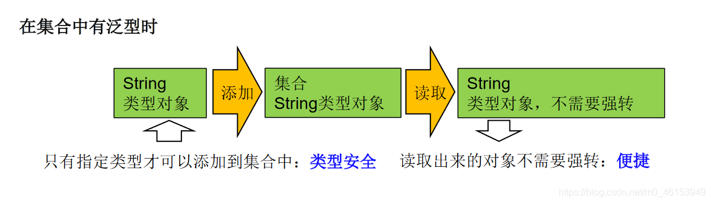
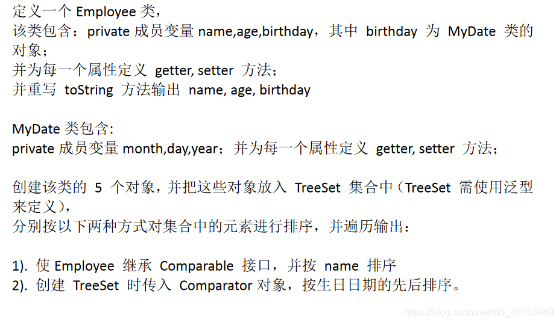

## 01、为什么要有泛型

- 泛型：标签

### 1.1、举例

- 中药店，每个抽屉外面贴着标签
- 超市购物架上很多瓶子，每个瓶子装的是什么，有标签。

### 1.2、泛型的设计背景

集合容器类在设计阶段/声明阶段不能确定这个容器到底实际存的是什么类型的对象，所以在JDK1.5之前只能把元素类型设计为Object，JDK1.5之后使用泛型来解决。因为这个时候除了元素的类型不确定，其他的部分是确定的，例如关于这个元素如何保存，如何管理等是确定的，因此此时把元素的类型设计成一个参数，这个类型参数叫做泛型。Collection，List，ArrayList这个就是类型参数，即泛型。

### 1.3、其他说明

所谓泛型，就是允许在定义类、接口时通过一个标识表示类中某个属性的类型或者是某个方法的返回值及参数类型。这个类型参数将在使用时（例如，继承或实现这个接口，用这个类型声明变量、创建对象时）确定（即传入实际的类型参数，也称为类型实参）。
从JDK1.5以后，Java引入了“参数化类型（Parameterizedtype）”的概念，允许我们在创建集合时再指定集合元素的类型，正如：List，这表明该List只能保存字符串类型的对象。
JDK1.5改写了集合框架中的全部接口和类，为这些接口、类增加了泛型支持，从而可以在声明集合变量、创建集合对象时传入类型实参。

### 1.4、那么为什么要有泛型呢

那么为什么要有泛型呢，直接Object不是也可以存储数据吗？

1、解决元素存储的安全性问题，好比商品、药品标签，不会弄错。2.解决获取数据元素时，需要类型强制转换的问题，好比不用每回拿商品、药品都要辨别。


2、Java泛型可以保证如果程序在编译时没有发出警告，运行时就不会产生ClassCastException异常。同时，代码更加简洁、健壮。

```java
import org.junit.Test;

import java.util.ArrayList;

/**
 * 泛型的使用
 * 1.jdk5.0新增的特征
 */
public class GenericTest {

    //在集合中使用泛型之前的情况：
    @Test
    public void test(){
        ArrayList list = new ArrayList();
        //需求：存放学生的成绩
        list.add(78);
        list.add(49);
        list.add(72);
        list.add(81);
        list.add(89);
        //问题一：类型不安全
//        list.add("Tom");

        for(Object score : list){
            //问题二：强转时可能出现类型转化异常
            int stuScore = (Integer)score;

            System.out.println(stuScore);
        }

    }

}
```

## 02、在集合中使用泛型

> 注意点：泛型的类型必须是类，不能是基本数据类型。需要用到基本数据类型的位置，拿包装类替换

### 2.1、举例

```java
import org.junit.Test;

import java.util.*;

/**
 * 泛型的使用
 * 1.jdk5.0新增的特征
 *
 * 2.在集合中使用泛型：
 *  总结：
 *  ①集合接口或集合类在jdk5.0时都修改为带泛型的结构。
 *  ②在实例化集合类时，可以指明具体的泛型类型
 *  ③指明完以后，在集合类或接口中凡是定义类或接口时，内部结构（比如：方法、构造器、属性等）使用到类的泛型的位置，都指定为实例化的泛型类型。
 *    比如：add(E e)  --->实例化以后：add(Integer e)
 *  ④注意点：泛型的类型必须是类，不能是基本数据类型。需要用到基本数据类型的位置，拿包装类替换
 *  ⑤如果实例化时，没有指明泛型的类型。默认类型为java.lang.Object类型。
 *
 * 3.如何自定义泛型结构：泛型类、泛型接口；泛型方法。见 GenericTest1.java
 *
 */
public class GenericTest {

    //在集合中使用泛型的情况：以HashMap为例
    @Test
    public void test3(){
//        Map<String,Integer> map = new HashMap<String,Integer>();
        //jdk7新特性：类型推断
        Map<String,Integer> map = new HashMap<>();

        map.put("Tom",87);
        map.put("Tone",81);
        map.put("Jack",64);

//        map.put(123,"ABC");

        //泛型的嵌套
        Set<Map.Entry<String,Integer>> entry = map.entrySet();
        Iterator<Map.Entry<String, Integer>> iterator = entry.iterator();

        while(iterator.hasNext()){
            Map.Entry<String, Integer> e = iterator.next();
            String key = e.getKey();
            Integer value = e.getValue();
            System.out.println(key + "----" + value);
        }
    }

    //在集合中使用泛型的情况：以ArrayList为例
    @Test
    public void test2(){
        ArrayList<Integer> list = new ArrayList<Integer>();

        list.add(78);
        list.add(49);
        list.add(72);
        list.add(81);
        list.add(89);
        //编译时，就会进行类型检查，保证数据的安全
//        list.add("Tom");

        //方式一：
//        for(Integer score :list){
//            //避免了强转的操作
//            int stuScore = score;
//
//            System.out.println(stuScore);
//        }

        //方式二：
        Iterator<Integer> iterator = list.iterator();
        while(iterator.hasNext()){
            int stuScore = iterator.next();
            System.out.println(stuScore);
        }
    }
}
```

### 2.2、练习

> 练习1



> 1、MyDate类

```java
/**
 * MyDate类包含:
 * private成员变量year,month,day；并为每一个属性定义getter,  setter 方法；
 *
 */
public class MyDate implements Comparable<MyDate>{
    private int year;
    private int month;
    private int day;

    public int getYear() {
        return year;
    }

    public void setYear(int year) {
        this.year = year;
    }

    public int getMonth() {
        return month;
    }

    public void setMonth(int month) {
        this.month = month;
    }

    public int getDay() {
        return day;
    }

    public void setDay(int day) {
        this.day = day;
    }

    public MyDate() {
    }

    public MyDate(int year, int month, int day) {
        this.year = year;
        this.month = month;
        this.day = day;
    }

    @Override
    public String toString() {
        return "MyDate{" +
                "year=" + year +
                ", month=" + month +
                ", day=" + day +
                '}';
    }

//    @Override
//    public int compareTo(Object o) {
//        if(o instanceof MyDate){
//            MyDate m = (MyDate)o;
//
//            //比较年
//            int minusYear = this.getYear() - m.getYear();
//            if(minusYear != 0){
//                return minusYear;
//            }
//            //比较月
//            int minusMonth = this.getMonth() - m.getMonth();
//            if(minusMonth != 0){
//                return minusMonth;
//            }
//            //比较日
//            return this.getDay() - m.getDay();
//        }
//
//        throw new RuntimeException("传入的数据类型不一致！");
//
//    }

    @Override
    public int compareTo(MyDate m) {
        //比较年
        int minusYear = this.getYear() - m.getYear();
        if(minusYear != 0){
            return minusYear;
        }
        //比较月
        int minusMonth = this.getMonth() - m.getMonth();
        if(minusMonth != 0){
            return minusMonth;
        }
        //比较日
        return this.getDay() - m.getDay();
    }
}
```

> 2、Employee类

```java
/**
 * 定义一个Employee类。
 * 该类包含：private成员变量name,age,birthday，
 * 其中birthday 为MyDate 类的对象；
 * 并为每一个属性定义getter, setter 方法；
 * 并重写toString 方法输出name, age, birthday
 *
 */
public class Employee implements Comparable<Employee>{
    private String name;
    private int age;
    private MyDate birthday;

    public String getName() {
        return name;
    }

    public void setName(String name) {
        this.name = name;
    }

    public int getAge() {
        return age;
    }

    public void setAge(int age) {
        this.age = age;
    }

    public MyDate getBirthday() {
        return birthday;
    }

    public void setBirthday(MyDate birthday) {
        this.birthday = birthday;
    }

    public Employee() {
    }

    public Employee(String name, int age, MyDate birthday) {
        this.name = name;
        this.age = age;
        this.birthday = birthday;
    }

    @Override
    public String toString() {
        return "Employee{" +
                "name='" + name + '\'' +
                ", age=" + age +
                ", birthday=" + birthday +
                '}';
    }

    //没有指明泛型时的写法
    //按name排序
//    @Override
//    public int compareTo(Object o){
//        if(o instanceof Employee){
//            Employee e = (Employee)o;
//            return this.name.compareTo(e.name);
//        }
        return 0;
//        throw new RuntimeException("传入的数据类型不一致");
//    }

    //指明泛型时的写法
    @Override
    public int compareTo(Employee o) {
        return this.name.compareTo(o.name);
    }
}
```

> 3、测试类

```java
import org.junit.Test;

import java.util.Comparator;
import java.util.Iterator;
import java.util.TreeSet;

/**
 * 创建该类的5 个对象，并把这些对象放入TreeSet 集合中
 * （下一章：TreeSet 需使用泛型来定义）分别按以下两种方式
 * 对集合中的元素进行排序，并遍历输出：
 *
 * 1). 使Employee 实现Comparable 接口，并按name 排序
 * 2). 创建TreeSet 时传入Comparator对象，按生日日期的先后排序。
 */
public class EmployeeTest {

    //问题二：按生日日期的先后排序
    @Test
    public void test2(){
        TreeSet<Employee> set = new TreeSet<>(new Comparator<Employee>() {
            //使用泛型以后的写法
            @Override
            public int compare(Employee o1, Employee o2) {
                MyDate b1 = o1.getBirthday();
                MyDate b2 = o2.getBirthday();

                return b1.compareTo(b2);
            }
            //使用泛型之前的写法
            //@Override
//            public int compare(Object o1, Object o2) {
//                if(o1 instanceof Employee && o2 instanceof Employee){
//                    Employee e1 = (Employee)o1;
//                    Employee e2 = (Employee)o2;
//
//                    MyDate b1 = e1.getBirthday();
//                    MyDate b2 = e2.getBirthday();
//                    //方式一：
                    //比较年
                    int minusYear = b1.getYear() - b2.getYear();
                    if(minusYear != 0){
                        return minusYear;
                    }
                    //比较月
                    int minusMonth = b1.getMonth() - b2.getMonth();
                    if(minusMonth != 0){
                        return minusMonth;
                    }
                    //比较日
                    return b1.getDay() - b2.getDay();
//
//                    //方式二：
//                    return b1.compareTo(b2);
//
//                }
                return 0;
//                throw new RuntimeException("传入的数据类型不一致！");
//            }
        });

        Employee e1 = new Employee("liudehua",55,new MyDate(1965,5,4));
        Employee e2 = new Employee("zhangxueyou",43,new MyDate(1987,5,4));
        Employee e3 = new Employee("guofucheng",44,new MyDate(1987,5,9));
        Employee e4 = new Employee("liming",51,new MyDate(1954,8,12));
        Employee e5 = new Employee("liangzhaowei",21,new MyDate(1978,12,4));

        set.add(e1);
        set.add(e2);
        set.add(e3);
        set.add(e4);
        set.add(e5);

        Iterator<Employee> iterator = set.iterator();
        while (iterator.hasNext()){
            System.out.println(iterator.next());
        }
    }

    //问题一：使用自然排序
    @Test
    public void test(){
        TreeSet<Employee> set = new TreeSet<Employee>();

        Employee e1 = new Employee("wangxianzhi",41,new MyDate(334,5,4));
        Employee e2 = new Employee("simaqian",43,new MyDate(-145,7,12));
        Employee e3 = new Employee("yanzhenqin",44,new MyDate(709,5,9));
        Employee e4 = new Employee("zhangqian",51,new MyDate(-179,8,12));
        Employee e5 = new Employee("quyuan",21,new MyDate(-340,12,4));

        set.add(e1);
        set.add(e2);
        set.add(e3);
        set.add(e4);
        set.add(e5);

        Iterator<Employee> iterator = set.iterator();
        while (iterator.hasNext()){
            Employee next = iterator.next();
            System.out.println(next);
        }
    }
}
```

## 03、自定义泛型结构

### 3.1、自定义泛型类举例

> 1、OrderTest类

```java
/**
 * 自定义泛型类
 *
 */
public class OrderTest<T> {

    String orderName;
    int orderId;

    //类的内部结构就可以使用类的泛型
    T orderT;

    public OrderTest(){

    };

    public OrderTest(String orderName,int orderId,T orderT){
        this.orderName = orderName;
        this.orderId = orderId;
        this.orderT = orderT;
    }

    //如下的三个方法都不是泛型方法
    public T getOrderT(){
        return orderT;
    }

    public void setOrderT(T orderT){
        this.orderT = orderT;
    }

    @Override
    public String toString() {
        return "Order{" +
                "orderName='" + orderName + '\'' +
                ", orderId=" + orderId +
                ", orderT=" + orderT +
                '}';
    }
    
    //泛型方法：在方法中出现了泛型的结构，泛型参数与类的泛型参数没有任何关系。
    //换句话说，泛型方法所属的类是不是泛型类都没有关系。
    //泛型方法，可以声明为静态的。原因：泛型参数是在调用方法时确定的。并非在实例化类时确定。
    public static <E>  List<E> copyFromArrayToList(E[] arr){

        ArrayList<E> list = new ArrayList<>();

        for(E e : arr){
            list.add(e);
        }
        return list;

    }
}
```

> 2、SubOrder类

```java
public class SubOrder extends OrderTest<Integer>{   //SubOrder:不是泛型类
}
```

> 3、SubOrder1类

```java
public class SubOrder1<T> extends OrderTest<T> {//SubOrder1<T>:仍然是泛型类
}
```

> 4、GenericTest1类

```java
import org.junit.Test;

/**
 * 如何自定义泛型结构：泛型类、泛型接口；泛型方法。
 *
 * 1.关于自定义泛型类、泛型接口：
 */
public class GenericTest1 {

    @Test
    public void test(){
        /**
         * 如果定义了泛型类，实例化没有指明类的泛型，则认为此泛型类型为Object类型
         * 要求：如果大家定义了类是带泛型的，建议在实例化时要指明类的泛型。
         */
        OrderTest order = new OrderTest();
        order.setOrderT(123);
        order.setOrderT("ABC");

        //建议：实例化时指明类的泛型
        OrderTest<String> order1 = new OrderTest<String>("orderAA",1001,"order:AA");

        order1.setOrderT("AA:hello");
    }

    @Test
    public void test2(){
        SubOrder sub1 = new SubOrder();
        //由于子类在继承带泛型的父类时，指明了泛型类型。则实例化子类对象时，不再需要指明泛型。
        sub1.setOrderT(1122);

        SubOrder1<String> sub2 = new SubOrder1<>();
        sub2.setOrderT("order2...");
    }
}
```

3.2、自定义泛型类泛型接口的注意点
注意点：

泛型类可能有多个参数，此时应将多个参数一起放在尖括号内。比如：<E1,E2,E3>

泛型类的构造器如下：public GenericClass(){}。而下面是错误的：public GenericClass(){}

实例化后，操作原来泛型位置的结构必须与指定的泛型类型一致。

泛型不同的引用不能相互赋值。尽管在编译时ArrayList和ArrayList是两种类型，但是，在运行时只有一个ArrayList被加载到JVM中。

泛型如果不指定，将被擦除，泛型对应的类型均按照Object处理，但不等价于Object。
经验：泛型要使用一路都用。要不用，一路都不要用。

如果泛型结构是一个接口或抽象类，则不可创建泛型类的对象。

jdk1.7，泛型的简化操作：ArrayList flist = new ArrayList<>();

泛型的指定中不能使用基本数据类型，可以使用包装类替换。

在类/接口上声明的泛型，在本类或本接口中即代表某种类型，可以作为非静态属性的类型、非静态方法的参数类型、非静态方法的返回值类型。但在静态方法中不能使用类的泛型。

异常类不能是泛型的


```java
//异常类不能声明为泛型类
//public class MyException<T> extends Exception{
//}
```

