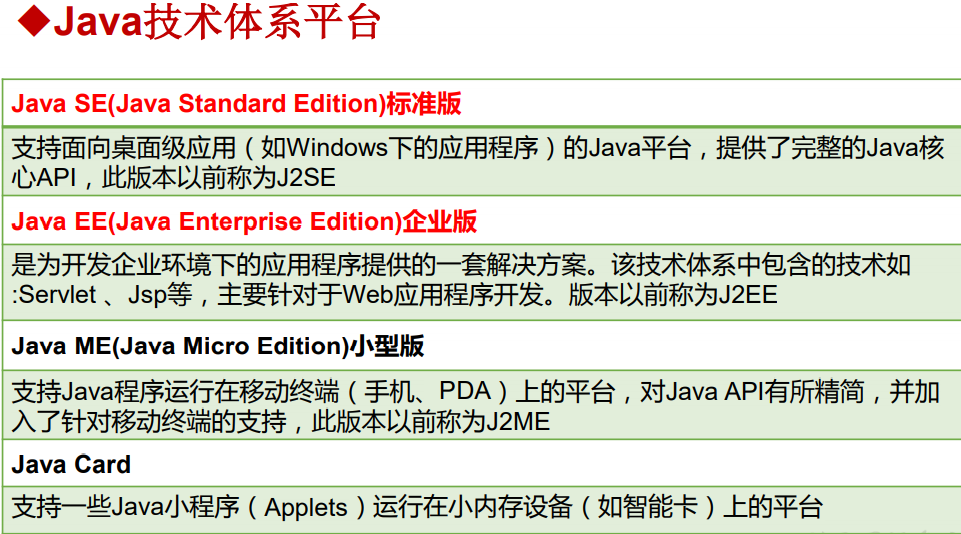
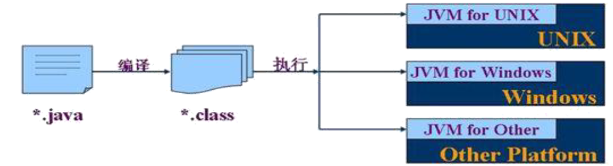
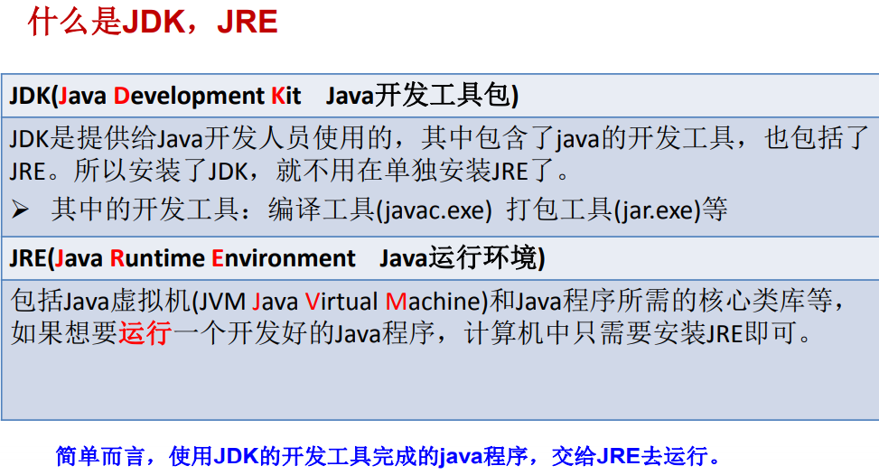
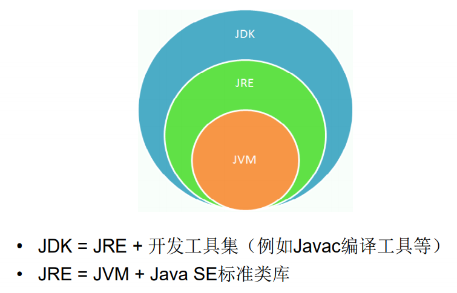
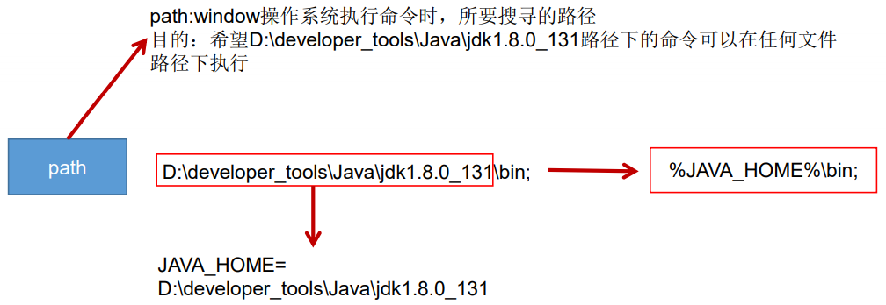
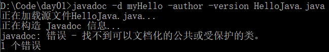

1.1 软件开发介绍

1. 软件，即一系列按照特定顺序组织的计算机数据和指令的集合。有系统软件（操作系统windows、mac、linux、unix、android、ios），应用软件之分

2. 人机交互方式：   
   
   - 图形化界面（Graphical User Interface GUI）：
     
     这种方式简单直观，使用者易于接受，容易上手操作。
   
   - 命令行方式（Command Line Interface CLI）：
     
     需要有一个控制台，输入特定的指令，让计算机完成一些操作。较为麻烦，需要记录住一些命令。

​    算法+数据结构=程序

3. 常用命令行指令（DOS指令）：
   
   - d：：进盘符
   
   - dir : 列出当前目录下的文件以及文件夹 directory
   
   - md : 创建目录                                          make directory
   
   - rd : 删除目录 （需要保证目录是空的） remove directory
   
   - cd : 进入指定目录                                    change directory
   
   - cd.. : 退回到上一级目录 
   
   - cd\，cd\: 退回到根目录                                    
   
   - del : 删除文件                                          delete
     
     del 目录：删除该目录中的所有文件，不删除文件夹
     
     del *.txt：删除所有此格式的文件
     
     删除文件夹步骤，先删除文件夹中所有文件，在删除文件夹。是一个递归的过程。
   
   - exit : 退出 dos 命令行 
   
   - 补充：创建文件echo javase>1.doc 不需要掌握

4. 常用快捷键 
   
   - ← →：移动光标 
   - ↑ ↓：调阅历史操作命令 
   - Delete和Backspace：删除字符

## 1.2 计算机编程语言介绍

计算机语言：人与计算机交流的方式

第一代：机器语言。指令以二进制代码形式存在。

第二代：汇编语言。使用助记符表示一条机器指令。

第三代：高级语言

- 面向过程/对象：C++
- 面向过程的语言：C，Pascal、Fortran
- 面向对象的语言：Java,Python,Scala

语言排行榜 TIOBEhttps://www.tiobe.com/tiobe-index/

## 1.3 Java语言概述

是SUN( Stanford University Network ，斯坦福大学网络公司 ) 1995 年推出的一门高级编程语言。

后台开发语言：Java（首选语言）、PHP、Python、Go、Node.js

Java简史：

- 1991年，Green 项目，开发语言最初命名为 Oak (橡树)
- 1996年，发布JDK 1.0
- **2004年，发布里程碑式版本：JDK 1.5，为突出此版本的重要性，更名为JDK 5.0（JDK 1.6等于JDK 6.0。依此类推）**
- 2005年， J2SE --> JavaSE，J2EE --> JavaEE，J2ME --> JavaME
- 2009年， Oracle 公司收购 SUN ，交易价格 74 亿美元
- 2014年，发布JDK 8.0，是继JDK 5.0以来变化最大的版本
- 2018年3月，发布JDK 10.0，版本号也称为18.3（按照发布时间来命名，2018年3月）



应用领域：

- 企业级应用（JavaEE）：主要指复杂的大企业的软件系统、各种类型的网站。 
- Android平台应用：Android 应用程序使用 Java 语言编写。
- 大数据平台开发：各类框架有 Hadoop spark storm flink 等，就这类技术生态圈来讲，还有各种中间件如 flume，kafka，sqoop 等等 ，这些框架以及工具大多数是用 Java 编写而成，但提供诸如 Java，scala，Python，R 等各种语言 API 供编程。
- 移动领域应用：主要表现在消费和嵌入式领域， 是指在各种小型设备上的应用，包括手机、PDA 、机顶盒、汽车通信设备等。

Java是一个**纯粹的面向对象**的程序设计语言，它继承了C++语言 面向对象技术的核心。Java**舍弃了C语言中容易引起错误的指针**（以引用取代）、运算符重载（operator overloading）、多重继承（以接口取代）等特性，**增加了垃圾回收器功能**用于回收不再被引用 的对象所占据的内存空间。JDK1.5又引入了泛
型编程（Generic Programming）、类型安全的枚举、不定长参数和自动装/拆箱。

## 1.4 Java 语言运行机制及运行过程

### Java语言的特点

特点一：**面向对象 **

- 两个基本概念：类、对象 
- 三大特性：封装、继承、多态 

特点二：**健壮性** 

①吸收了C/C++语言的优点，但去掉了其影响程序健壮性的部分（如指针、内存的申请与释放等），提供了一个相对安全的内存管理和访问机制
②自动的垃圾回收机制仍然会出现内存溢出、内存泄漏

特点三：**跨平台性** 

跨平台性：通过Java语言编写的应用程序在不同的系统平台上都可以运行。“Write once , Run Anywhere” 
原理：只要在需要运行 java 应用程序的操作系统上，先安装一个`Java虚拟机 (JVM Java Virtual Machine)` 即可。由JVM来负责Java程序在该系统中的运行。

**JAVA程序在JVM上运行。**


### Java 两种核心机制

1. Java 虚拟机 (Java Virtal Machine）
   
   - JVM 是一个虚拟的计算机，具有指令集并使用不同的存储区域。负责执行指令，管理数据、内存、寄存器 。
   
   - 对于不同的平台，有不同的虚拟机。只有某平台提供了对应的 java 虚拟机， java 程序才可在此平台运行。
   
   - Java 虚拟机机制屏蔽了底层运行平台的差别，实现了“ 一次编译，到处运行”。
     
     

2. 垃圾收集机制 (Garbage Collection）
   
   - 不再使用的内存空间应回收——垃圾回收。
     - 在 C/C++ 等语言中，由程序员负责回收无用内存。
     - Java 语言消除了程序员回收无用内存空间的责任：它提供一种系统级线程跟踪存储空间的分配情况。并在 JVM 空闲时，检查并释放那些可被释放的存储空间。
   - 垃圾回收在 Java 程序运行过程中自动进行，程序员无法精确控制和干预。
   - Java 程序还会出现内存泄漏和内存溢出问题吗？ Yes!

## 1.5 Java语言的环境搭建

### 什么是JDK，JRE





### JDK与JRE的安装

1. 安装 
   
   傻瓜式安装，各个部分都是什么，了解一下

2. 环境变量的配置
   
   - 原因：（在命令行方式下）我们希望在任何文件目录下都能执行bin目录下的指令，这需要配置环境变量。
   
   - 过程：
     
     Administrator的用户变量：对当前用户有效
     系统变量：对所有用户都有效
     两个都可以
     
     path：windows系统执行命令时要搜寻的路径。 （执行命令过程：先在当前路径下寻找有没有这个指令，如果有就执行，如果没有，就去path路径下寻找）
     
     配置环境变量方法：
     
     1. path中配置绝对路径的方法：path路径中添加bin目录的绝对路径（最好上移到第一个）
     
     2. 开发中通常配置方法：新建变量 JAVA_HOME，赋值为JDK的绝对路径，在path路径下动态引用%JAVA_HOME%\bin（两个%——获取值）
        原因：后面 javaweb，tomcat寻找的就是 JAVA_HOME



几个问题：

1. 允许安装多个版本JDK，但只能用一个（全看环境变量配的是谁）
2. 没有path就新建一个path
3. win10与win7的区别（新建，然后上移，不然其他路径也包含有指令，识别到那儿就不往下走了导致有的指令可以运行有的不可以）

## 1.6 第一个JAVA程序

步骤：

1. 将 Java 代码编写到扩展名为 .java 的文件中。

2. 通过 javac 命令对该 java 文件进行**编译**。

3. 通过 java 命令对生成的 class 文件进行**运行**。


几个问题：

1. java中严格区分大小写，windows中不严格区分大小写（编译时大小写都可以——文件名大小写都一样，运行时区分大小写——类名区分大小写）

2. classpath环境变量删了

3. 语法错误

## 1.7 常见问题及解决方法

安装、配置EditPlus3

## 1.8 注释（Comment）

用于注解说明释程序的文字就是注释

1. Java 中的注释类型：
   
   - 单行注释 格式： //注释文字
   
   - 多行注释 格式： /* 注释文字 */ 
   
   - 文档注释 (Java特有）
     格式：/** 
     
                 @author 指定java程序的作者  
                 @version 指定源文件的版本
                 */

2. 单行注释和多行注释的作用：
   
   ①对所写的程序进行解释说明，增强可读性。方便自己，方便别人
   ②调试所写的代码

3. 特点：
   
   单行注释和多行注释，注释的内容不参与编译（不会被JVM解释执行）。
   换句话说，编译以后生成的．class结尾的字节码文件不包含注释掉的信息。

4. 文档注释的使用：
   
   注释内容可以被 JDK 提供的工具 javadoc 所解析，生成一套以网页文件形式体现的该程序的说明文档。
   操作方式：javadoc -d mydoc -author -version HelloWorld



错误原因：https://blog.csdn.net/da_ye_zi/article/details/104098421

5. 多行注释不可以嵌套使用
   
   原因：多行注释识别到*/结束

## 1.9 Java API文档

### API

API（Application Programming Interface, 应用程序编程接口）是 Java 提供的基本编程接口。
Java 语言提供了大量的基础类，因此 Oracle 也为这些基础类提供了相应的
API 文档，用于告诉开发者如何使用这些类，以及这些类里包含的方法。
下载 API：http://www.oracle.com/technetwork/java/javase/downloads/index.html

### 对第一个java程序进行总结

1. java程序编写——编译——运行的过程
   
   编写：我们将编写的 java 代码保存在以".java"结尾的源文件中
   编译：使用 javac.exe 命令编译 java 源文件。    格式：javac 源文件名.java
   运行：使用 java.exe 命令解释运行字节码文件。格式：java 类名

2. 在一个java源文件中可以声明多个 class。但是，只能最多有一个类声明为 public 的。而且，要求声明为 public 的类的类名必须与源文件名相同。

3. 程序的入口是 main() 方法。格式是固定的。

4. 输出语句：
   System.out.println() 先输出数据，然后换行
   System.out.print()    只输出数据

5. 每个执行语句都以";"结束。

6. 编译的过程：编译以后，会生成一个或多个字节码文件。字节码文件的文件名与 java 源文件中的类名相同。

7. 运行的过程：运行 main() 方法（不同类里面可能都有main()方法）

## 1.10 良好的编程风格

- 正确的注释和注释风格使用文档
  
  - 使用文档注释来注释整个类或整个方法。
  - 如果注释方法中的某一个步骤，使用单行或多行注释。

- 正确的缩进和空白
  
  - 使用一次tab操作，实现缩进
  - 运算符两边习惯性各加一个空格。比如：2 + 4 * 5。

- 块的风格
  
  - Java API 源代码选择了行尾风格

```java
public class Test {
    public static void main(String[] args){
    System.out.println("Block Style!");
    }
}
//行尾风格
public class Test
{
    public static void main(String[] args)
    {
        System.out.println("Block Style!");
    }
}

//次行风格
```

## 1.11 常用的Java开发工具

- 文本编辑工具： 
  
  - 记事本 
  - UltraEdit     
  - EditPlus     
  - TextPad     
  - NotePad

- Java集成开发环境（Integrated Development Environment 缩写IDE)：
  
  - JBuilder     
  - NetBeans     
  - Eclipse
  - MyEclipse
  - IntelliJ IDEA
  
  ![1443ea3c259b498fdd83c834f6a.png)