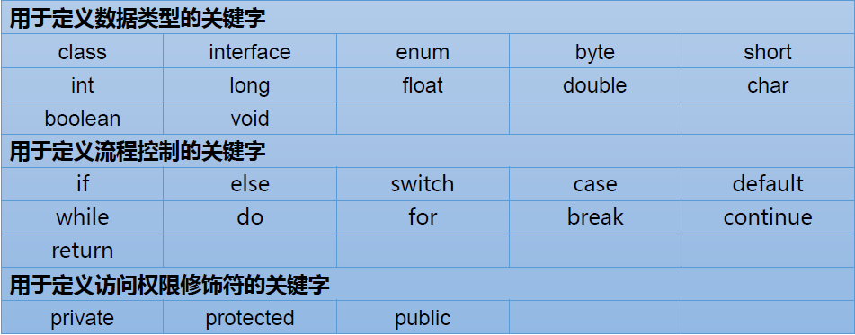
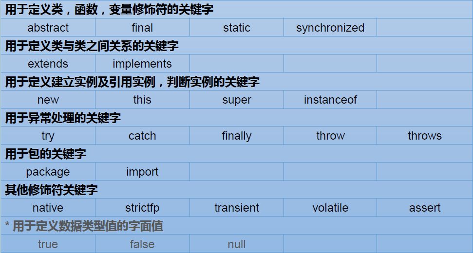
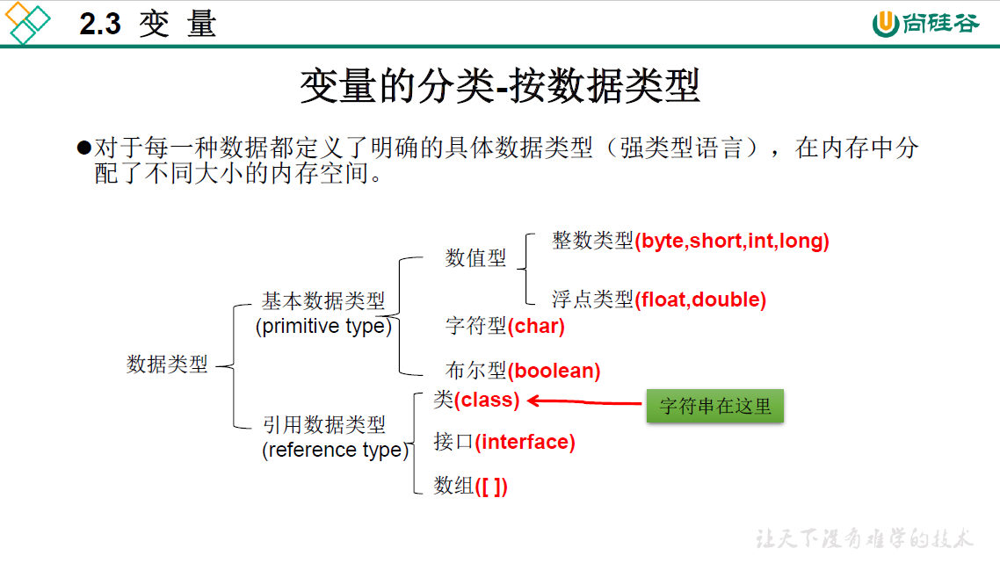
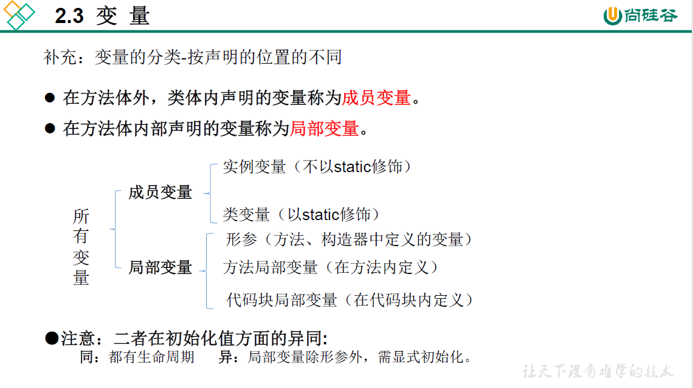
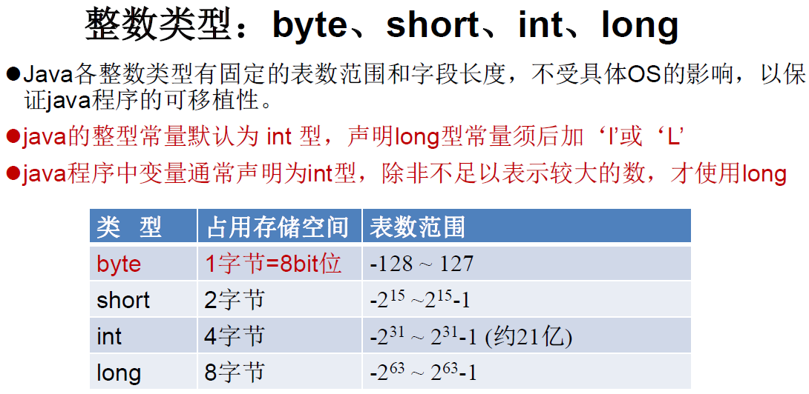
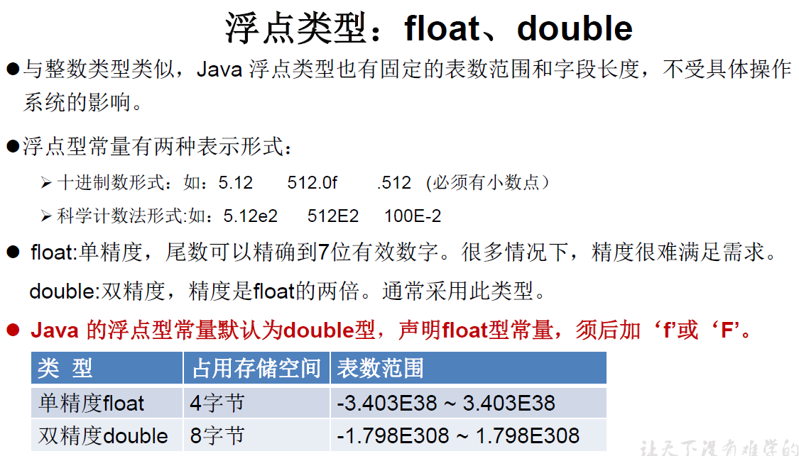
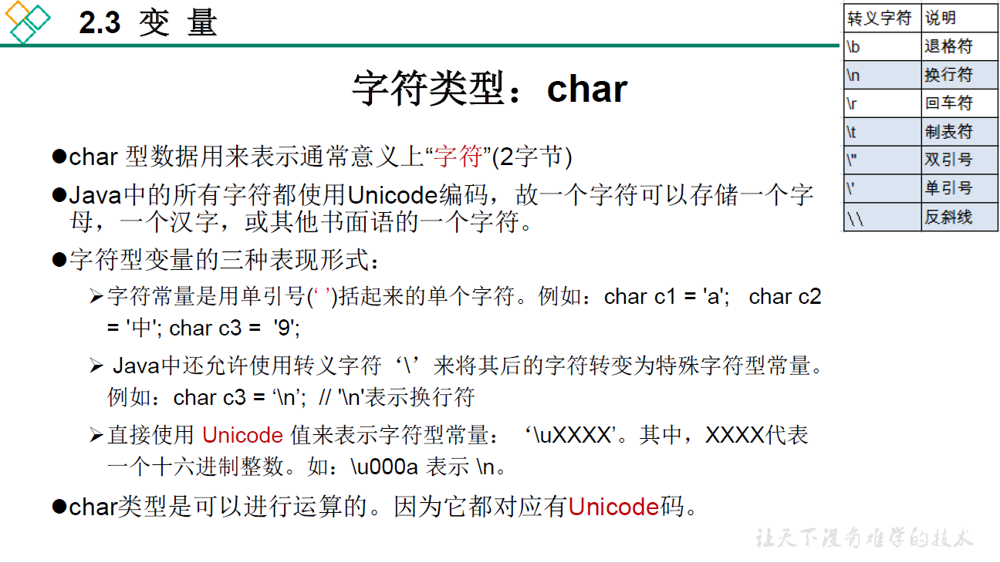
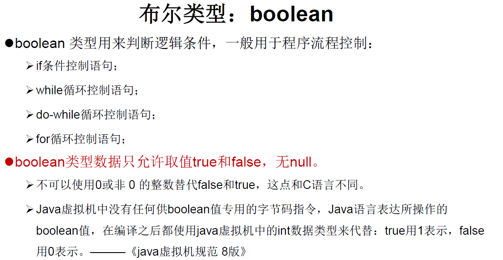
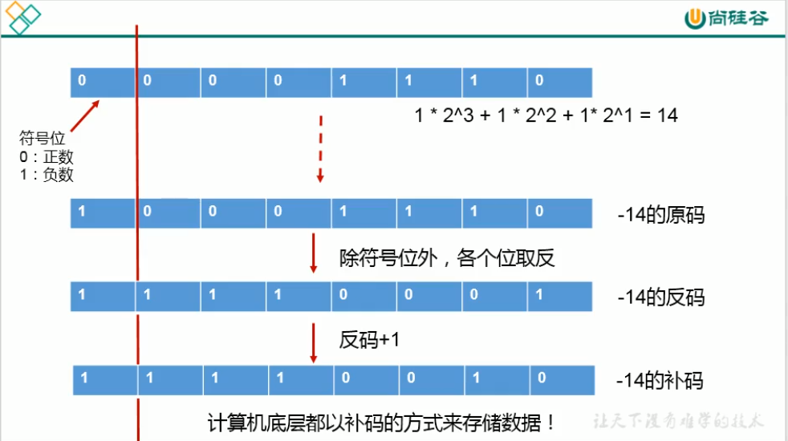

## 2.1 关键字与保留字

### 关键字(keyword)

- 定义：被 Java 语言赋予了特殊含义，用做专门用途的字符串（单词）

- 特点：关键字中所有字母都为小写

官方地址：https://docs.oracle.com/javase/tutorial/java/nutsandbolts/_keywords.html





### 保留字(reserved word)

- 定义：现有 Java 版本尚未使用，但以后版本可能会作为关键字使用。自己命名标识符时要避免使用这些保留字，如 goto 、 const

## 2.2 标识符（identifier）

- 定义：
  
  - Java 对各种变量、方法和类等要素命名时使用的字符序列称为标识符
    
    技巧：凡是自己可以起名字的地方都叫标识符。

- 标识符的命名**规则**：
  
  - 由 26 个英文字母大小写，0-9，_ 或 $ 组成
  
  - 数字不可以开头。
  
  - 不可以使用关键字和保留字，但能包含关键字和保留字。
  
  - Java 中严格区分大小写，长度无限制。
  
  - 标识符不能包含空格。

​    如果不遵守如上规则，编译不通过！需要大家严格遵守

​    小技巧：在文件管理系统路径中输入cmd可以直接打开命令行

- Java中标识符的命名**规范**：
  
  - 包名：多单词组成时所有字母都小写 xxxyyyzzz
  
  - 类名、接口名：多单词组成时，所有单词的首字母大写 XxxYyyZzz（大驼峰）
  
  - 变量名、方法名：多单词组成时，第一个单词首字母小写，第二个单词开始每个单词首字母大写 xxxYyyZzz（小驼峰）
  
  - 常量名：所有字母都大写。多单词时每个单词用下划线连接 XXX_YYY_ZZZ

​    如果不遵守如上规则，编译可以通过！建议大家遵守

- 注意1 ：在起名字时，为了提高阅读性，要尽量有意义，“见名知意”。
- 注意2： java 采用 unicode 字符集，因此标识符也可以使用汉字声明，但是不建议使用。
- **作用域**指标识符能够被使用的范围，只有在作用域内标识符才可以被使用。
- **生命期**指的是标识符从运行开始时被创建，具有存储空间，到程序结束时消亡，释放存储空间的时间段。

## 2.3 变量（variable）

### 变量的概念，变量的声明、定义（初始化）、使用

1. 变量的概念：
   
   - 内存中的一个存储区域
   
   - 该区域的数据可以在同一类型范围内不断变化
   
   - 变量是程序中最基本的存储单元。包含**变量类型**、**变量名**和**存储的值**。

2. 变量的作用：用于在内存中保存数据

3. 变量的作用域：其定义所在的一对{} 内
   
   变量只有在其作用域内才有效。
   同一个作用域内，不能定义重名的变量。

4. 变量的声明、定义（初始化）：
   
   java定义变量的格式：
   
   ```java
   数据类型 变量名 = 变量值;
   int num;//声明
   num = 10;//初始化
   int id = 1001;//声明 + 初始化
   ```
   
   java是强类型的语言，一定要声明数据类型
   可以声明变量的同时进行初始化，也可以先声明后赋值

5. 变量的使用
   
   使用变量名来访问这块区域的数据
   注意点：Java 中每个变量必须先声明，后使用。

### 变量的类型

#### 变量的分类

一、按照数据类型分类

- 基本数据类型：
  
  - 整型：byte，short，int，long
    
    - 浮点型：float，double
    
    - 字符型：char
    
    - 布尔型：boolean

- 引用数据类型：
  
  - 类（class） ——字符串在这里
  
  - 接口（interface）
  
  - 数组（array）



二、按照在类中声明的位置分类

​    成员变量 vs 局部变量



#### 整型



#### 浮点型



#### 字符型



char类型不能为空，必须放一个字符
就想打印出\n可以在前面加一个\

##### 字符集

底层以 二进制方式存储字符，因此字符与数值存在某种对应关系，即字符集。

- ASCII码 1个字节代表一个字符 0~127
- Unicode 2个字节代表一个字符0~65536
  - UTF-8
  - UCS-2
  - UTF-16

UTF-8是使用最广的一种Unicode的实现方式

乱码问题：统一字符集

| 编码      | 单个英文(含标点符号)字节数 | 单个中文(含标点符号)字节数 |
| ------- | -------------- | -------------- |
| UTF-8   | 1              | 3              |
| Unicode | 2              | 2              |
| GBK     | 1              | 2              |

#### 布尔型



#### 字符串类型（String）

- 定义：String属于引用数据类型，翻译为：字符串

- String类型变量的声明
  
  声明String类型变量时，使用一对双引号 ""。
  String类型可以为空。

- String类型变量的使用
  
  String可以和8种基本数据类型变量做运算，且运算只能是连接运算：+ 。运算的结果仍然是String类型。
  怎么判断+是加运算还是连接运算？看+号两边有没有String类型。

#### 进制(了解)

所有数字在计算机底层都以二进制形式存在 。

对于整数，有四种表示方式：

- 二进制(binary)：0 ,1，满 2 进 1。以 0b或 0B 开头。
- 十进制 (decimal)：0-9，满 10 进 1 。
- 八进制 (octal)：0-7，满 8 进 1。以数字0开头表示。
- 十六进制(hex)：0-9 及A-F ，满 16 进 1。以 0x或0X开头表示。此处的A-F不区分大小写。

如：0x21AF +1= 0X21B0

二进制-->十进制

十进制-->二进制

除2取余的逆

二进制<-->八进制,十六进制

三位一看，四位一看

基本数据类型转换

- 前提：这里讨论的只是7种基本数据类型变量间的转换，不包含boolean类型。
1. 隐式转换（自动类型提升）
   
   规则：当容量小的数据类型的变量与容量大的数据类型的变量做运算时(包括==)，结果自动提升为容量大的数据类型。（说明：此时的容量大和小指的是，表示数的范围的大和小，而不是占用内存空间的大和小。比如：float容量要大于long的容量）
   byte、char、short --> int --> long --> float --> double
   特别的：当byte、char、short三种类型的变量做运算时，结果为int类型。
   不符合上述规则时隐式转换将无法实现，此时需要显式转换 。

2. 显式转换（强制类型转换（自动类型提升的逆运算））
   
   - 需要使用强转符:（需要强制转换的类型）
   
   - 注意点：
     
     强制类型转换，可能导致精度损失（截断操作）
     整型常量，默认类型为int型
     浮点型常量，默认类型为double型

## 2.4 常量（constant）

### 常量的概念

常量是指在程序的整个运行过程中值保持不变的量。
常量和常量值是不同的概念，常量值是常量的具体和直观的表现形式，常量是形式化的表现。通常在程序中既可以直接使用常量值，也可以使用常量。

### 常量的分类

一、按照数据类型分类

- 基本数据类型：
  
  - 整型：byte，short，int，long
  
  - 浮点型：float，double
  
  - 字符型：char
  
  - 布尔型：boolean

- 引用数据类型：
  
  - 类（class） ——字符串在这里
  - 接口（interface）
  - 数组（array）
  - 空常量   null   ---> 代表不指向任何的地址 
  - 枚举
  - 注解　

二、按照表现形式分类

- 字面值常量（字面值、常量值，Literal）: 用数字和字符串表示。看到这个常量之后,就知道其值为多少。例如： 123  12.5
- 符号常量: 是用符号表示,。看到常量之后,能够知道其表示什么意思,但是不能知道其值为多少 。例如：PI 、 E

#### 整型字面值

Java 的整型字面值主要有如下 3 种形式。

- 十进制数形式：如 54、-67、0。
- 八进制数形式：Java 中的八进制常数的表示以 0 开头，如 0125 表示十进制数 85，-013 表示十进制数 -11。
- 十六进制数形式：Java 中的十六进制常数的表示以 0x 或 0X 开头，如 0x100 表示十进制数 256，-0x16 表示十进制数 -22。

整型字面值默认为int类型，但是int类型字面值可以赋值给byte， short ，char ，long ，int类型变量，只要字面值在目标范围以内，Java会自动完成转换。如果试图将超出范围的字面值赋给某一类型变量（比如把128赋给byte类型），编译通不过。而如果想让这个整型字面值被当作long类型来处理，则需要在字面值最后面加上L或者l。通常建议使用容易区分的L。所以整型字面值包括int字面值和long字面值两种。

#### 浮点字面值

Java 的浮点字面值主要有如下两种形式。

- 十进制数形式：由数字和小数点组成，且必须有小数点，如 12.34、-98.0。
- 科学记数法形式：如 1.75e5 或 32&E3，其中 e 或 E 之前必须有数字，且 e 或 E 之后的数字必须为整数。

浮点字面值默认为double类型。想让这个浮点字面值被当作float类型来处理，则需要在该常数后面加 F 或 f。

#### 布尔型字面值

Java 的布尔型字面值只有两个值，即 false（假）和 true（真）。

#### 字符型和字符串字面值

Java 的字符型字面值是用单引号引起来的一个字符，如 'e'、E'。需要注意的是，Java 字符串字面值中的单引号和双引号不可混用。双引号用来表示字符串，像 "11"、"d" 等都是表示单个字符的字符串。

除了以上所述形式的字符字面值之外，Java 还允许使用一种特殊形式的字符字面值来表示一些难以用一般字符表示的字符，这种特殊形式的字符是以开头的字符序列，称为转义字符。

注意：这里表示字符和字符串的单引号和双引号都必须是英语输入环境下输入的符号。

#### 特殊字面值

null是一种特殊的类型（type），可以将它赋给任何引用类型变量，表示这个变量不引用任何东西。如果一个引用类型变量为null，表示这个变量不可用。

### 常量的定义
