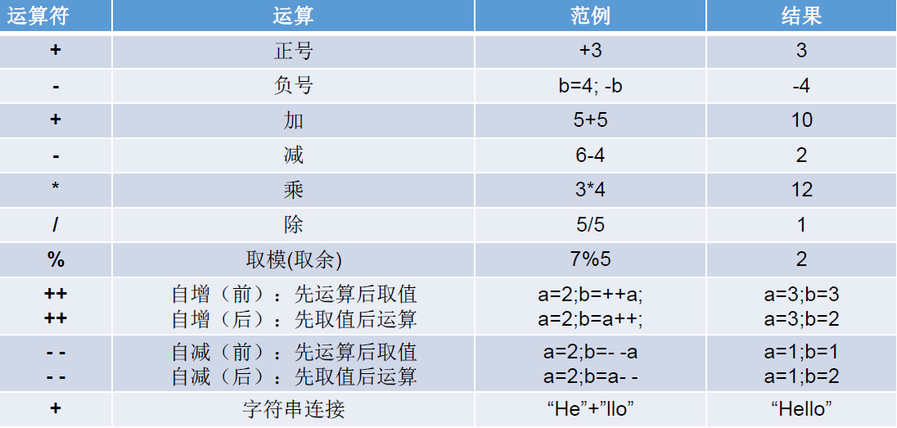
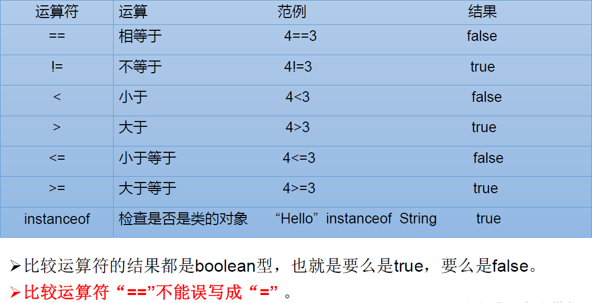
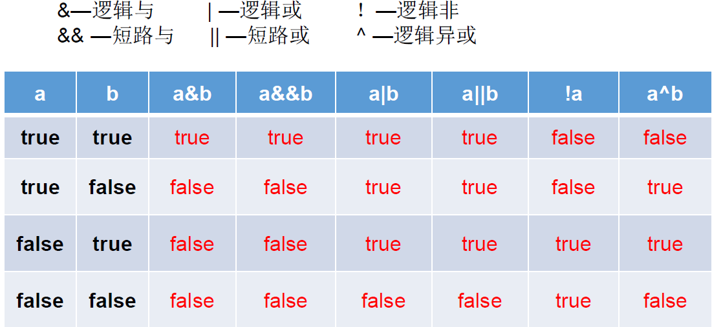
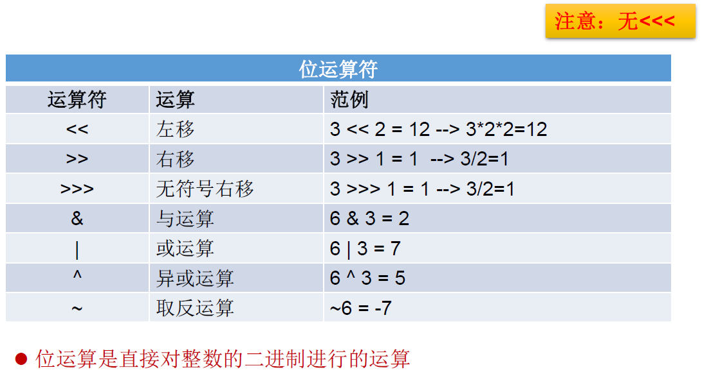
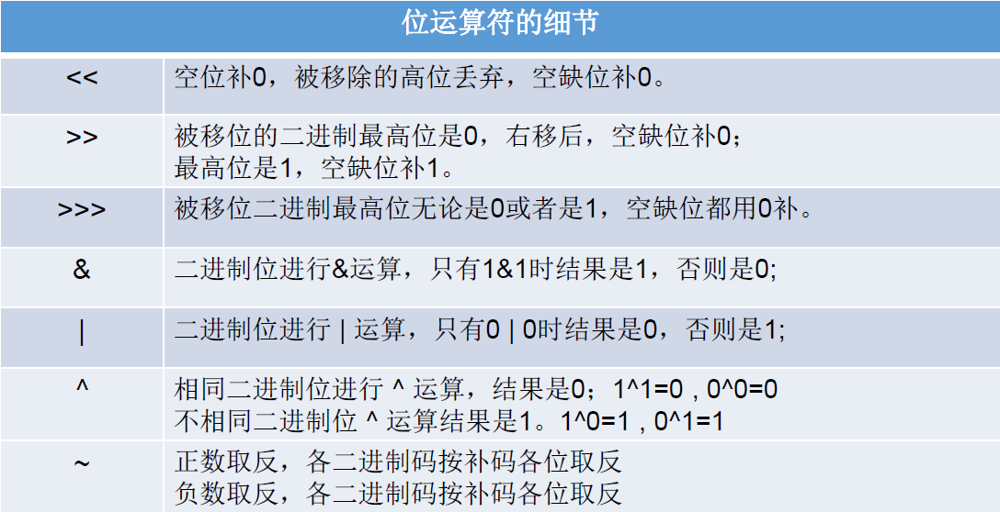
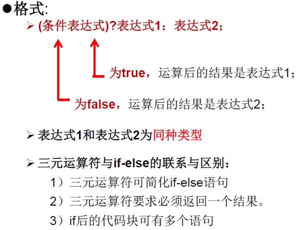
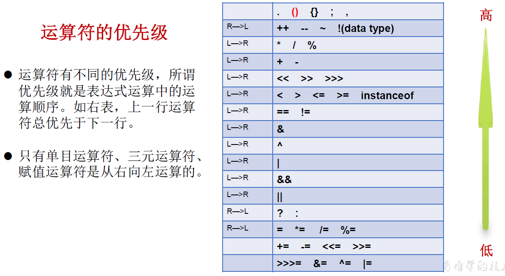

## 2.4 运算符

运算符是一种特殊的符号，用以表示数据的运算、赋值和比较等

- 算术运算符
- 赋值运算符
- 比较运算符（关系运算符）
- 逻辑运算符
- 位运算符
- 三元运算符

 

### 一、算术运算符



**除运算**

符号：/

- 整数之间做除法，只保留整数部分而舍弃小数部分。
- 浮点数之间做除法，则是确切的数值。

**取模（余）运算符**

符号：%

- 结果的符号与被模数的符号相同

- 开发中，经常使用%来判断能否被除尽的情况。


**自增（减）运算符**

符号：++/--

- （前）++/--：先自增（减）1，再运算

- （后）++/--：先运算，后自增（减）1


- 注意点：自增（减）1不会改变自身变量的类型（不同于加（减）1运算）


### 二、赋值运算符

符号：= 

- 当 “ = ” 两侧数据类型不一致时，可以使用自动类型转换或强制类型转换原则进行处理。
- 支持连续赋值。

扩展赋值运算符： +=, -= , *=, /= , %=

- 注意点：+= ，-= ，*=， /=， %= 不会改变变量本身的数据类型


开发中，如果希望变量实现加2操作（int num = 10）

方式一：

```
num = num + 2;
```

方式二：（推荐）

```
num += 2；
```

开发中，如果希望变量实现加1操作（int num = 10）

方式一：

```
num = num + 1;
```

方式二：

```
num += 1;
```

方式三：（推荐） 

```
num++;
```

### 三、比较运算符（关系运算符）



==：不仅可以使用在数值类型数据之间，还可以使用在其他引用类型变量之间

### 四、逻辑运算符



注意点1：逻辑运算符操作的都是boolean类型的变量

**逻辑与&和短路与&&的区别**

- 相同点1：& 与 && 的运算结果相同

  相同点2：当符号左边是true时，两者都会执行符号右边的运算

- 不同点：当符号左边是false时，逻辑与&继续执行符号右边的运算。短路与&&不再执行符号右边的运算。

**逻辑或|和短路或|| 的区别**

- 相同点1：| 与 || 的运算结果相同

  相同点2：当符号左边是false时，两者都会执行符号右边的运算

- 不同点：当符号左边是true时，逻辑或|继续执行符号右边的运算。短路或||不再执行符号右边的运算。

开发中，推荐使用短路与&&与短路或|| 

 

### 五、位运算符（了解）





注意点：

1. 位运算符操作的都是整型的数据，如果符号左右两边是布尔型的数据则是逻辑运算符。

2. << :在一定范围内，每向左移1位，相当于*2
    \>> :在一定范围内，每向右移1位，相当于/2

 

面试题：最高效方式的计算2 * 8 ？——2 << 3 或 8 << 1

```java
	//练习：交换两个变量的值
	int num1 = 10;
	int num2 = 20;
	System.out.println("num1 = " + num1 + ",num2 = " + num2);
 
	//方式一：定义临时变量的方式
	//推荐的方式
	int temp = num1;
	num1 = num2;
	num2 = temp;

	//方式二：
	//好处：不用定义临时变量 
	//弊端：① 相加操作可能超出存储范围 ② 有局限性：只能适用于数值类型
	num1 = num1 + num2;
	num2 = num1 - num2;
	num1 = num1 - num2;

	//方式三：使用位运算符
	//有局限性：只能适用于数值类型
	num1 = num1 ^ num2;
	num2 = num1 ^ num2;
	num1 = num1 ^ num2;

	System.out.println("num1 = " + num1 + ",num2 = " + num2);
```


###  六、三元运算符



- 条件表达式的结果为boolean类型。
  根据条件表达式真或假，决定执行表达式1，还是表达式2。如果条件表达式为true,则执行表达式1 ，如果条件表达式为false，则执行表达式2。
  
- 表达式1和表达式2要求能够统一为一个数据类型。
  
  ```java
  	//获取两个整数的较大值
  	int m = 12;
  	int n = 5;
  	int max = (m > n) ? m : n;
  	//表达式1和表达式2要求能够统一为一个数据类型
  	double num = (m > n) ? 2 : 1.0;//2.0,编译时统一为2.0：1.0
  	//(m > n) ?2 : "n大";编译错误
  
  	//三元运算符可以嵌套使用
  	n = 12;
  	String str = (m > n) ? "m大" : ((m == n) ? "m和n相等" : "n大");
  	System.out.println(str);
  ```
  
- 三元运算符可以嵌套使用

- 凡是可以使用三元运算符的地方，都可以改写成if-else。反之，不成立。

- 如果程序既可以使用三元运算符，又可以使用if-else结构，那么优先选择三元运算符。原因：简洁、运行效率高

 

### 运算符的优先级

实际开发中，加小括号