##  Java面向对象学习的三条主线

1.类及类的成员：属性、方法、构造器；代码块、内部类

2.面向对象的三大特征：封装性、继承性、多态性、（抽象性） 

3.其他关键字：this、super、static、final、abstract、interface、package、import等

“大处着眼，小处着手”

  

## 4.1 面向过程与面向对象

- ### 面向过程(POP)与面向对象(OOP)的区别

  - 面向对象：Object Oriented Programming

    面向过程：Procedure Oriented Programming

  - 二者都是一种思想，面向对象是相对于面向过程而言的。
    面向过程：强调的是功能行为，以函数为最小单位，考虑怎么做 。
    面向对象：将功能封装进对象，强调具备了功能的对象，以类/对象为最小单位，考虑谁来做。
  - 面向对象更加强调运用人类在日常的思维逻辑中采用的思想方法与原则，如抽象、分类、继承、聚合、多态等。

- ### 面向对象的三大特征

  - 封装（Encapsulated）
  - 继承（Inheritance）
  - 多态 (Polymorphism） 


举例体会1：“人把大象装进冰箱”

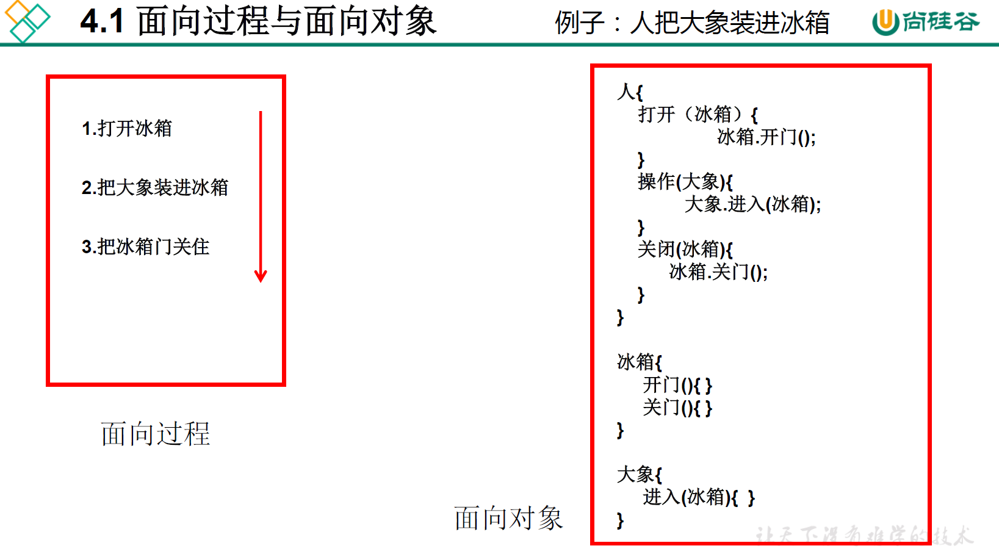


1. 面向过程：强调的是功能行为，以函数为最小单位，考虑怎么做。

   ①把冰箱门打开

   ②抬起大象，塞进冰箱

   ③把冰箱门关闭

2. 面向对象：强调具备了功能的对象，以类/对象为最小单位，考虑谁来做。

```java
人{
	打开(冰箱){
        冰箱.开开();
    }
    抬起(大象){
        大象.进入(冰箱);
    }
    关闭(冰箱){
        冰箱.闭合();
    }
}

冰箱{
    开开(){
    }
    闭合(){
    }
 }

大象{
    进入(冰箱){
    }
}
```

 举例体会2：公司运作

- 面向过程：创业公司，只有几个人，不区分每个人的职责，有事要做了，几个人商量商量直接就干了。

- 面向对象：大公司，几百人，需要分部门，给各个部门分配自己的职能（相当于设计类的属性和功能）。有事要做了，先xx部干活，再交给xx部。


### 面向对象的思想概述

- 程序员从面向过程的**执行者**转化成了面向对象的**指挥者**
- 面向对象分析方法分析问题的思路和步骤：
  - 根据问题需要，选择问题所针对的**现实世界中的实体**。
  - 从实体中寻找解决问题相关的属性和功能，这些属性和功能就形成了**概念世界中的类** 
  - 把抽象的实体用计算机语言进行描述，形成**计算机世界中类的定义**。即借助某种程序语言，把类构造成计算机能够识别和处理的数据结构。
  - 将**类实例化成计算机世界中的对象**。对象是计算机世界中解决问题的最终工具。


## 4.2 Java语言基本元素：类和对象

- 面向对象的两个要素：
  - 类(Class)：对一类事物的描述，是**抽象**的、**概念**上的定义
  - 对象(Object)：**实际存在**的该类事物的每个个体，因而也称为**实例** (instance）
  
- “万事万物皆对象”

  - 面向对象程序设计的重点是**类的设计**

  - 类的设计，其实就是**类的成员的设计**


## 4.3 类的设计，对象的创建和使用

### 类的设计

- 属性 = 成员变量 = 域、字段 = field

- 方法 = 成员方法 = 函数 = method


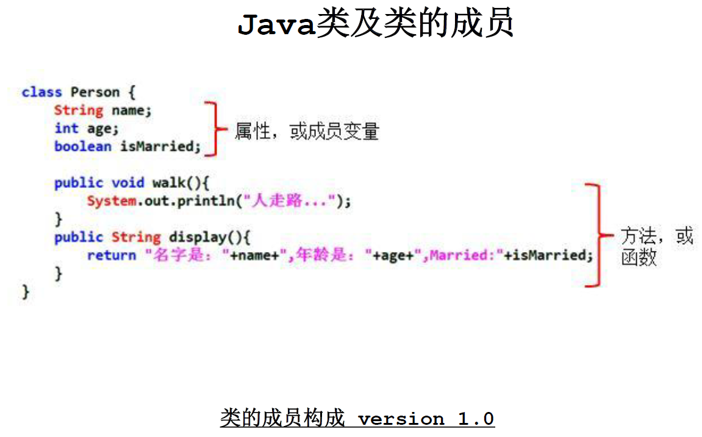

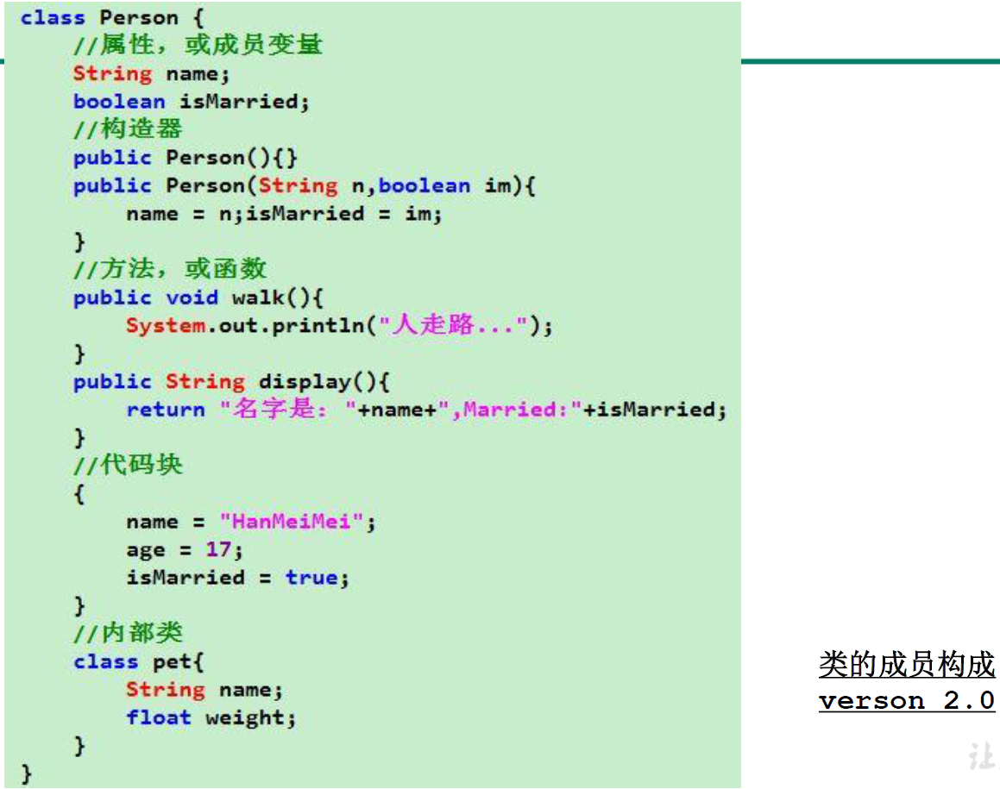

 

### 类和对象的创建与使用(面向对象思想的实现)

1. 创建类：设计类的成员

   - 语法格式：

     `修饰符 class 类名{`

     `属性声明;`

     `方法声明;`

     `}`

2. 创建类的对象（创建类的对象 = 类的实例化 = 实例化类）
   - 语法格式： `类名 对象名 = new 类名();`

3. 调用对象的结构
   - 语法格式：`对象.属性 对象.方法`

- 注意点：如果创建了一个类的多个对象，则每个对象都独立的拥有一套类的属性(非static的)。这意味着如果我们修改一个对象的属性a，不影响另外一个对象的属性a的值。

 ```java
 //测试类
 public class PersonTest {
 	public static void main(String[] args) {
 		//2.创建 Person 类的对象
 		//创建对象语法：类名对象名= new 类名();
 		Person p1 = new Person();
 		//Scanner scan = new Scanner(System.in);
 		
 		//调用类的结构：属性、方法
 		//调用属性:“对象.属性”
 		p1.name = "Tom";
 		p1.age = 25;
 		p1.isMale = true;
 		System.out.println(p1.name);
 		
 		//调用方法:“对象.方法”
 		p1.eat();
 		p1.sleep();
 		p1.talk("chinese");
 		//**********************
 		Person p2 = new Person();
 		System.out.println(p2.name); //null
 		System.out.println(p2.isMale);
 		//**********************
 		//将p1变量保存的对象地址值赋给p3,导致p1和p3指向了堆空间中的一个对象实体。
 		Person p3 = p1;
 		System.out.println(p3.name);
 		
 		p3.age = 10;
 		System.out.println(p1.age); //10
 	}
 }
 /*
  * 类的语法格式：
  * 修饰符 class 类名{
  * 		属性声明;
  * 		方法声明;
  * }
  * 说明：修饰符public：类可以被任意访问类的正文要用{  }括起来
  */
 //1.创建类，设计类的成员
 class Person{
 	
 	//属性:对应类中的成员变量
 	String name;
 	int age;
 	boolean isMale;
 	
 	//方法:对应类中的成员方法
 	public void eat(){
 		System.out.println("吃饭");
 	}
 	
 	public void sleep(){
 		System.out.println("睡觉");
 	}
 	
 	public void talk(String language){
 		System.out.println("人可以说话，使用的是：" + language);
 	}
 }
 ```

### 对象的内存解析

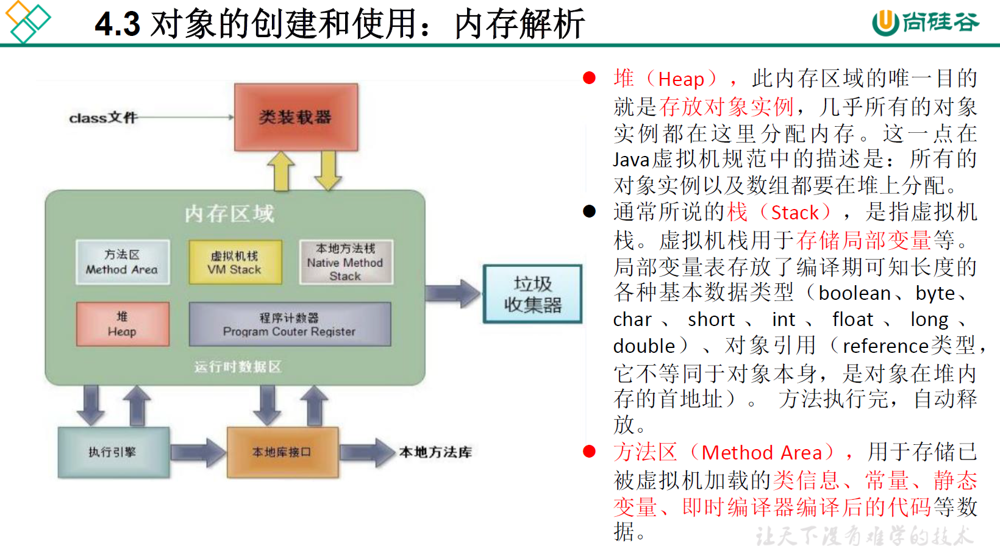

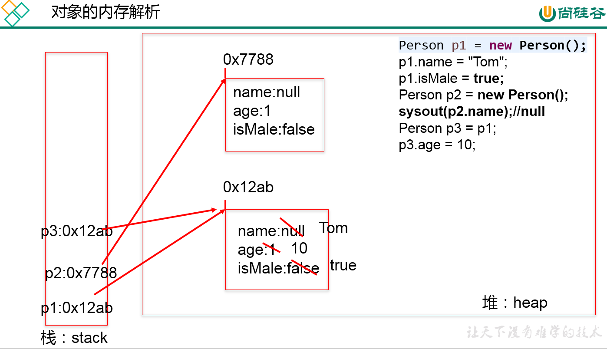

## 4.4 类的成员之一：属性(field)

### 类中属性的声明和使用

 **属性（成员变量）  vs   局部变量**

- 相同点：

1. 定义变量的格式：`数据类型 变量名 = 变量值;`

2. 先声明，后使用

3. 变量都有其对应的作用域

 

- 不同点

1. 在类中声明位置不同

   - 属性：直接定义在类的一对{}内

   - 局部变量：声明在方法内、方法形参、代码块内、构造器形参、构造器内部变量

2. 关于权限修饰符的不同

   - 属性：可以再声明属性时，指明其权限，使用权限修饰符

     - 常用的权限修饰符：private、public、缺省、protected  --->封装性

     - 目前，大家声明属性时，都是用缺省就可以了

   - 局部变量：不可以使用权限修饰符

3. 默认初始化值的情况

   - 属性：类的属性，根据其类型，都有默认初始化值。

     - 整型(byte、short、int、long)：0

     - 浮点型(float、double)：0.0
     - 字符型(char)：0（或'\u0000'）
     - 布尔型(boolean)：false
     - 引用数据类型(类、数组、接口)：null

   - 局部变量：没有默认初始化值。

     - 意味着，我们在调用局部变量之前，一定要显式赋值。
     - 特别地：形参在调用时，赋值即可

4. 在内存中加载的位置
   - 属性：加载到堆空间（非static）
   - 局部变量：加载到栈空间

 

## 4.5  类的成员之二：方法(method)

### 类中方法的声明和使用

方法：描述类应该具有的功能。

比如：Math类：sqrt()\random() \...

​           Scanner类：nextXxx() ...

​           Arrays类：sort() \ binarySearch() \ toString() \ equals() \ ...

1. 方法的声明：

   - 语法格式

     `权限修饰符 返回值类型 方法名(形参列表){`
     	`方法体`
     `}`

   - 注意：关键字static、final、abstract 来修饰的方法，后面再讲。

2. 关于权限修饰符：

   - 默认方法的权限修饰符先都使用public

   - Java规定的4种权限修饰符：private、public、缺省、protected -->封装性再细说

3. 返回值类型： 

   - 有返回值 vs 没有返回值

     - 如果方法有返回值，则必须在方法声明时，指定返回值的类型。同时，方法中需要使用return关键字来返回指定类型的变量或常量：`return 数据;`。

     - 如果方法没有返回值，则方法声明时，使用void来表示。通常，没有返回值的方法中就不需要使用return。但是，如果使用的话，只能`return;`表示结束此方法的意思。

   - 我们定义方法该不该有返回值？

     - 题目要求
     - 凭经验：具体问题具体分析

4. 方法名：属于标识符，遵循标识符的规则和规范，“见名知意”

5. 形参列表： 方法可以声明0个，1个，或多个形参。
   - 语法格式：`数据类型1 形参1,数据类型2 形参2,...`
   - 我们定义方法时，该不该定义形参？
     - 题目要求
     - 凭经验：具体问题具体分析

6. 方法体：方法功能的体现。         

7. return关键字的使用：

   - 使用范围：使用在方法体中

   - 作用：① 结束方法

     ​			②针对于有返回值类型的方法，使用`return 数据;`方法返回所要的数据。

   - 注意点：return关键字后面不可以声明执行语句。   

8. 方法的使用中，可以调用当前类的属性或方法
   - 特殊的：方法A中又调用了方法A——递归方法。
   - 方法中，不可以定义方法。

### JVM内存结构

代码运行过程

- 编译源程序以后，生成一个或多个字节码文件。（src目录中存放源代码，bin目录中存放字节码文件）

- 我们使用 JVM 中的类的加载器和解释器对生成的字节码文件进行解释运行。意味着，需要将字节码文件对应的类加载到内存中，涉及到内存解析（运行时）。


《 JVM 规范》

虚拟机栈，即为平时提到的栈结构。
我们将局部变量存储在栈结构中堆，我们将new出来的结构（比如：数组、对象）加载在堆空间中。补充：对象的属性（非static的）加载在堆空间中。

方法区：类的加载信息、常量池、静态域

### 对象数组的内存解析

```java
/*
 * 4. 对象数组题目：定义类Student，包含三个属性：
 * 学号number(int)，年级state(int)，成绩score(int)。
 * 创建20个学生对象，学号为1到20，年级和成绩都由随机数确定。
 * 问题一：打印出3年级(state值为3）的学生信息。
 * 问题二：使用冒泡排序按学生成绩排序，并遍历所有学生信息
 * 提示：  1) 生成随机数：Math.random()，返回值类型double;  
 * 		  2) 四舍五入取整：Math.round(double d)，返回值类型long。
 * 
 * 此代码是对StudentTest.java的改进，将操作数组的功能封装到方法中。
 */
public class StudentTest2 {
	public static void main(String[] args) {
		//声明一个Student类型的数组
		Student2[] stu = new Student2[20];
		
		for(int i = 0;i <stu.length;i++){
			//给数组元素赋值
			stu[i] = new Student2();
			//给Student的对象的属性赋值
			stu[i].number = i + 1;
			//年级:[1,6]
			stu[i].state = (int)(Math.random() * (6 - 1 + 1) + 1);
			//成绩:[0,100]
			stu[i].score = (int)(Math.random() * (100 - 0 + 1));
		}
		
		StudentTest2 test = new StudentTest2();
		
		//遍历学生数组
		test.print(stu);
		
		System.out.println("*********以下是问题1*********");
		
		//问题一：打印出3年级(state值为3）的学生信息。
		test.searchState(stu, 3);
		System.out.println("********以下是问题2**********");
		
		//问题二：使用冒泡排序按学生成绩排序，并遍历所有学生信息。
		test.sort(stu);
		
		//遍历学生数组
		for(int i = 0;i < stu.length;i++){
			System.out.println(stu[i].info());
		}
	}
	
	/**
	  * 
	  * @Description 遍历Student[]数组的操作
	 */
	public void print(Student2[] stu){
		for(int i = 0;i < stu.length;i++){	
			System.out.println(stu[i].info());
		}
	}
	
	/**
	  * 
	  * @Description 查找Student数组中指定年级的学习信息
	 */
	public void searchState(Student2[] stu,int state){
		for(int i = 0;i < stu.length;i++){
			if(stu[i].state == state){
				System.out.println(stu[i].info());
			}
		}
	}
	
	/**
	  * 
	  * @Description 给Student数组排序
	 */
	public void sort(Student2[] stu){
		for(int i = 0;i < stu.length - 1;i++){
			for(int j = 0;j <stu.length - 1 - i;j++){
				if(stu[j].score >stu[j+1].score){
					//如果需要换序，交换的是数组的元素，Student对象！！！
					Student2 temp = stu[j];
					stu[j] = stu[j+1];
					stu[j+1] = temp;
				}
			}
		}
	}
}
class Student2{
	int number;	//学号
	int state;	//年级
	int score;	//成绩
	
	//显示学生信息的方法
	public String info(){
		return "学号:" + number + ",年级:" + state + ",成绩:" + score;
	}
}
```


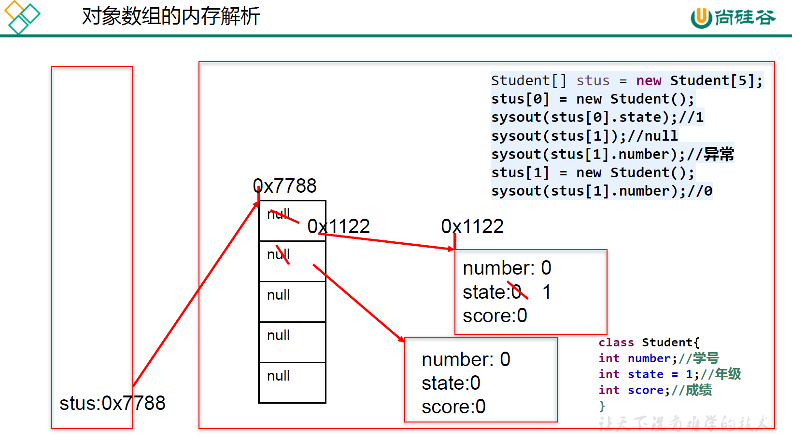

###  理解“万事万物皆对象”

1. 在 Java 语言范畴中，我们都将功能、结构等封装到类中，通过类的实例化，来调用具体的功能结构
   - Scanner,String等
   - 文件：File
   - 网络资源：URL

2. 涉及到 Java 语言与前端Html、后端的数据库交互时，前后端的结构在 Java 层面交互时，都体现为类、对象。

### 内存解析的说明

- 引用类型的变量，只可能存储两类值：null 或 地址值（含变量的类型）

### 匿名对象的使用

1. 理解：我们创建的对象，没有显式的赋给一个变量名，即为匿名对象 

2. 特征：匿名对象只能调用一次。

3. 使用：
   - 如果对一个对象只需要进行一次方法调用，那么就可以使用匿名对象。
   - 我们经常将匿名对象作为实参传递给一个方法调用。

```java
public class InstanceTest {
	public static void main(String[] args) {
		Phone p = new Phone();
//		p = null;
		System.out.println(p);
		
		p.sendEmail();
		p.playGame();
	//匿名对象
//	new Phone().sendEmail();
//	new Phone().playGame();
		
	new Phone().price = 1999;
	new Phone().showPrice();//0.0
		
	//**********************************
	PhoneMall mall = new PhoneMall();
//	mall.show(p);
	//匿名对象的使用
	mall.show(new Phone());
    }
}

class PhoneMall{
    
	public void show(Phone phone){
		phone.sendEmail();
		phone.playGame();
	}
}

class Phone{
	double price;	//价格
	
	public void sendEmail(){
		System.out.println("发邮件");
	}
	public void playGame(){
		System.out.println("打游戏");
	}
	public void showPrice(){
		System.out.println("手机价格为:" + price);
	}
}
```

### 自定义数组的工具类

1、**工具类**

```java
/*
 * 自定义数组工具类
 */
public class ArrayUtil{

	// 求数组的最大值
	public int getMax(int[] arr) {
		int maxValue = arr[0];
		for (int i = 1; i < arr.length; i++) {
			if (maxValue < arr[i]) {
				maxValue = arr[i];
			}
		}
		return maxValue;
	}

	// 求数组的最小值
	public int getMin(int[] arr) {
		int minValue = arr[0];
		for (int i = 1; i < arr.length; i++) {
			if (minValue > arr[i]) {
				minValue = arr[i];
			}
		}
		return minValue;
	}

	// 求数组总和
	public int getSum(int[] arr) {
		int sum = 0;
		for (int i = 0; i < arr.length; i++) {
			sum += arr[i];
		}
		return sum;
	}

	// 求数组平均值
	public int getAvg(int[] arr) {
		int avgValue = getSum(arr) / arr.length;
		return avgValue;
	}

	// 反转数组
	public void reverse(int[] arr) {
		for (int i = 0; i < arr.length / 2; i++) {
			int temp = arr[i];
			arr[i] = arr[arr.length - i - 1];
			arr[arr.length - i - 1] = temp;
		}
	}

	// 复制数组
	public int[] copy(int[] arr) {
		int[] arr1 = new int[arr.length];
		for (int i = 0; i < arr1.length; i++) {
			arr1[i] = arr[i];
		}
		return null;
	}

	// 数组排序
	public void sort(int[] arr) {
		for (int i = 0; i < arr.length - 1; i++) {
			for (int j = 0; j < arr.length - 1 - i; j++) {
				if (arr[j] > arr[j + 1]) {
					int temp = arr[j];
					arr[j] = arr[j + 1];
					arr[j + 1] = temp;
				}
			}
		}
	}

	// 遍历数组
	public void print(int[] arr) {
		System.out.print("[");
		for (int i = 0; i < arr.length; i++) {
			System.out.print(arr[i] + ",");
		}
		System.out.println("]");
	}

	// 查找指定元素
	public int getIndex(int[] arr, int dest) {
		//线性查找
		for (int i = 0; i < arr.length; i++) {
			if (dest==arr[i]) {
				return i;
			}
		}
		return -1;
	}
}
```

2、**测试类**

```java
/**
  * @Description 测试类
  *
 */
public class ArrayUtilTest {


	public static void main(String[] args) {
		ArrayUtil util = new ArrayUtil();
		int[] arr = new int[]{32,5,26,74,0,96,14,-98,25};
		int max = util.getMax(arr);
		System.out.println("最大值为:" + max);
		
//		System.out.print("排序前:");
//		util.print(arr);
//		
//		util.sort(arr);
//		System.out.print("排序后:");
//		util.print(arr);
		
		System.out.println("查找:");
		int index = util.getIndex(arr, 5);
		if(index > 0){
			System.out.println("找到了，索引地址:" + index);
		}else{
			System.out.println("没找到");
		}
	}
}

```

### 方法的重载(overload)

1. 重载的概念：在同一个类中，允许存在一个以上的同名方法，只要它们的参数列表不同（参数个数或者参数类型不同）即可。
2. 重载的特点——"两同一不同"
   - 同一个类，相同方法名。
   - 参数列表不同：参数个数不同，参数类型不同
3. 判断是否是重载？跟方法的权限修饰符、返回值类型、形参变量名、方法体都没有关系！
4. 在通过对象调用方法时，如何确定某一个指定的方法？
   - 先看方法名 ---> 再看参数列表
5. 方法重载的优先级
   1. 参数具有继承、实现关系，优先考虑子类；
   2. 在不考虑对基本类型自动装拆箱（auto-boxing，auto-unboxing），以及可变长参数的情况下选取重载方法；
   3. 如果在第 1 个阶段中没有找到适配的方法，那么在允许自动装拆箱，但不允许可变长参数的情况下选取重载方法；
   4. 如果在第 2 个阶段中没有找到适配的方法，那么在允许自动装拆箱以及可变长参数的情况下选取重载方法。
6. 举例：println/Arrays类中重载的sort() / binarySearch()

```java
1.判断：与void show(int a,char b,double c){}构成重载的有：
    
a)void show(int x,char y,double z){} // no
b)int show(int a,double c,char b){} // yes
c)void show(int a,double c,char b){} // yes
d)boolean show(int c,char b){} // yes
e)void show(double c){} // yes 
f)double show(int x,char y,double z){} // no
g)void shows(){double c} // no
```

### 可变个数形参的方法 

1. JavaSE 5.0 中提供了Varargs(variable number of arguments)机制，允许**直接定义能和多个实参相匹配的形参**。从而，可以用一种更简单的方式，来传递个数可变的实参。

2. 具体使用：

   - 可变个数形参的格式：`数据类型 ... 变量名`

   - 当调用可变个数形参的方法时，传入的参数个数可以是：0个,1个,2个,······

   - 可变个数形参的方法与本类中方法名相同，形参不同的方法之间构成重载。优先匹配确定类型的方法。

   - 可变个数形参的方法与本类中方法名相同，形参类型也相同的数组的方法之间不构成重载。换句话说，二者不能共存。

     JDK 5.0之前：采用数组形参定义方法，传入多个同一类型变量

     public static void test(int a,String[] books){}
   
     JDK 5.0：采用可变个数形参定义方法，传入多个同一类型变量
   
     public static void test(int a,String ... books){}
   
   - 可变个数形参在方法的形参中，必须声明在末尾。
   
   - 可变个数形参在方法的形参中,最多只能声明一个可变形参。

```java
public class MethodArgs {

	public static void main(String[] args) {
		MethodArgs test = new MethodArgs();
		test.show(12);
		// test.show("hell0");
		// test.show("hello","world");
		// test.show();
        //以前String[] strs写法参数传数组，现在String... strs写法参数传数组或用逗号分隔都可以，方法         //中想调用参数同样是使用数组（实质上参数就是传的数组）
		test.show(new String[] { "AA", "BB", "CC" });
	}

	public void show(int i) {

	}

	// public void show(String s){
	// System.out.println("show(String)");
	// }
	public void show(String... strs) {
		System.out.println("show(String ...strs)");
		for (int i = 0; i < strs.length; i++) {
			System.out.println(strs[i]);
		}
	}

	// 此方法与上一方法不可共存
	// public void show(String[] strs){
	//
	// }

	public void show(int i, String... strs) {

	}

	//The variable argument type String of the method show must be the last parameter
//	public void show(String... strs,int i,) {
//
//	}
}
```

### 方法的形参的传递机制：值传递

关于变量的赋值：

- 如果变量是基本数据类型，此时赋值的是变量所保存的数据值。
- 如果变量是引用数据类型，此时赋值的是变量所保存的数据的地址值。


Java 里方法的参数传递方式只有一种——值传递 。 

1. 形参：方法定义时，声明的小括号内的参数

   实参：方法调用时，实际传递给形参的数据

2. 值传递机制：

   如果参数是基本数据类型，此时实参赋给形参的是实参真实存储的数据值。

   如果参数是引用数据类型，此时实参赋给形参的是实参存储数据的地址值。

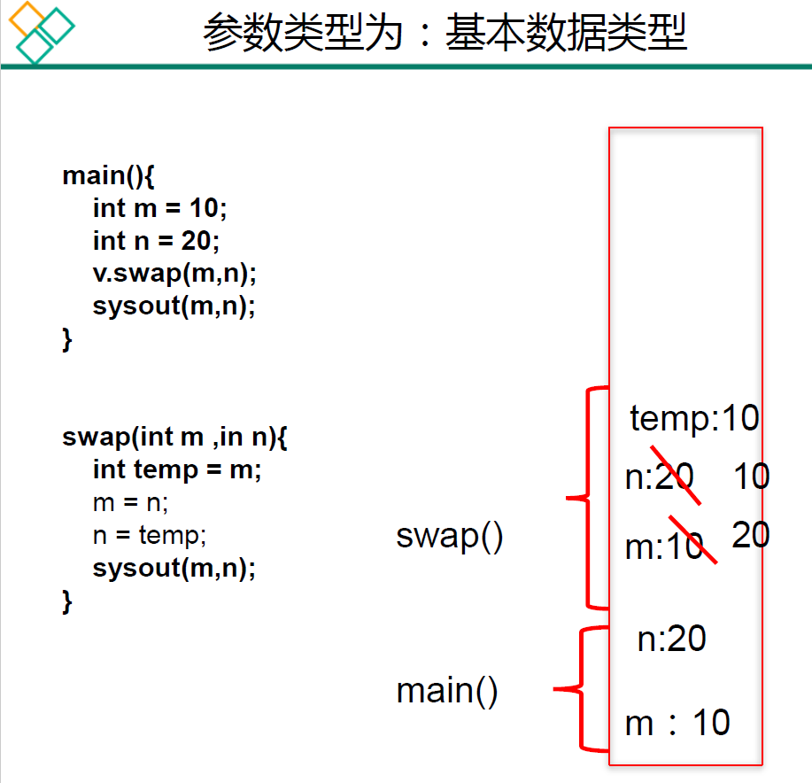

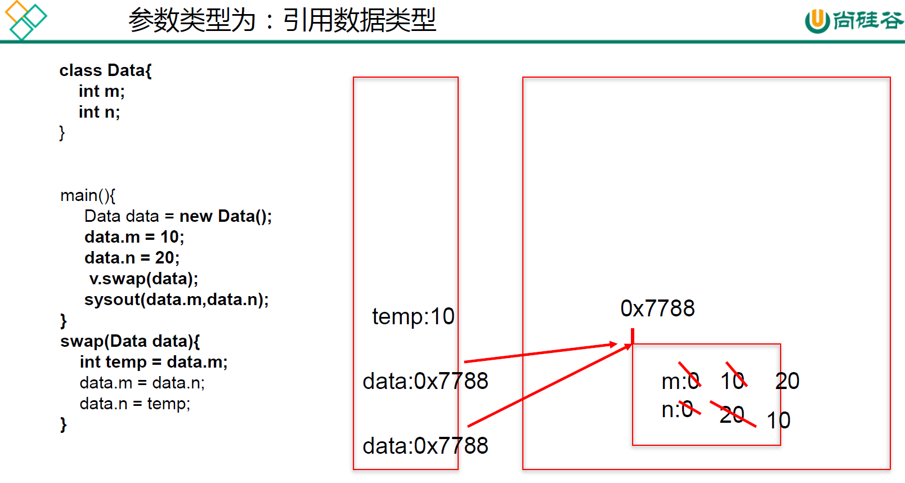

练习1

```java
public class TransferTest3{
	public static void main(String args[]){
		TransferTest3 test=new TransferTest3();
		test.first();
	}
	
	public void first(){
		int i=5;
		Value v=new Value();
		v.i=25;
		second(v,i);
		System.out.println(v.i);
	}
	
	public void second(Value v,int i){
		i=0;
		v.i=20;
		Value val=new Value();
		v=val;
		System.out.println(v.i+" "+i);
		
	}
}
class Value {
	int i= 15;
} 
```

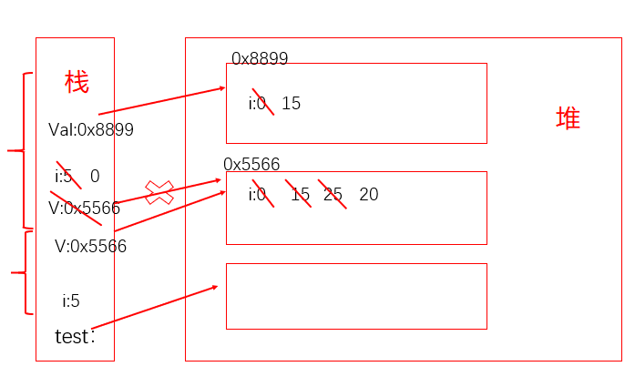

网红面试题2

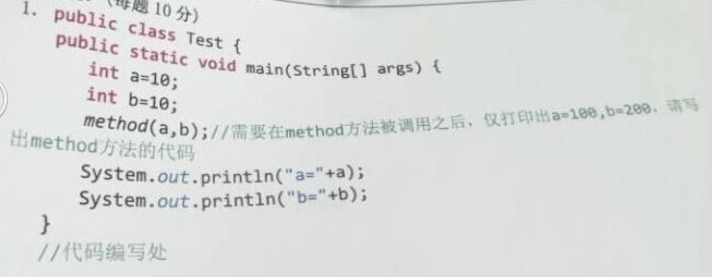

```java
法一：System.exit(0)终止程序
public static void method(int a,int b){
	a = a * 10;
	b = b * 20;
	System.out.println(a);
	System.out.println(b);
	System.exit(0);
}
法二：重写打印流
puclic static void method(int a,int b){
    printStream ps = new PrintStream(System.out){
        @Override
        public void println(String x){
            if("a=10".equals(x)){
                x = "a=100";
            }else if("b=10".equals(x)){
                x = "b=200";
            }
            super.println(x);
        }
    }
}
```

微软面试题：

```java
/*
 * 微软：
 * 定义一个int型的数组：int[] arr = new int[]{12,3,3,34,56,77,432};
 * 让数组的每个位置上的值去除以首位置的元素，得到的结果，作为该位置上的新值。遍历新的数组。 
 */
 
//错误写法
for(int i= 0;i < arr.length;i++){
	arr[i] = arr[i] / arr[0];
}

//正确写法1
for(int i = arr.length –1;i >= 0;i--){
	arr[i] = arr[i] / arr[0];
}

//正确写法2
int temp = arr[0];
for(int i= 0;i < arr.length;i++){
	arr[i] = arr[i] / temp;
}
```

练习

```java
/*
 * int[] arr = new int[10];
 * System.out.println(arr);//地址值?
 * 
 * char[] arr1 = new char[10];
 * System.out.println(arr1);//地址值?
 */
public class ArrayPrint {

	public static void main(String[] args) {
		int[] arr = new int[]{1,2,3};
        //调用void java.io.PrintStream.println(Object x)，返回地址值
		System.out.println(arr);//地址值
		
		char[] arr1 = new char[]{'a','b','c'};
        //调用void java.io.PrintStream.println(char[] x)，返回遍历数组
		System.out.println(arr1);//abc
	}
}
```

练习5：将对象作为参数传递给方法

> Circle类

```java
/*
 * 练习5：将对象作为参数传递给方法
 * (1)定义一个Circle类，包含一个double型的radius属性代表圆的半径，一个findArea()方法返回圆的面积。
 * 
 * (2)定义一个类PassObject，在类中定义一个方法printAreas()，该方法的定义如下：
 * public void printAreas(Circle c,int time)
 * 在printAreas方法中打印输出1到time之间的每个整数半径值，以及对应的面积。
 * 例如，times为5，则输出半径1，2，3，4，5，以及对应的圆面积。
 * 
 * (3)在main方法中调用printAreas()方法，调用完毕后输出当前半径值。
 *
 */
public class Circle {

	double radius;	//半径
	
	//返回圆的面积
	public double findArea(){
		return radius * radius * Math.PI;
	}
}
```

>  PassObject类

```java
public class PassObject {
	
	public static void main(String[] args) {
		PassObject test = new PassObject();
		
		Circle c = new Circle();
		
		test.printAreas(c, 5);
		
		System.out.println("no radius is:" + c.radius);
	}
	
	public void printAreas(Circle c,int time){
		
		System.out.println("Radius\t\tAreas");
		
		//设置圆的半径
		for(int i = 1;i <= time ;i++){
			c.radius = i;
			System.out.println(c.radius + "\t\t" + c.findArea());
		}
		
		//重新赋值
		c.radius = time + 1;
	}
}
```

### 递归(recursion)方法

递归方法的使用(了解) 

- 递归方法：一个方法体内调用它自身。

- 方法递归包含了一种隐式的循环，它会重复执行某段代码，但这种重复执行无须循环控制。

- 递归一定要向已知方向递归，否则这种递归就变成了无穷递归，类似于死循环。

```java
public class RecursionTest{
	public static void main(String[] args){
		
        //例1:计算1-100之间所有自然数的和
		//方法1:
		int sum = 0;
		for (int i = 1; i <= 100; i++){
			sum += i;
		}
		System.out.println("sum = " + sum);

		//方法2:
		RecursionTest test = new RecursionTest();
		int sum1 = test.getSum(100);
		System.out.println("sum1 = " + sum1);
	}

	//例1:计算1-n之间所有自然数的和
	public int getSum(int n){
		if(n == 1){
			return 1;
		} else {
			return n + getSum(n - 1);
		}
	}

	//例2:计算1-n之间所有自然数的乘积
	//归求阶乘(n!)的算法
	public int getSum1(int n){
		if(n == 1){
			return 1;
		}else{
			return n * getSum1(n - 1);
		}
	}
    
    //例3:已知有一个数列：f(0) = 1,f(1) = 4,f(n+2)=2*f(n+1) + f(n),
	//其中n是大于0的整数，求f(10)的值。
	public int f(int n){
		if(n == 0){
			return 1;
		}else if(n == 1){
			return 4;
		}else{
			return 2*f(n-1) + f(n-2);
		}
	}
    
    //例4:已知一个数列：f(20) = 1,f(21) = 4,f(n+2) = 2*f(n+1)+f(n),
	//其中n是大于0的整数，求f(10)的值。
	public int f1(int n){
		if(n == 20){
			return 1;
		}else if(n == 21){
			return 4;
		}else{
			return 2*f1(n-1) + f1(n-2);
		}
	}
 /*
 * 例5：斐波那契数列
 * 输入一个数据n，计算斐波那契数列(Fibonacci)的第n个值
 * 1  1  2  3  5  8  13  21  34  55
 * 规律：一个数等于前两个数之和
 * 要求：计算斐波那契数列(Fibonacci)的第n个值，并将整个数列打印出来
 * 
 */
    public int f(int n){
		if(n == 1 || n == 2){
			return 1;
		}else{//f(n) = f(n-1) + f(n-2)
			return f(n - 1) + f(n - 2);
		}
	}
    //例5：汉诺塔
    //例6：快排
}
```

## 4.6 面向对象特征之一：封装性

为什么要有封装？封装的作用和含义？

- 为什么需要封装？封装的作用和含义？
  - 我要用洗衣机，只需要按一下开关和洗涤模式就可以了。有必要了解洗衣机内部的结构吗？有必要碰电动机吗？
  - 我要开车，···

- 我们程序设计追求“高内聚，低耦合”。
  - 高内聚：类的内部数据操作细节自己完成，不允许外部干涉。
  - 低耦合：仅对外暴露少量的方法用于使用。

- 隐藏对象内部的复杂性，只对外公开简单的接口。便于外界调用，从而提高系统的可扩展性、可维护性 。通俗的说，**把该隐藏的隐藏起来，该暴露的暴露出来。这就是封装性的设计思想。**

3W:what? why? how?

What？

一、问题的引入：

当我们创建一个类的对象以后，我们可以通过`对象.属性`的方式，对对象的属性进行赋值。这里，赋值操作要受到属性的数据类型和存储范围的制约。除此之外，没有其他制约条件。但是，在实际问题中，我们往往需要给属性赋值加入额外的限制条件。这个条件难以在属性声明时体现，我们只能通过方法进行限制条件的添加(比如：setLegs())。同时，我们需要避免用户再使用`对象.属性`的方式对属性进行赋值。这时需要将属性声明为私有的(private)。此时，针对于属性就体现了封装性。

Why？

二、封装性的体现：

1. 我们将类的属性xxx私有化(private)，同时，提供公共的(public)方法来获取(getXxx)和设置(setXxx)此属性的值。

2. 不对外暴露的私有的方法

3. 单例模式

   ·············

How？  

三、封装性的实现，需要权限修饰符来配合。

1. Java规定的4种权限(从小到大排列)：private、缺省、protected 、public
2. 4种权限可以用来修饰类及类的内部结构
   - 4种权限都可以用来修饰类的内部结构(属性、方法、构造器、内部类。代码块不行)
   - 修饰类的话，只能使用：缺省、public
3. 总结封装性：Java提供了4种权限修饰符来修饰类及类的内部结构，体现类及类的内部结构在被调用时的可见性的大小。

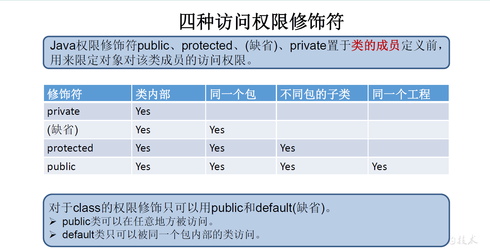

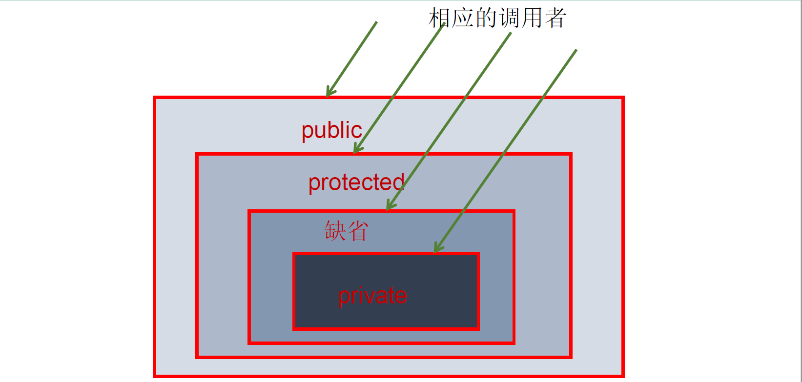


## 4.7 类的成员之三：构造器(或构造方法)(constructor)

一、构造器的作用

- 创建类的对象
  - 语法格式：`new 构造器();//无参或有参数列表`

- 初始化对象

二、定义构造器的语法格式

`权限修饰符 类名(形参列表){`

​		`初始化语句；`

`}`

三、构造器的特征

- 构造器名必须与它所在的类名相同
- 构造器没有返回值，不需要声明返回值类型（与声明为void不同）。
- 修饰符只能是权限修饰符，不能被关键字static、final、synchronized、abstract、native修饰，不能有return语句返回值。

四、根据参数不同，构造器可以分为如下两类：

- 隐式无参构造器(系统默认提供)
- 显式定义一个或多个构造器(无参、有参)

五、说明：

- Java语言中，每个类都至少有一个构造器。
- 如果没有显式定义的类的构造器的话，系统会默认提供一个空参的构造器。
  一旦我们显式地定义了类的构造器之后，系统就不再提供默认的空参构造器。

- 默认构造器的权限修饰符与所属类的权限修饰符一致。
- 一个类中定义的多个构造器，彼此构成重载。
- 父类的构造器不可被子类继承。


## 4.8 属性赋值的先后顺序

① 默认初始化

② 显式初始化

③ 构造器初始化

④ 通过`对象.属性`或`对象.方法`的方式赋值

以上操作的先后顺序：① - ② - ③ - ④ 

 

## 4.9 拓展知识：JavaBean

- JavaBean 是一种 Java 语言写成的可重用组件。

- 所谓 JavaBean ，是指符合如下标准的 Java 类：

  - 类是公共的

  - 有一个无参的公共的构造器

  - 有属性，且有对应的 get()、set() 方法

- 用户可以使用 JavaBean将功能、处理、值、数据库访问和其他任何可以用 Java 代码创造的对象进行打包，并且其他的开发者可以通过内部的JSP页面、Servlet 、其他JavaBean 、 applet 程序或者应用来使用这些对象。用户可以认为 JavaBean 提供了一种随时随地的复制和粘贴的功能，而不用关心任何改变。

## 4.10 UML类图

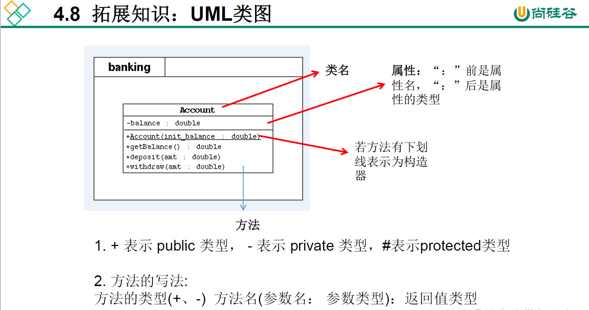

属性的写法：

`权限修饰符 属性名：属性的类型`

方法的写法：

`权限修饰符 方法名(参数名：参数类型)：返回值类型`

## 4.11 关键字：this

this关键字的使用：

1. this可以用来(修饰)调用：属性、方法、构造器

2. this调用属性和方法

   this理解为：**当前对象或当前正在创建的对象**

   - 在类的方法中，我们可以使用`this.属性`和`this.方法`的方式，调用**当前对象**的属性和方法。但是在通常情况下，我们习惯省略`this.`。
     - 特殊情况下，如果方法的形参和类的属性同名时，我们必须显式地使用`this.属性`的方式，表明此变量是属性，而非形参。
   - 在类的构造器中，我们可以使用`this.属性`和`this.方法`的方式，调用**当前正在创建的对象**的属性和方法。但是在通常情况下，我们都选择省略`this.`。
     - 特殊情况下，如果构造器的形参和类的属性同名时，我们必须显式地使用`this.属性`的方式，表明此变量是属性，而非形参。
   - 使用 this 调用属性和方法时，如果在本类中未找到，会从父类中查找。

3. this调用构造器
   - 在类的构造器中，我们可以显式地使用`this(参数列表);`方式，调用本类中指定的其它构造器（要注意这个过程中只创建了一个对象）。
   - 构造器中不能通过`this(参数列表);`方式调用自己
   - 如果一个类中有 n 个构造器，则最多有 n - 1个构造器中使用了`this(形参列表);`
   - 规定：`this(形参列表);`必须声明在当前构造器的首行
   - 构造器内部，最多只能声明一个`this(形参列表);`用来调用其它的构造器

 

## 4.12 关键字：package 、import

一、package关键字的使用

1. 为了更好的实现项目中类的管理，提供包的概念。
2. package 语句作为 Java 源文件的第一条语句，指明该文件中定义的类/接口所在的包。若缺省该语句，则指定为无名包 。它的语法格式为：
   `package.顶层包名.子包名;`
3. 包属于标识符，遵循标识符的命名规则、规范(xxxyyyzzz)、“见名知意”。
4. 包对应于文件系统的目录， package 语句中，用"."来指明包目录的层次。包通常用小写单词标识。通常使用所在公司域名的倒置： com.atguigu.xxx

 补充：同一个包下，不能命名同名的接口、类。
			不同的包下，可以命名同名的接口、类。

原因：①不知道用的哪一个类

​			②windows下不允许


二、JDK中主要的包介绍

| 包名      | 介绍                                                         |
| :-------- | :----------------------------------------------------------- |
| java.lang | 包含一些 Java 语言的核心类，如 String 、Math 、Integer 、System 和Thread 提供常用功能。 |
| java.net  | 包含执行与网络相关的操作的类和接口。                         |
| java.io   | 包含能提供多种输入/输出功能的类。                            |
| java.util | 包含一些实用工具类，如定义系统特性、接口的集合框架类、使用与日期日历相关的函数。 |
| java.text | 包含了一些 java 格式化相关的类。                             |
| java.sql  | 包含了 java 进行 JDBC 数据库编程的相关类/接口                |
| java.awt  | 包含了构成抽象窗口工具集(abstract window toolkits)的多个类,这些类被用来构建和管理应用程序的图形用户界面(GUI)。 B/S C/S |

三、MVC 设计模式

MVC 是常用的设计模式之一，将整个程序分为三个层次：**视图模型层，控制器层，数据模型层**。这种将程序输入输出、数据处理，以及数据的展示分离开来的设计模式使程序结构变的灵活而且清晰，同时也描述了程序各个对象间的通信方式，降低了程序的耦合性。

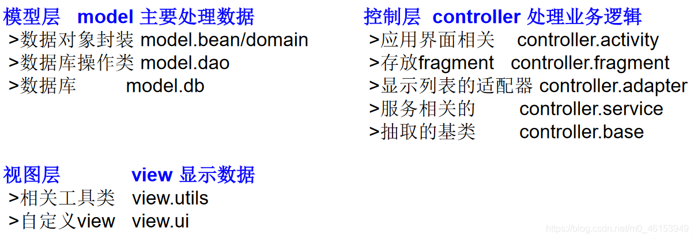


四、import关键字的使用

 import:导入

1. 在源文件中显式地使用import结构导入指定包下的类、接口。它的语法格式为：

   `import xxx.xxx.类名;`

2. import结构声明在包的声明和类的声明之间

3. 如果需要导入多个结构，则并列写出即可

4. 可以使用`import xxx.xxx.*;`的方式，表示导入xxx包下的所有结构。

5. 如果使用的类或接口是java.lang包下定义的(核心包)，则可以省略import结构。

6. 如果使用的类或接口是本包下定义的，则可以省略import结构。

7. 如果在源文件中，使用了不同包下的同名的类，则必须至少有一个类需要以全类名的方式显示。即`xxx.xxx.类名`

8. 使用`import xxx.xxx.*;`方式表明可以调用xxx包下的所有结构。但是如果使用的是xxx子包下的结构，则仍需要显式导入

9. `import static xxx;`表示导入指定类或接口中的静态结构(属性或方法)。 

 

