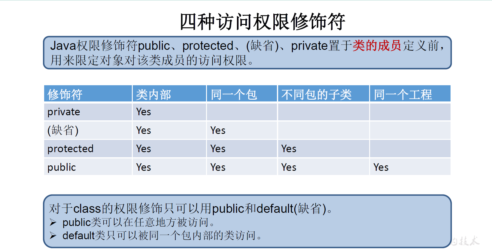
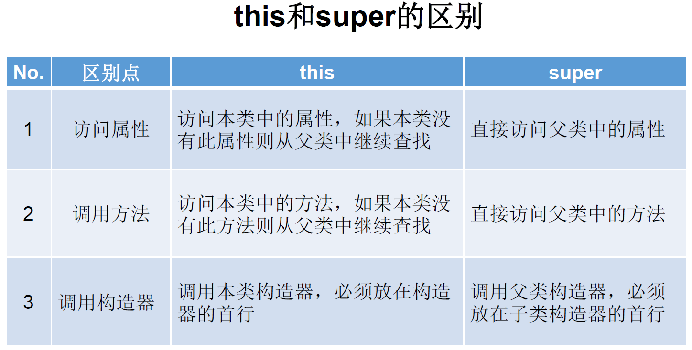
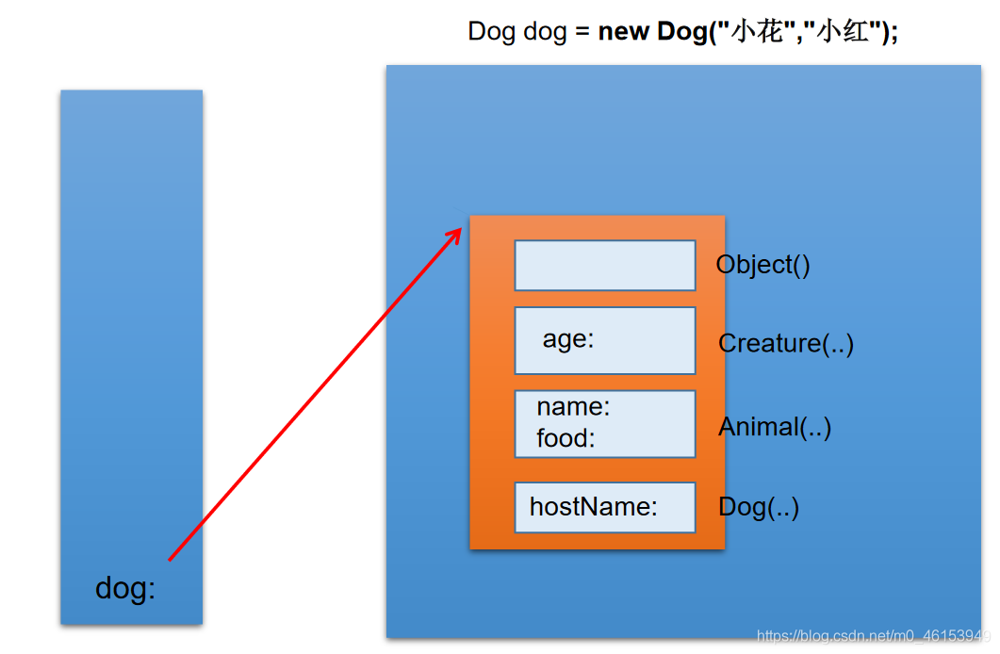
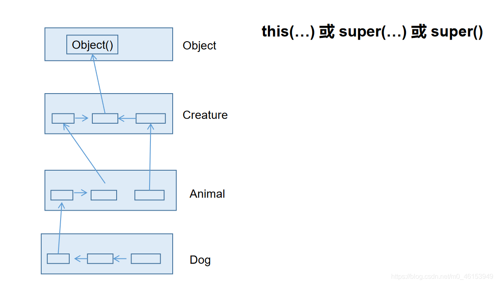
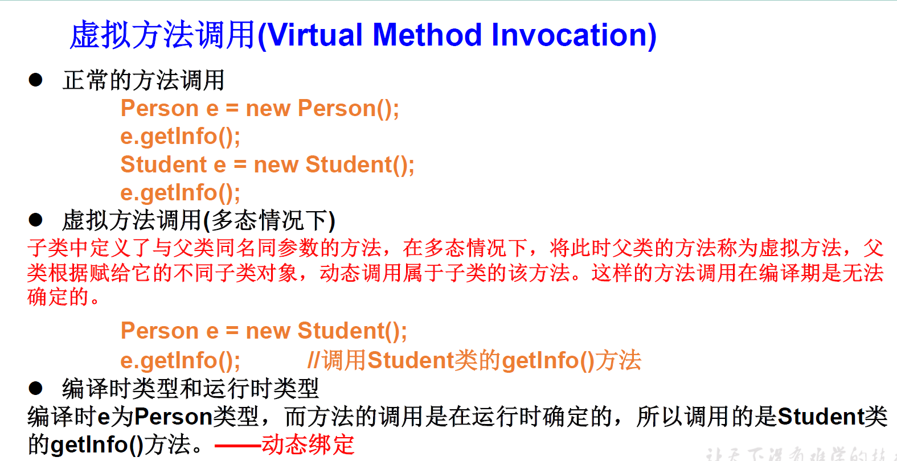
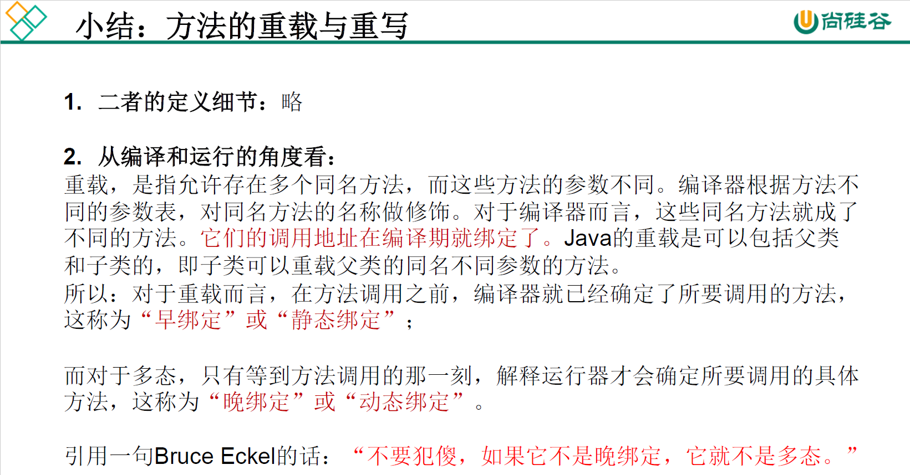
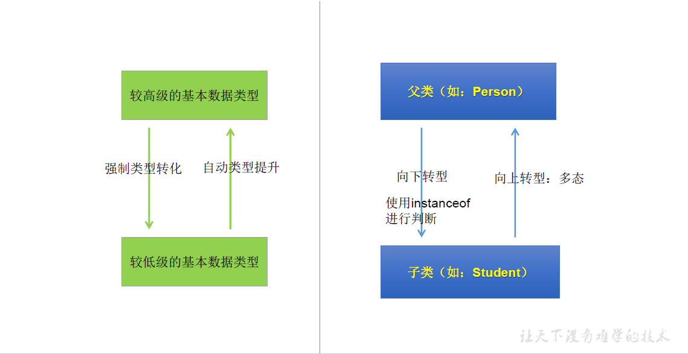
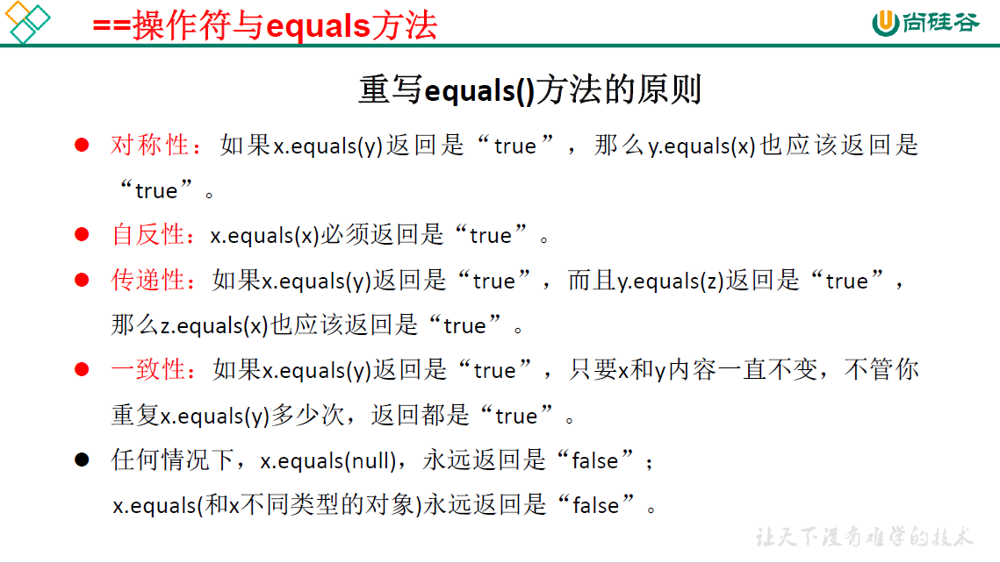
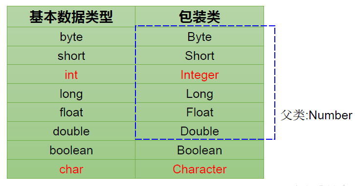
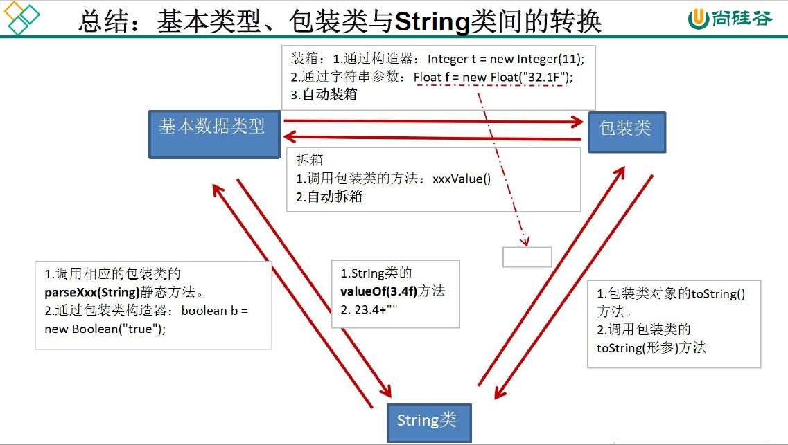

## 5.1 面向对象特征之二：继承性

为什么要有继承？

- 多个类中存在相同的属性和方法时，将这些内容抽取到单独一个类中，那么多个类无需再定义这些属性和方法，只要继承那个类即可。

一、继承性的好处：

 ① 减少了代码的冗余，提高了代码的复用性

 ② 便于功能的扩展

 ③ 为之后多态性的使用，提供了前提

二、继承性的实现： 

- 语法格式：
  
  `修饰符 class A extends B{`
  
  `}`
  
  A:子类、派生类、subclass
  
  B:父类、超类、基类、superclass
  
  可以理解为“**子类 is a 父类**” 

- 说明
  
  - 一旦子类A继承父类B以后，子类A中就获取了父类B中声明的所有的属性和方法。
    - 特别地，父类中声明为private的属性或方法，子类继承父类以后，仍然认为获取了父类中私有的结构。只是因为封装性的影响，使得子类不能直接调用父类的结构而已。
  - 子类继承父类以后，还可以声明自己特有的属性或方法以实现功能的拓展。(extends：延展、扩展)

三、Java中关于继承性的规定：

1. Java只支持单继承和多层继承，不允许多重继承（一个子类有多个父类）
   - 单继承性：一个类只能有一个父类
   - 多层继承：一个父类可以派生出多个子类
2. 子父类是相对的概念。
   子类直接继承的父类，称为直接父类。间接继承的父类称为间接父类。
   子类继承父类以后，就获取了直接父类以及所有间接父类中声明的属性和方法。
3. 如果我们没有显式地声明一个类的父类的话，则此类继承于 java.lang.Object 类。
   所有的 java 类（除 java.lang.Object 类之外）都直接或间接的继承于java.lang.Object类。
   这意味着，所有的java类具有java.lang.Object类声明的功能。

## 5.2 方法的重写(override/overwrite）

1. 定义：子类继承父类以后，在子类中可以根据需要对从父类中继承来的方法进行改造，即方法的重写，也称为方法的重置、覆盖。重写之后，创建子类对象，并通过子类对象调用从父类中继承来的方法时，实际执行的是子类重写的方法。 

2. 重写的规则
   
   方法的声明：
   
   `权限修饰符 返回值类型 方法名(形参列表) throws 异常的类型{`
   
   ​               `方法体`
   
   `}`
   
   - 约定俗成：子类中的叫重写的方法，父类中的叫被重写的方法。
   
   - 方法名(形参列表)：
     
     - 子类重写的方法的方法名和形参列表与父类被重写的方法的方法名和形参列表相同。
   
   - 权限修饰符：
     
     - 子类重写的方法的权限修饰符不小于父类被重写的方法的权限修饰符。
     - 特殊情况：子类不能重写父类中声明为private权限的方法。
       原因：看不到父类中的private方法，此时不认为是方法的重写，子类对象调用的仍是父类中的private方法。
   
   - 返回值类型：
     
     - 父类被重写的方法的返回值类型是void，则子类重写的方法的返回值类型只能是void。
     
     - 父类被重写的方法的返回值类型是基本数据类型(比如double类型)，则子类重写的方法的返回值类型必须是相同的基本数据类型(必须也是double类型)。
     
     - 父类被重写的方法的返回值类型是A类型，则子类重写的方法的返回值类型可以是A类或A类的子类。
   
   - 异常的类型：
     
     - 子类重写的方法抛出的异常类型不大于父类被重写的方法抛出的异常类型（具体放到异常处理时候讲） 
   
   - 子类和父类中的同名同参数的方法要么都声明为非static的（考虑重写），要么都声明为static的（不是重写）。    

面试题：

区分方法的重载与重写？

答：方法的重写(Overriding)和重载(Overloading)是Java多态性的不同表现。

* 重写(Overriding)是父类与子类之间多态性的一种表现，重载(Overloading)是一个类中多态性的一种表现。
* 如果在子类中定义某方法与其父类有相同的名称和参数，我们说该方法被重写(Overriding)。
* 子类的对象使用这个方法时，将调用子类中的定义，对它而言，父类中的定义如同被"屏蔽"了。
* 如果在一个类中定义了多个同名的方法，它们或有不同的参数个数或有不同的参数类型，则称为方法的重载(Overloading)。

## 5.3 四种访问权限修饰符



体会四种不同的权限修饰符

> Order类

```java
package com.atguigu.java;
/*
 * 类内部
 */
public class Order {

    private int orderPrivate;
    int orderDefault;
    protected int orderProtected;
    public int orderPublic;

    private void methodPrivate(){
        orderPrivate = 1;
        orderDefault = 2;
        orderProtected = 3;
        orderPublic = 4;
    }

    void methodDefault(){
        orderPrivate = 1;
        orderDefault = 2;
        orderProtected = 3;
        orderPublic = 4;
    }

    protected void methodProtected(){
        orderPrivate = 1;
        orderDefault = 2;
        orderProtected = 3;
        orderPublic = 4;
    }

    public void methodPublic(){
        orderPrivate = 1;
        orderDefault = 2;
        orderProtected = 3;
        orderPublic = 4;
    }
}
```

> Ordertest类

```java
package com.atguigu.java;
/*
 * 同一个包
 */
public class OrderTest {
    public static void main(String[] args) {

        Order order = new Order();

        order.orderDefault = 1;
        order.orderProtected = 2;
        order.orderPublic = 3;

        order.methodDefault();
        order.methodProtected();
        order.methodPublic();

        //同一个包中的其它类，不可以调用Order类中私有的属性
//        order.orderPrivate = 4;    
//        order.methoPrivate();
    }
}
```

> SubOrder类

```java
package com.atguigu.java1;
/*
 * 不同包的子类
 */
import com.atguigu.java.Order;

public class SubOrder extends Order {

    public void method(){
        orderProtected = 1;
        orderPublic = 2;

        methodProtected();
        methodPublic();

        //在不同包的子类中，不能调用Order类中声明为private和缺省的权限的属性、方法
//        orderDefault = 3;
//        orderPrivate = 4;
//        
//        methodDefault();
//        methodPrivate();
    }
}
```

> OrderTest类

```java
package com.atguigu.java1;
/*
 * t
 */
import com.atguigu.java1.Order;

public class OrderTest {
    public static void main(String[] args) {

        Order order = new Order();
        order.orderPublic = 1;
        order.methodPublic();

        //不同包下的普通类(非子类)要使用Order类，不可以调用声明为private、缺省、           //protected权限的属性、方法。
//        order.orderPrivate = 2;
//        order.orderProtected = 3;
//        order.orderProtected = 4;
//        
//        order.methodPrivate();
//        order.methodDefault();
//        order.methodProtected();

    }

    public void show(Order order){
        order.orderPublic = 1;
        order.methodPublic();

        //不同包下的普通类(非子类)要使用Order类，不可以调用声明为private、缺省、           //protected权限的属性、方法。
//        order.orderPrivate = 2;
//        order.orderProtected = 3;
//        order.orderProtected = 4;
//        
//        order.methodPrivate();
//        order.methodDefault();
//        order.methodProtected();
    }
}
```

## 5.4 关键字：super

super关键字的使用

1. super理解为：**当前对象或当前正在创建的对象的父类**
2. super可以用来(修饰)调用：属性、方法、构造器
3. super调用属性和方法
   - 在子类的方法或构造器中，我们可以使用`super.属性`和`super.方法`的方式，调用**当前对象或当前正在创建的对象父类**中声明的属性和方法。但是在通常情况下，我们习惯省略`super.`。
     - 特殊情况：如果子类和父类中定义了同名的属性时，我们要想在子类中调用父类中声明的属性，则必须显式地使用`super.属性`的方式，表明调用的是父类中声明的属性。
     - 特殊情况：如果子类重写了父类中的方法以后，我们想在子类的方法中调用父类中被重写的方法时，则必须显式地使用`super.方法`的方式， 表明调用的是父类中被重写的方法。
4. super调用构造器
   - 在子类的构造器中，我们可以显式地使用`super(形参列表);`的方式，调用父类中声明的指定的构造器
   - 规定：`super(形参列表);`的使用，必须声明在子类构造器的首行！
   - 在类的构造器中，针对于`this(形参列表);`或`super(形参列表);`只能二选一，不能同时出现！
   - 在构造器的首行，没有显式地声明`this(形参列表);`或`super(形参列表);`，则默认调用的是父类中空参的构造器`super();`
   - 在类的多个构造器中，至少有一个类的构造器中使用了`super(形参列表);`，调用父类中的构造器



## 5.5 子类对象实例化过程





1. 从结果上来看：（继承性）
   
   子类继承父类以后，就获取了父类中声明的属性或方法。创建子类的对象，在堆空间中，就会加载所有父类中声明的属性。

2. 从过程上来看：
   
   当我们通过子类的构造器创建子类对象时，我们一定会直接或间接的调用其父类的构造器，进而调用父类的父类的构造器，·····直到调用了java.lang.Object类中空参的构造器为止。正因为加载过所有的父类的结构，所以才可以看到内存中有父类中的结构，子类对象才可以考虑进行调用。

明确：虽然创建子类对象时，调用了父类的构造器，但是自始至终就创建过一个对象，即为new的子类对象。

## 5.6 面向对象特征之三：多态性(Polymorphism)

1. 多态性的概念：可以理解为一个事物的多种形态。

2. Java中的多态性：
   
   **对象的多态性**：父类的引用指向子类的对象(或子类的对象赋给父类的引用)。即在Java中子类的对象可以替代父类的对象使用。
   
   说明：  
   
   - Java 引用类型变量有两个类型：编译时类型和运行时类型。编译时类型由声明该变量时使用的类型决定，运行时类型由实际赋给该变量的对象决定。(编译，看左边;运行，看右边)
   - 若编译时类型和运行时类型不一致就出现了对象的多态性。
   - 子类可看做是特殊的父类，所以父类类型的引用可以指向子类的对象，即**向上转型**（upcasting）。
   
   **对象的多态性，只适用于方法，不适用于属性**。
   
   说明：
   
   - Java 基本数据类型变量只能有一种确定的数据类型。(编译和运行都看左边)
   
   **多态是运行时行为，而不是编译时行为**

3. 多态性的使用：
   
   **虚拟方法调用(Virtual Method Invocation)**
   
   有了对象的多态性以后，我们在编译期，只能调用父类中声明的方法，但在运行期，我们实际执行的是子类重写父类的方法。
   
   总结：
   
   - 编译，看左边；运行，看右边。
   - 该变量可以调用父类中声明的属性和方法，不能调用子类特有的属性和方法

4. 多态性的使用前提：①类的继承关系 ②方法的重写



多态性举例

```java
/*
 * 多态性应用举例
 */
//举例一：
public class AnimalTest {

    public static void main(String[] args) {
        AnimalTest test = new AnimalTest();
        test.func(new Dog());

        test.func(new Cat());
    }

    public void func(Animal animal){    //Animal animal = new Dog();
        animal.eat();
        animal.shout();
    }

    //如果没有多态性，就会写很多如下的方法，去调用
    public void func(Dog dog){
        dog.eat();
        dog.shout();
    }

    public void func(Cat cat){
        cat.eat();
        cat.shout();
    }
}

class Animal{

    public void eat(){
        System.out.println("动物，进食");
    }

    public void shout(){
        System.out.println("动物：叫");
    }
}

class Dog extends Animal{
    public void eat(){
        System.out.println("狗吃骨头");
    }

    public void shout() {
        System.out.println("汪！汪！汪！");
    }
}

class Cat extends Animal{
    public void eat(){
        System.out.println("猫吃鱼");
    }

    public void shout() {
        System.out.println("喵！喵！喵！");
    }
}
//举例二：
class Order{
    //方法的通用性很好，参数想放谁都行。没有多态性就要写很多方法
    public void method(Object obj){

    }
}
```

面试题：多态性是编译时行为还是运行时行为？怎么证明？

```java
import java.util.Random;
//证明如下：
class Animal  {

    protected void eat() {
        System.out.println("animal eat food");
    }
}

class Cat  extends Animal  {

    protected void eat() {
        System.out.println("cat eat fish");
    }
}

class Dog  extends Animal  {

    public void eat() {
        System.out.println("Dog eat bone");

    }

}

class Sheep  extends Animal  {

    public void eat() {
        System.out.println("Sheep eat grass");

    }

}

public class InterviewTest {

    public static Animal  getInstance(int key) {
        switch (key) {
        case 0:
            return new Cat ();
        case 1:
            return new Dog ();
        default:
            return new Sheep ();
        }

    }

    public static void main(String[] args) {
        int key = new Random().nextInt(3);

        System.out.println(key);

        Animal  animal = getInstance(key);//运行时才知道new的是谁

        animal.eat();

    }

}
```

多态性练习

```java
/*
 * 练习:子类继承父类
 * 
 * 1.若子类重写了父类方法，就意味着子类里定义的方法彻底覆盖了父类里的同名方法，
 * 系统将不可能把父类里的方法转移到子类中。
 * 
 * 2.对于实例变量则不存在这样的现象，即使子类里定义了与父类完全相同的实例变量，
 * 这个实例变量依然不可能覆盖父类中定义的实例变量
 * 
 */
public class FieldMethodTest {
    public static void main(String[] args){
        Sub s= new Sub();
        System.out.println(s.count);    //20
        s.display();//20

        Base b = s;
        //==:对于引用数据类型来讲，比较的是两个引用数据类型变量的地址值是否一样。
        System.out.println(b == s);    //true
        System.out.println(b.count);    //10
        b.display();
    }
}

class Base {
    int count= 10;
    public void display() {
        System.out.println(this.count);
    }
}

class Sub extends Base {
    int count= 20;
    public void display() {
        System.out.println(this.count);
    }
}
```

方法的重载与重写的区别？



### 向下转型

有了对象的多态性以后，内存中实际上是加载了子类特有的属性和方法的，但是由于变量声明为父类类型，导致编译时，只能调用父类中声明的属性和方法，而子类特有的属性和方法不能调用。
如何才能调用子类特有的属性和方法？向下转型：使用强制类型转换符。




无继承关系的引用类型间的转换是非法的，使用强转时，会出现ClassCastException的异常。为了避免在向下转型时出现ClassCastException的异常，我们在向下转型之前，先进行 instanceof 的判断，一旦返回true，就进行向下转型。如果返回false，不进行向下转型。

### instanceof 关键字的使用

| 关键字            | 作用                                 |
| -------------- | ---------------------------------- |
| a instanceof A | 判断对象a是否是类A的实例。是，返回true；不是，返回false。 |

如果`a instanceof A`返回true，则`a instanceof B`也返回true。其中，类B是类A的父类。

```JAVA
//向下转型的常见问题
        //练习
        //问题1:编译时通过，运行时不通过
        //举例一
//        Person p3 = new Woman();
//        Man m3 = (Man)p3;

        //举例二
//        Person p4 = new Person();
//        Man m4 = (Man)p4;

        //问题二:编译通过，运行时也通过
        Object obj = new Woman();
        Person p = (Person)obj;

        //问题三:编译不通过
//        Man m5 = new woman();

//        String str = new Date();
        //编译时通过，运行时不通过
//        Object o = new Date();
//        String str1 = (String)o;
```

多态性的练习

```java
public class InterviewTest1 {

    public static void main(String[] args) {
        Base base = new Sub();
        base.add(1, 2, 3);

//        Sub s = (Sub)base;
//        s.add(1,2,3);
    }
}

class Base {
    public void add(int a, int... arr) {
        System.out.println("base");
    }
}

class Sub extends Base {

    public void add(int a, int[] arr) {
        System.out.println("sub_1");
    }

//    public void add(int a, int b, int c) {
//        System.out.println("sub_2");
//    }

}
```

## 5.7 Object 类

java.lang.Object类

1. Object类是所有Java类的根父类

2. 如果在类的声明中未使用extends关键字指明其父类，则默认父类为java.lang.Object类

3. Object类中的功能(属性、方法)就具有通用性。

4. Object类只声明了一个空参的构造器
   
   Object类

属性：无

构造器：Object()

方法：clone()/equals() / toString() / getClass() /hashCode() / clone() / finalize() /wait() 、notify()、notifyAll()

面试题：

final、finally、finalize的区别？

Object类中equal()方法的使用

== 与 equals()的使用

```java
import java.sql.Date;

public class EqualsTest {
    public static void main(String[] args) {

        //基本数据类型
        int i = 10;
        int j = 10;
        double d = 10.0;
        System.out.println(i == j);    //true
        System.out.println(i == d); //true

//        boolean b =true;
//        System.out.println(i == b);

        char c = 10;
        System.out.println(i == c); //true

        char c1 = 'A';
        char c2 = 65;
        System.out.println(c1 == c2); //true

        //引用数据类型
        Customer cust1 = new Customer("Tom" ,21);
        Customer cust2 = new Customer("Tom" ,21);
        System.out.println(cust1 == cust2); //false

        String str1 = new String("BAT");
        String str2 = new String("BAT");
        System.out.println(str1 == str2); //false
        System.out.println("*************************");
        System.out.println(cust1.equals(cust2));//false，重写后为true
        System.out.println(str1.equals(str2));//true

        Date date1 = new Date(23432525324L);
        Date date2 = new Date(23432525324L);
        System.out.println(date1.equals(date2));//true
    }
}
```

### == 和 equals()方法

一、回顾 == 的使用：

 == ：运算符

1. 可以使用在基本数据类型变量和引用数据类型变量中

2. 如果比较的是基本数据类型变量：比较两个变量保存的数据是否相等。（不一定类型要相同，自动类型提升）
   
   如果比较的是引用数据类型变量：比较两个对象的地址值是否相同，即两个引用是否指向同一个对象实体。
   
   补充： == 符号使用时，必须保证符号左右两边的变量类型一致。（能统一在一起，尤其注意string和boolean类型）
   
   二、equals()方法的使用：

3. 是一个方法，而非运算符

4. 只能适用于引用数据类型变量

5. Object类中equals()的定义：
   
   `public boolean equals(Object obj) {`

​            `return (this == obj);`

​      `}`

   说明：Object类中定义的equals()和==的作用是相同的：比较两个对象的地址值是否相同.即两个引用是否指向同一个对象实体

4. 像String、Date、File、包装类等都重写了Object类中的equals()方法。重写以后，比较的不是两个引用的地址是否相同，而是比较两个对象的"实体内容"是否相同。

5. 通常情况下，我们自定义的类如果使用equals()的话，也通常是比较两个对象的"实体内容"是否相同。那么，我们就需要对Object类中的equals()进行重写。
   
   重写的原则：比较两个对象的实体内容是否相同。

### 重写equals()方法

手动实现、自动生成

```java
public class Customer {

    private String name;
    private int age;
    public String getName() {
        return name;
    }
    public void setName(String name) {
        this.name = name;
    }
    public int getAge() {
        return age;
    }
    public void setAge(int age) {
        this.age = age;
    }
    public Customer() {
        super();
    }
    public Customer(String name, int age) {
        super();
        this.name = name;
        this.age = age;
    }


    //自动生成的equals()
    @Override
    public boolean equals(Object obj) {
        if (this == obj)
            return true;
        if (obj == null)
            return false;
        if (getClass() != obj.getClass())
            return false;
        Customer other = (Customer) obj;
        if (age != other.age)
            return false;
        if (name == null) {
            if (other.name != null)
                return false;
        } else if (!name.equals(other.name))
            return false;
        return true;
    }

    //重写原则，比较两个对象的实体内容(即name和age)是否相同
    //手动实现equals()的重写
//    @Override
//    public boolean equals(Object obj) {
//        
        System.out.println("Customer equals()....");
//        if(this == obj){
//            return true;
//        }
//        
//        if(obj instanceof Customer){
            //Object类型的变量不向下转型就调不了Customer类型中特有的属性
//          Customer cust = (Customer)obj;
//            //比较两个对象的属性是否都相同
            if(this.age == cust.age && this.name.equals(cust.name)){
                return true;
            }else{
                return false;
            }
//            
//            //或
//            return this.age == cust.age && this.name.equals(cust.name);
//        }
//        
//        return false;
//    }

}
```

练习

```java
    int it = 65;
    float fl= 65.0f;
    System.out.println("65和65.0f是否相等？" + (it == fl)); //true
    char ch1 = 'A'; 
    char ch2 = 12;
    System.out.println("65和'A'是否相等？" + (it == ch1));//true
    System.out.println("12和ch2是否相等？" + (12 == ch2));//true 
    String str1 = new String("hello");
    String str2 = new String("hello");
    System.out.println("str1和str2是否相等？"+ (str1 == str2));//false
    System.out.println("str1是否equals str2？"+(str1.equals(str2)));//true
    System.out.println("hello" == new java.util.Date()); //编译不通过
```

### 重写equals()方法的原则



### 面试题： == 和 equals() 区别

> 1.== 既可以比较基本类型也可以比较引用类型。对于基本类型就是比较值，对于引用类型就是比较内存地址
> 2.equals 的话，它是属于 java.lang.Object 类里面的方法，如果该方法没有被重写过默也是==，我们可以看到 String 等类 的 equals 方法是被重写过的，而且 String 类在日常开发中用的比较多，久而久之，形成了 equals 是比较值的错误观点。
> 3.具体要看自定义类里有没有 重写 Object 的 equals 方法来判断。
> 4.通常情况下，重写 equals 方法，会比较类中的相应属性是否都相等。

### toString()方法

1. 当我们输出一个对象的引用时，实际上就是调用当前对象的toString()方法。（对象为null时调用toString()方法会报异常。而println()有保护机制，当参数对象为null时，会直接输出"null"而不会再调用toString()方法）

2. Object类中toString()的定义：
   
   `public String toString() {`

​    `return getClass().getName() + "@" + Integer.toHexString(hashCode());`

   `}`

3. 像String、Date、File、包装类等都重写了Object类中的toString()方法。使得在调用对象的toString()时，返回"实体内容"信息。
   
   ```java
   import java.util.Date;
   
   public class ToStringTest {
       public static void main(String[] args) {
   
           Customer cust1 = new Customer("Tom" ,21);
           System.out.println(cust1.toString());//github4.Customer@15db9742 重写后 Customer[name = Tom,age = 21]        
           System.out.println(cust1);//github4.Customer@15db9742 重写后 Customer[name = Tom,age = 21]。println()源码也是调用的toString()        
           String str = new String("MM");
           System.out.println(str);//MM
   
           Date date = new Date(45362348664663L);
           System.out.println(date.toString());//Wed Jun 24 12:24:24 CST 3407
   
       }
   }
   ```

4. 自定义类也可以重写toString()方法，当调用此方法时，返回对象的"实体内容"

```java
public class Customer {

    private String name;
    private int age;

    public String getName() {
        return name;
    }
    public void setName(String name) {
        this.name = name;
    }
    public int getAge() {
        return age;
    }
    public void setAge(int age) {
        this.age = age;
    }

    public Customer() {
        super();
    }

    public Customer(String name, int age) {
        super();
        this.name = name;
        this.age = age;
    }

    //自动生成的equals()
    @Override
    public boolean equals(Object obj) {
        if (this == obj)
            return true;
        if (obj == null)
            return false;
        if (getClass() != obj.getClass())
            return false;
        Customer other = (Customer) obj;
        if (age != other.age)
            return false;
        if (name == null) {
            if (other.name != null)
                return false;
        } else if (!name.equals(other.name))
            return false;
        return true;
    }

    //重写原则，比较两个对象的实体内容(即name和age)是否相同
    //手动实现equals()的重写
//    @Override
//    public boolean equals(Object obj) {
//        
        System.out.println("Customer equals()....");
//        if(this == obj){
//            return true;
//        }
//        
//        if(obj instanceof Customer){
//            Customer cust = (Customer)obj;
//            //比较两个对象的属性是否都相同
            if(this.age == cust.age && this.name.equals(cust.name)){
                return true;
            }else{
                return false;
            }
//            
//            //或
//            return this.age == cust.age && this.name.equals(cust.name);
//        }
//        
//        return false;
//    }

    //手动实现toString()方法的重写
//    @Override
//    public String toString() {
//        return "Customer[name = " + name + ",age = " + age + "]";
//    }

    //自动实现
    @Override
    public String toString() {
        return "Customer [name=" + name + ", age=" + age + "]";
    }

}
```

### 单元测试

Java中的JUnit单元测试

步骤：

 1.选中当前工程 - 右键选择：build path - add libraries - JUnit 4 - 下一步 

 2.创建Java类，进行单元测试。

  此时的Java类要求：① 此类是public的 ②此类提供公共的无参的构造器

 3.此类中声明单元测试方法。

  此时的单元测试方法：方法的权限是public,没有返回值，没有形参 

 4.此单元测试方法上需要声明注解：@Test，并在单元测试类中导入：import org.junit.Test; 类
    简化版：直接打@Test，并导入

 5.声明好单元测试方法以后，就可以在方法体内测试相关的代码。

 6.写完代码以后，左键双击单元测试方法名，右键：run as - JUnit Test。（相当于main方法）

说明：

如果执行结果没有任何异常：绿条

如果执行结果出现异常：红条

```java
import java.util.Date;
import org.junit.Test;

public class JUnit {

    int num = 10;

    //第一个单元测试方法
    @Test
    public void testEquals(){
        String s1 = "MM";
        String s2 = "MM";
        System.out.println(s1.equals(s2));

        //ClassCastException的异常
//        Object obj = new String("GG");
//        Date date = (Date)obj;

        System.out.println(num);
        show();
    }

    public void show(){
        num = 20;//不是静态的方法，所以可以直接调用Junit类中属性和方法，而不用造对象
        System.out.println("show()...");
    }

    //第二个单元测试方法
    @Test
    public void testToString(){
        String s2 = "MM";
        System.out.println(s2.toString());
    }
}
```

## 5.8 包装类(Wrapper)

### 包装类的介绍

- 针对八种基本数据类型定义相应的引用类型——包装类（封装类）
- 有了类的特点，就可以调用类中的方法，Java才是真正的面向对象



### 基本数据类型、包装类与String类型之间的转换

| 类型转换                    | 途径                            | 例子                                                                |
| ----------------------- | ----------------------------- | ----------------------------------------------------------------- |
| 基本数据类型--->包装类           | 1.调用包装类的构造器                   | Integer in1 = new Integer(8);<br/>Integer in2 = new Integer("8"); |
|                         | 2.自动装箱                        | int num2 = 10;<br/>Integer in1 = num2;                            |
| 包装类--->基本数据类型           | 1.调用包装类Xxx的xxxValue()方法       | Integer in1 = new Integer(12);<br/>int i1 = in1.intValue();       |
|                         | 2.自动拆箱                        | int num3 = in1;                                                   |
| 基本数据类型、包装类--->String类型  | 方式1：连接运算                      |                                                                   |
|                         | 方式2：调用String的valueOf(Xxx xxx) |                                                                   |
| String类型 --->基本数据类型、包装类 | 调用包装类的parseXxx(String s)      |                                                                   |
|                         |                               |                                                                   |



```java
/*
 * 包装类的使用:
 * 1.java提供了8种基本数据类型对应的包装类，使得基本数据类型的变量具有类的特征
 * 
 * 2.掌握的：基本数据类型、包装类、String三者之间的相互转换
 * 
 * 
 * 
 */
public class WrapperTest {

    //String类型 --->基本数据类型、包装类：调用包装类的parseXxx(String s)
    @Test
    public void test5(){
        String str1 = "123";
        //错误的情况：
//        int num1 = (int)str1;
//        Integer in1 = (Integer)str1;
        //可能会报NumberFormatException
        int num2 = Integer.parseInt(str1);
        System.out.println(num2 + 1);

        String str2 = "true1";
        boolean b1 = Boolean.parseBoolean(str2);
        System.out.println(b1);
    }

    //基本数据类型、包装类--->String类型：调用String重载的valueOf(Xxx xxx)
    @Test
    public void test4(){

        int num1 = 10;
        //方式1：连接运算
        String str1 = num1 + "";
        //方式2：调用String的valueOf(Xxx xxx)
        float f1 = 12.3f;
        String str2 = String.valueOf(f1);//"12.3"

        Double d1 = new Double(12.4);
        String str3 = String.valueOf(d1);
        System.out.println(str2);
        System.out.println(str3);//"12.4"

    }

    /*
     * JDK 5.0 新特性：自动装箱 与自动拆箱
     */
    @Test
    public void test3(){
//        int num1 = 10;
//        //基本数据类型-->包装类的对象
//        method(num1);

        //自动装箱：基本数据类型 --->包装类
        int num2 = 10;
        Integer in1 = num2;//自动装箱

        boolean b1 = true;
        Boolean b2 = b1;//自动装箱

        //自动拆箱：包装类--->基本数据类型
        System.out.println(in1.toString());

        int num3 = in1;//自动拆箱

    }

    public void method(Object obj){
        System.out.println(obj);
    }

    //包装类--->基本数据类型:调用包装类Xxx的xxxValue()方法
    @Test
    public void test2(){
        Integer in1 = new Integer(12);

        int i1 = in1.intValue();
        System.out.println(i1 + 1);


        Float f1 = new Float(12.3);
        float f2 = f1.floatValue();
        System.out.println(f2 + 1);
    }

    //基本数据类型 --->包装类：调用包装类的构造器
    @Test
    public void test1(){

        int num1 = 10;
//        System.out.println(num1.toString());
        Integer in1 = new Integer(num1);
        System.out.println(in1.toString());

        Integer in2 = new Integer("123");
        System.out.println(in2.toString());

        //报异常
//        Integer in3 = new Integer("123abc");//必须是纯粹的数
//        System.out.println(in3.toString());

        Float f1 = new Float(12.3f);
        Float f2 = new Float("12.3");
        System.out.println(f1);//12.3
        System.out.println(f2);//12.3

        Boolean b1 = new Boolean(true);
        Boolean b2 = new Boolean("TrUe");//优化过，只要忽略大小写之后和true一样就行
        System.out.println(b2);//true
        Boolean b3 = new Boolean("true123");
        System.out.println(b3);//false


        Order order = new Order();
        System.out.println(order.isMale);//false
        System.out.println(order.isFemale);//null
    }

}

class Order{

    boolean isMale;//基本数据类型
    Boolean isFemale;//包装类
```

### 面试题

```java
import org.junit.Test;
/*
 * 如下两个题目输出结果相同吗？各是什么：
 *         Object o1= true? new Integer(1) : new Double(2.0);
 *         System.out.println(o1);//
 * 
 *         Object o2;
 *         if(true)
 *             o2 = new Integer(1);
 *        else 
 *            o2 = new Double(2.0);
 *        System.out.println(o2);//
 *
 */
public class InterViewTest {

    @Test
    public void test(){
        Object o1= true? new Integer(1) : new Double(2.0);/编译时会统一成一个类型
        System.out.println(o1);//1.0
    }

    @Test
    public void test2(){
        Object o2;
        if(true)
            o2 = new Integer(1);
        else 
            o2 = new Double(2.0);
        System.out.println(o2);//1
    }

    @Test
    public void method1() {
        Integer i = new Integer(1);
        Integer j = new Integer(1);
        System.out.println(i == j); //false

        //Integer内部定义了一个IntegerCache结构，IntegerCache中定义Integer[]
        //保存了从-128-127范围的整数。如果我们使用自动装箱的方式，给Integer赋值的范围在其中时，
        //可以直接使用数组中的元素，不用再去new了。目的：提高效率。

        Integer m = 1;
        Integer n = 1;
        System.out.println(m == n);//true

        Integer x = 128;//相当于new了一个Integer对象
        Integer y = 128;//相当于new了一个Integer对象
        System.out.println(x == y);//false

    }
}
```

练习

```java
import java.util.Scanner;
import java.util.Vector;

/*
 * 利用Vector代替数组处理：从键盘读入学生成绩（以负数代表输入结束），
 * 找出最高分，并输出学生成绩等级。
 * 
 * 提示：数组一旦创建，长度就固定不变，所以在创建数组前就需要知道它的长度。
 * 而向量类java.util.Vector可以根据需要动态伸缩。
 * 
 * 创建Vector对象：Vector v=new Vector();
 * 给向量添加元素：v.addElement(Object obj);   //obj必须是对象
 * 取出向量中的元素：Object  obj=v.elementAt(0);
 * 注意第一个元素的下标是0，返回值是Object类型的。
 * 计算向量的长度：v.size();
 * 若与最高分相差
 *         10分内：A等；
 *         20分内：B等；
 *         30分内：C等；
 *         其它：D等
 * 
 */
public class VectorTest {
    public static void main(String[] args) {
        // 1.实例化Scanner，用于从键盘获取学生成绩
        Scanner scan = new Scanner(System.in);

        // 2.创建Vector对象：Vector v=new Vector();相当于原来的数组
        Vector v = new Vector();

        // 3.通过for(;;)或while(true)方式，给Vector中添加数组
        int maxScore = 0;
        for (;;) {
            System.out.println("请输入学生成绩（以负数代表输入结束）");
            int score = scan.nextInt();
            // 3.2 当输入是负数时，跳出循环
            if (score < 0) {
                break;
            }
            if (score > 100) {
                System.out.println("输入的数据非法，请重新输入");
                continue;
            }
            // 3.1 添加操作：：v.addElement(Object obj)
            // jdk5.0之前：
            // Integer inScore = new Integer(score);
            // v.addElement(inScore);//多态
            // jdk5.0之后：
            v.addElement(score);// 自动装箱
            // 4.获取学生成绩的最大值
            if (maxScore < score) {
                maxScore = score;
            }
        }

        // 5.遍历Vector，得到每个学生的成绩，并与最大成绩比较，得到每个学生的等级。
        char level;
        for (int i = 0; i < v.size(); i++) {
            Object obj = v.elementAt(i);
            // jdk 5.0之前：
            // Integer inScore = (Integer)obj;
            // int score = inScore.intValue();
            // jdk 5.0之后：
            int score = (int) obj;

            if (maxScore - score <= 10) {
                level = 'A';
            } else if (maxScore - score <= 20) {
                level = 'B';
            } else if (maxScore - score <= 30) {
                level = 'C';
            } else {
                level = 'D';
            }

            System.out.println("student-" + i + " score is " + score + ",level is " + level);

        }
    }
}
```
