## 6.1 关键字：static

### 1.static关键字的使用

- static：静态的

- static可以用来修饰：属性、方法、代码块、内部类

 

### 2.static 修饰属性

3.1 属性，按是否使用static修饰，又分为：静态属性(类变量) vs 非静态属性(实例变量)

- 实例变量：我们创建了类的多个对象，每个对象都独立的拥有一套类中的非静态属性。当修改其中一个对象中的非静态属性时，不会导致其他对象中同样的属性值的修改。

- 静态变量：我们创建了类的多个对象，多个对象共享同一个静态变量。当通过某一个对象修改静态变量时，会导致其他对象调用此静态变量时，是修改过了的。

3.2 static修饰属性的其他说明：

① 静态变量随着类的加载而加载。可以通过`类.静态变量`的方式进行调用

② 静态变量的加载要早于对象的创建。

③ 由于类只会加载一次，则静态变量在内存中也只会存在一份：存在方法区的静态域中。

④ 

|      | 类变量 | 实例变量 |
| ---- | ------ | -------- |
| 类   | yes    | yes      |
| 对象 | no     | yes      |

3.3 静态属性举例：`System.out`; `Math.PI`;

3.4 类变量 vs 实例变量内存解析

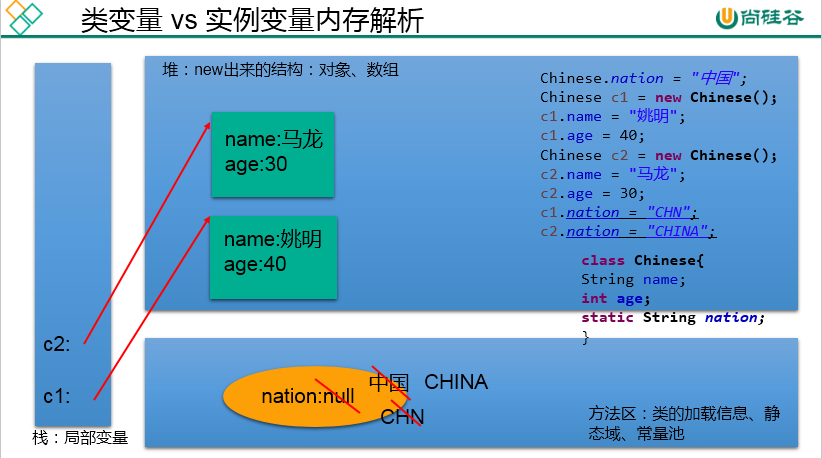

### 3.static 修饰方法

① 静态方法随着类的加载而加载，可以通过`类.静态方法`的方式进行调用

② 

|      | 静态方法 | 非静态方法 |
| ---- | -------- | ---------- |
| 类   | yes      | no         |
| 对象 | yes      | yes        |

③ 静态方法中，只能调用静态的方法或属性。（省略的是类.）

​    非静态方法中，既可以调用非静态的方法或属性，也可以调用静态的方法或属性。

​          

5. static注意点：

- 在静态的方法内，不能使用this关键字、super关键字

- 关于静态属性和静态方法的使用，大家都从生命周期的角度去理解。

   

6. 开发中，如何确定一个属性是否要声明为static的？

- 属性是可以被多个对象所共享的，不会随着对象的不同而不同的。

- 类中的常量也常常声明为static

 

7. 开发中，如何确定一个方法是否要声明为static的？

- 操作静态属性的方法，通常设置为static的

- 工具类中的方法，习惯上声明为static的。 比如：Math、Arrays、Collections

 

## 单例(Singleton)设计模式

### 单例(Singleton)设计模式

- 设计模式是在大量的实践中总结和理论化之后优选的代码结构、编程风格、以及解决问题的思考方式。设计模式免去我们自己再思考和摸索。就像是经典的棋谱，不同的棋局，我们用不同的棋谱。“套路”
- `所谓类的单例设计模式，就是采取一定的方法保证在整个的软件系统中，对某个类只能存在一个对象实例，并且该类只提供一个取得其对象实例的方法。`如果我们要让类在一个虚拟机中只能产生一个对象，我们首先必须将类的构造器的访问权限设置为 private，这样，就不能用 new 操作符在类的外部产生类的对象了，但在类内部仍可以产生该类的对象。因为在类的外部开始还无法得到类的对象，只能调用该类的某个静态方法以返回类内部创建的对象，静态方法只能访问类中的静态成员变量，所以，指向类内部产生的该类对象的变量也必须定义成静态的。

### 单例设计模式的实现

```java
/*
 * 单例设计模式：
 * 1. 所谓类的单例设计模式，就是采取一定的方法保证在整个的软件系统中，对某个类只能存在一个对象实例。
 * 
 * 2. 如何实现？
 * 	 饿汉式  vs 懒汉式
 * 
 * 3. 区分饿汉式 和 懒汉式
 * 		饿汉式： 一上来先造好对象	
 *   		坏处：对象加载时间过长。
 *   		好处：饿汉式是线程安全的
 *   
 *		懒汉式：要用的时候再造对象
 *   		好处：延迟对象的创建。
 * 			目前的写法坏处：线程不安全。--->到多线程内容时，再修改
 * 
 * 
 */
public class SingletonTest1 {
	public static void main(String[] args) {
//		Bank bank1 = new Bank();
//		Bank bank2 = new Bank();
		
		Bank bank1 = Bank.getInstance();
		Bank bank2 = Bank.getInstance();
		
		System.out.println(bank1 == bank2);
	}
}

//饿汉式
class Bank{
	
	//1.私有化类的构造器
	private Bank(){
		
	}
	
	//2.内部创建类的对象
	//4.要求此对象也必须声明为静态的
	private static Bank instance = new Bank();
	
	//3.提供公共的静态的方法，返回类的对象
	public static Bank getInstance(){
		return instance;
	}
}
```

```java
/*
 * 单例模式的懒汉式实现
 * 
 */
public class SingletonTest2 {
	public static void main(String[] args) {
		
		Order order1 = Order.getInstance();
		Order order2 = Order.getInstance();
		
		System.out.println(order1 == order2);
		
	}
}


class Order{
	
	//1.私有化类的构造器
	private Order(){
		
	}
	
	//2.声明当前类对象，没有初始化
	//4.此对象也必须声明为static的
	private static Order instance = null;
	
	//3.声明public、static的返回当前类对象的方法
	public static Order getInstance(){		
		if(instance == null){			
			instance = new Order();			
		}
		return instance;
	}	
}
```

### 单例模式的优点

由于单例模式只生成一个实例，减少了系统性能开销 ，当一个对象的产生需要比较多的资源时，如读取配置、产生其他依赖对象时，则可以通过在应用启动时直接产生一个单例对象，然后永久驻留内存的方式来解决。

 举例：java.lang.Runtime

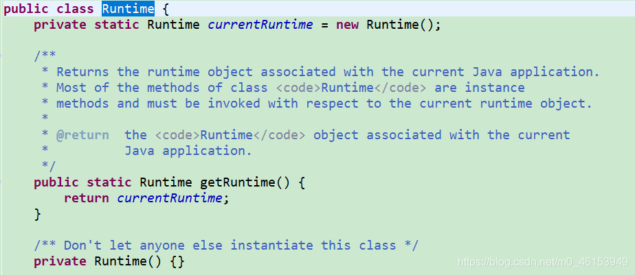

### 单例设计模式-应用场景

- 网站的计数器，一般也是单例模式实现，否则难以同步。
- 应用程序的日志应用，一般都使用单例模式实现，这一般是由于共享的日志文件一直处于打开状态，因为只能有一个实例去操作，否则内容不好追加。
- 数据库连接池的设计一般也是采用单例模式，因为数据库连接是一种数据库资源。
- 项目中，读取配置文件的类，一般也只有一个对象。没有必要每次使用配置文件数据，都生成一个对象去读取。
- Application也是单例的典型应用
- Windows 的 **Task Manager (任务管理器)**就是很典型的单例模式
- Windows 的 **Recycle Bin(回收站)**也是典型的单例应用。在整个系统运行过程中，回收站一直维护着仅有的一个实例。

## 6.2 理解 main 方法的语法

- 由于 Java 虚拟机需要调用类的 main() 方法，所以该方法的访问权限必须是public,又因为 Java 虚拟机在执行 main() 方法时不必创建对象，所以该方法必须是 static 的，该方法接收一个 String 类型的数组参数，该数组中保存执行 Java 命令时传递给所运行的类的参数。
- 又因为 main () 方法是静态的，我们不能直接访问该类中的非静态成员，必须创建该类的一个实例对象后，才能通过这个对象去访问类中的非静态成员，这种情况，我们在之前的例子中多次碰到。

main()方法的使用说明：

1. main()方法作为程序的入口

2. main()方法也是一个普通的静态方法

3. main()方法可以作为我们与控制台交互的方式。（之前：使用Scanner）

 ````java
 /*
  * main()方法的使用说明
  * 1.main()方法作为程序的入口;
  * 2.main()方法也是一个普通的静态方法
  * 3.main()方法也可以作为我们与控制台交互的方式。(之前，使用 Scanner)
  * 
  * 
  */
 public class MainTest {
 	public static void main(String[] args) {	//入口
 		
 		Main.main(new String[100]);
 		
 		MainTest test = new MainTest();
 		test.show();
 	}
 	
 	public void show(){
 		
 	}
 }
 
 class Main{
 	public static void main(String[] args) {
 		args = new String[100];
 		for(int i = 0;i < args.length;i++){
 			args[i] = "args_" + i;
 			System.out.println(args[i]);
 		}
 	}
 }
 ````

命令行参数用法举例

```java
public class MainDemo {
	public static void main(String[] args) {
		
		for(int i = 0;i < args.length;i++){
			System.out.println("/*/*/*/"+ args[i]);
		}	
	}
}
```

运行程序 MainDemo.java

```java
javac MainDemo.java
java MainDemo “Tom” “Jerry” “Shkstart”
```

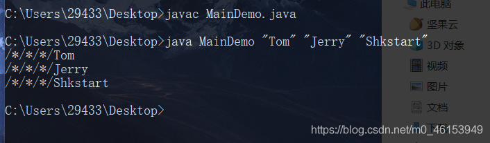

## 6.3 类的成员之四：代码块（或初始化块）

1. 代码块的作用：用来初始化类、对象

2. 代码块如果有修饰的话，只能使用 static 修饰。

3. 分类：静态代码块 vs 非静态代码块

4. 静态代码块
   - 内部可以有输出语句
   - 随着类的加载而执行，而且只执行一次
   - 作用：初始化类的信息
   - 如果一个类中定义了多个静态代码块，则按照声明的先后顺序执行
   - 静态代码块的执行要优先于非静态代码块的执行
   - 静态代码块内只能调用静态的属性、静态的方法，不能调用非静态的结构 

5. 非静态代码块
   - 内部可以有输出语句
   - 随着对象的创建而执行，每创建一个对象，就执行一次非静态代码块
   - 作用：可以在创建对象时，对对象的属性等进行初始化
   - 如果一个类中定义了多个非静态代码块，则按照声明的先后顺序执行
   - 非静态代码块内可以调用静态的属性、静态的方法，或非静态的属性、非静态的方法

 ```java
 public class BlockTest {
 	public static void main(String[] args) {
 		
 		String desc = Person.desc;
 		System.out.println(desc);
 		
 		Person p1 = new Person();
 		Person p2 = new Person();
 		System.out.println(p1.age);
 		
 		Person.info();
 	}
 }
 
 class Person{
 	//属性
 	String name;
 	int age;
 	static String desc = "我是一个青年";
 	
 	//构造器
 	public Person(){
 		
 	}
 	
 	//static 的代码块
 	static{
 		System.out.println("hello,static block-1");
 		//调用静态结构
 		desc = "我是一个爱小说的人";
 		info();
 		//不能调用非静态结构
 //		eat();
 //		name = "Tom";
 	}
 	
 	static{
 		System.out.println("hello,static block-2");
 	}
 	
 	//非 static 的代码块
 	{
 		System.out.println("hello,block-2");
 	}
 	{
 		System.out.println("hello,block-1");
 		//调用非静态结构
 		age = 1;
 		eat();
 		//调用静态结构
 		desc = "我是一个爱小说的人 1";
 		info();
 	}	
 	
 	//方法
 	public Person(String name,int age){
 		this.name = name;
 		this.age = age;
 	}
 	
 	public void eat(){
 		System.out.println("吃饭");
 	}
 
 	@Override
 	public String toString() {
 		return "Person [name=" + name + ", age=" + age + "]";
 	}
 	public static void info(){
 		System.out.println("我是一个快乐的人。");
 	}
 }
 
 ```

### 对属性可以赋值的位置

 ①默认初始化

 ②显式初始化/⑤在代码块中赋值

 ③构造器中初始化

 ④有了对象以后，可以通过`对象.属性`或`对象.方法`的方式，进行赋值 

执行的先后顺序：① - ② / ⑤ - ③ - ④  

### 子类对象实例化的过程：

- 执行顺序：由父及子，静态先行

先执行父类，再执行子类，先执行静态的再执行非静态的。

> 静态初始化块举例 1

```java
//总结:由父类到子类，静态先行
class Root{
	static{
		System.out.println("Root 的静态初始化块");
	}
	{
		System.out.println("Root 的普通初始化块");
	}
	public Root(){
		System.out.println("Root 的无参数的构造器");
	}
}
class Mid extends Root{
	static{
		System.out.println("Mid 的静态初始化块");
	}
	{
		System.out.println("Mid 的普通初始化块");
	}
	public Mid(){
		System.out.println("Mid 的无参数的构造器");
	}
	public Mid(String msg){
		//通过 this 调用同一类中重载的构造器
		this();
		System.out.println("Mid 的带参数构造器，其参数值："
			+ msg);
	}
}
class Leaf extends Mid{
	static{
		System.out.println("Leaf 的静态初始化块");
	}
	{
		System.out.println("Leaf 的普通初始化块");
	}	
	public Leaf(){
		//通过 super 调用父类中有一个字符串参数的构造器
		super("尚硅谷");
		System.out.println("Leaf 的构造器");
	}
}
public class LeafTest{
	public static void main(String[] args){
		new Leaf(); 
		new Leaf();
	}
}
//输出
//Root 的静态初始化块
//Mid 的静态初始化块
//Leaf 的静态初始化块
//Root 的普通初始化块
//Root 的无参数的构造器
//Mid 的普通初始化块
//Mid 的无参数的构造器
//Mid 的带参数构造器，其参数值：尚硅谷
//Leaf 的普通初始化块
//Leaf 的构造器

//Root 的普通初始化块
//Root 的无参数的构造器
//Mid 的普通初始化块
//Mid 的无参数的构造器
//Mid 的带参数构造器，其参数值：尚硅谷
//Leaf 的普通初始化块
//Leaf 的构造器
```

> 静态初始化块举例 2

```java
class Father {
	static {
		System.out.println("11111111111");
	}
	{
		System.out.println("22222222222");
	}

	public Father() {
		System.out.println("33333333333");

	}

}

public class Son extends Father {
	static {
		System.out.println("44444444444");
	}
	{
		System.out.println("55555555555");
	}
	public Son() {
		System.out.println("66666666666");
	}

	public static void main(String[] args) { // 由父及子 静态先行
		System.out.println("77777777777");
		System.out.println("************************");
		new Son();
		System.out.println("************************");

		new Son();
		System.out.println("************************");
		new Father();
	}

}
//输出
//11111111111
//44444444444
//77777777777
//************************
//22222222222
//33333333333
//55555555555
//66666666666
//************************
//22222222222
//33333333333
//55555555555
//66666666666
//************************
//22222222222
//33333333333
```

## 6.4 关键字：final

### 1.final的使用

- final：最终的

- final可以用来修饰的结构：类、方法、变量

### 2.final 修饰类

- 表明此类不能被其他类所继承。
- 比如：String类、System类、StringBuffer类 

### 3.final 修饰方法

- 表明此方法不可以被重写       
- 比如：Object类中 getClass();

### 4.final 修饰变量

此时的"变量"就称为是一个常量，名称大写，且只能被赋值一次。

4.1 final修饰属性

可以考虑赋值的位置有：显式初始化、代码块中初始化、构造器中初始化

不可以考虑赋值的位置：默认初始化、 `对象.属性`或`对象.方法`

4.2 final修饰局部变量

尤其是使用final修饰形参时，表明此形参是一个常量。当我们调用此方法时，给常量形参赋一个实参。一旦赋值以后，就只能在方法体内使用此形参，但不能进行重新赋值。

4.3 static final 用来修饰属性：全局常量

​      static final 用来修饰方法：方法不能被重写，直接通过类来调用

```java
public class FinalTest {
	
	final int WIDTH = 0;
	final int LEFT;
	final int RIGHT;
//	final int DOWN;
	
	{
		LEFT = 1;
	}
	
	public FinalTest(){
		RIGHT = 2;
	}
	
	public FinalTest(int n){
		RIGHT = n;
	}
	
//	public void setDown(int down){
//		this.DOWN = down;
//	}
	
	public void dowidth(){
//		width = 20;	//width cannot be resolved to a variable
	}
	
	public void show(){
		final int NUM = 10;	//常量
//		num += 20;
	}
	
	public void show(final int num){
		System.out.println(num);
	}
	
	public static void main(String[] args) {
		
		int num = 10;
		
		num = num + 5;
		
		FinalTest test = new FinalTest();
//		test.setDown(5);
		
		test.show(10);
	}
}

final class FianlA{
	
}

//class B extends FinalA{     //错误，不能被继承。
//	
//}

//class C extends String{
//	
//}

class AA{
	public final void show(){
		
	}
}

//class BB extends AA{	// 错误，不能被重写。
//	public void show(){
//		
//	}
//}

```

> 面试题1

```java
public class Something {
	public int addOne(final int x) {
		return ++x; // return x + 1;
	}
}
```

> 面试题2

```java
public class Something {

	public static void main(String[] args) {
		Other o = new Other();
		new Something().addOne(o);
	}

	public void addOne(final Other o) {
		// o = new Other();
		o.i++;
	}
}

class Other {
	public int i;
}
```

## 6.5 抽象类与抽象方法

随着继承层次中一个个新子类的定义，类变得越来越具体，而父类则更一般，更通用。类的设计应该保证父类和子类能够共享特征。有时将一个父类设计得非常抽象，以至于它没有具体的实例，这样的类叫做`抽象类` 。

类比：创业老板一开始亲历亲为，后来招的人越来越多，部门分的越来越细，老板就不干活了，将经验思想传授给手下的人，让他们去干活。

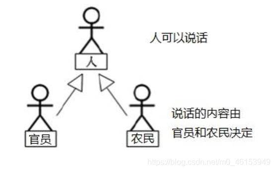

###  关键字：abstract

abstract关键字的使用

1. abstract:抽象的

2. abstract可以用来修饰的结构：类、方法

3. abstract修饰类：抽象类
   - 此类不能实例化
   - 抽象类中一定有构造器，便于子类实例化时调用（涉及：子类对象实例化的全过程）
   - 开发中，都会提供抽象类的子类，让子类对象实例化，完成相关的操作

4. abstract修饰方法：抽象方法

   - 抽象方法只有方法的声明，没有方法体。

   - 包含抽象方法的类，一定是一个抽象类。反之，抽象类中可以没有抽象方法的。

   - 若子类重写/实现了父类中的所有的抽象方法后，此子类方可实例化。

     若子类没有重写/实现父类中的所有的抽象方法，则此子类也是一个抽象类，需要使用abstract修饰。

5. abstract使用上的注意点
   - abstract不能用来修饰：属性、构造器等结构
   - abstract不能用来修饰私有方法、静态方法、final的方法、final的类

 ```java
 public class AbstractTest {
 	public static void main(String[] args) {
 		//一旦 Person 类抽象了，就不可实例化
 //		Person p1 = new Person();
 //		p1.eat();
 		
 	}
 }
 
 abstract class Creature{
 	public abstract void breath();//抽象方法
 }
 
 abstract class Person extends Creature{
 	String name;
 	int age;
 	
 	public Person(){
 		
 	}
 	
 	public Person(String name,int age){
 		this.name = name;
 		this.age = age;
 	}
 	
 	//不是抽象方法
 //	public void eat(){
 //		
 //	}
 	
 	//抽象方法
 	public abstract void eat();
 	
 	public void walk(){
 		System.out.println("人走路");
 	}
 }
 
 class Student extends Person{
 	public Student(String name,int age){
 		super(name,age);
 	}
 	public void eat(){//若子类重写了父类中的所有的抽象方法后，此子类方可实例化。
 		System.out.println("学生应该多吃有营养的。");
 	}
 	@Override
 	public void breath() {//若子类重写了父类中的所有的抽象方法后，此子类方可实例化。
 		System.out.println("学生应该呼吸新鲜的无雾霾空气");
 	}
 }
 ```

### 抽象类应用

抽象类是用来模型化那些父类无法确定全部实现，而是由其子类提供具体实现的对象的类。

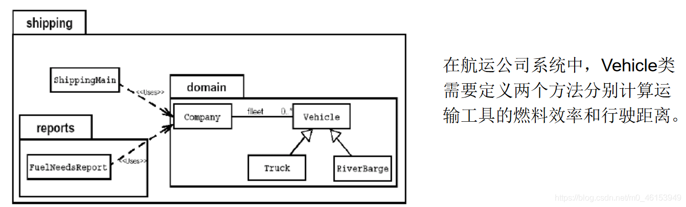

> 问题：卡车(Truck)和驳船(RiverBarge)的燃料效率和行驶距离的计算方法完全不同。Vehicle 类不能提供计算方法，但子类可以。

```java
/* Java 允许类设计者指定：超类声明一个方法但不提供实现，该方法的实现由子类提供。这样的方法称为抽象方法。有一个或更多抽象方法的类称为抽象类。
 * Vehicle 是一个抽象类，有两个抽象方法。
 * 注意：抽象类不能实例化 new Vihicle()是非法的
 */
public abstract class Vehicle{
	public abstract double calcFuelEfficiency();//计算燃料效率的抽象方法
	public abstract double calcTripDistance();//计算行驶距离的抽象方法
}
public class Truck extends Vehicle{
	public double calcFuelEfficiency(){ 
		//写出计算卡车的燃料效率的具体方法
	}
	public double calcTripDistance(){ 
		//写出计算卡车行驶距离的具体方法
	}
}
public class RiverBarge extends Vehicle{
	public double calcFuelEfficiency() { 
		//写出计算驳船的燃料效率的具体方法
	}
	public double calcTripDistance( )  {  
		//写出计算驳船行驶距离的具体方法
	}
}

```

### 抽象类的匿名子类（及其匿名对象）

```java
public class Num {

}

abstract class Creature{
	public abstract void breath();
}

abstract class Person extends Creature{
	String name;
	int age;
	
	public Person(){
		
	}
	
	public Person(String name,int age){
		this.name = name;
		this.age = age;
	}
	
	//不是抽象方法
//	public void eat(){
//		System.out.println("人吃饭");
//	}
	
	//抽象方法
	public abstract void eat();
	
	public void walk(){
		System.out.println("人走路");
	}
}

class Student extends Person{
	public Student(String name,int age){
		super(name,age);
	}
	public Student(){

	}
	public void eat(){
		System.out.println("学生应该多吃有营养的。");
	}
	@Override
	public void breath() {
		System.out.println("学生应该呼吸新鲜的无雾霾空气");
	}
}
```

> PersonTest 类

 ```java
 /*
  * 抽象类的匿名子类
  * 
  */
 public class PersonTest {
 	public static void main(String[] args) {
 		
 		method(new Student());//匿名对象
 		
         //1.创建抽象类的非匿名子类的非匿名对象
 		Worker worker = new Worker(); 
 		method1(worker);
 		
         //2.创建抽象类的非匿名子类的匿名对象
 		method1(new Worker());
 		
 		System.out.println("*********************");
 		
 		//3.创建抽象类的匿名子类的非匿名对象:p
 		Person p = new Person(){//匿名子类多态方式赋给父类
 
 			@Override
 			public void eat() {
 				System.out.println("吃东西");
 			}
 
 			@Override
 			public void breath() {
 				System.out.println("呼吸空气");
 			}
 			
 		};
 		method1(p);
 		System.out.println("**********************"); 
 		//4.创建抽象类的匿名子类的匿名对象
 		method1(new Person(){
 
 			@Override
 			public void eat() {
 				System.out.println("吃零食");
 			}
 
 			@Override
 			public void breath() {
 				System.out.println("云南的空气");
 			}
 			
 		});
 	}
 	
 	public static void method1(Person p){
 		p.eat();
 		p.breath();
 	}
 	
 	public static void method(Student s){
 		
 	}
 }
 class Worker extends Person{
 	
 	@Override
 	public void eat() {
 	}
 
 	@Override
 	public void breath() {
 	}
 }
 ```

### 多态的应用：模板方法设计模式（TemplateMethod）

抽象类体现的就是一种模板模式的设计，抽象类作为多个子类的通用模板，子类在抽象类的基础上进行扩展、改造，但子类总体上会保留抽象类的行为方式。

解决的问题：

- 当功能内部一部分实现是确定的一部分实现是不确定的。这时可以把不确定的部分暴露出去，让子类去实现     。
- 换句话说，在软件开发中实现一个算法时，整体步骤很固定、通用，这些步骤已经在父类中写好了。但是某些部分易变，易变部分可以抽象出来，供不同子类实现。这就是一种模板模式。

> 例子1

 ```java
 /*
  * 抽象类的应用:模板方法的设计模式
  */
 public class TemplateTest {
 	public static void main(String[] args) {
 		
 		SubTemlate t = new SubTemlate();
 		
 		t.sendTime();
 	}
 }
 abstract class Template{
 	
 	//计算某段代码执行所需花费的时间
 	public void sendTime(){
 		
 		long start = System.currentTimeMillis();
 		
 		code();	//不确定部分，易变的部分
 		
 		long end = System.currentTimeMillis();
 		
 		System.out.println("花费的时间为:" + (end - start));
 	}
 	
 	public abstract void code();
 }
 
 class SubTemlate extends Template{
 	
 	@Override
 	public void code() {
 		
 		for(int i = 2;i <= 1000;i++){
 			boolean isFlag = true;
 			for(int j = 2;j <= Math.sqrt(i);j++){
 				if(i % j == 0){
 					isFlag = false;
 					break;
 				}
 			}
 			if(isFlag){
 				System.out.println(i);
 			}
 		}
 	}
 }
 ```

> 例子2

```java
//抽象类的应用：模板方法的设计模式
public class TemplateMethodTest {

	public static void main(String[] args) {
		BankTemplateMethod btm = new DrawMoney();
		btm.process();

		BankTemplateMethod btm2 = new ManageMoney();
		btm2.process();
	}
}
abstract class BankTemplateMethod {
	// 具体方法
	public void takeNumber() {
		System.out.println("取号排队");
	}

	public abstract void transact(); // 办理具体的业务 //钩子方法

	public void evaluate() {
		System.out.println("反馈评分");
	}

	// 模板方法，把基本操作组合到一起，子类一般不能重写
	public final void process() {
		this.takeNumber();

		this.transact();// 像个钩子，具体执行时，挂哪个子类，就执行哪个子类的实现代码

		this.evaluate();
	}
}

class DrawMoney extends BankTemplateMethod {
	public void transact() {
		System.out.println("我要取款！！！");
	}
}

class ManageMoney extends BankTemplateMethod {
	public void transact() {
		System.out.println("我要理财！我这里有 2000 万美元!!");
	}
}
```

模板方法设计模式是编程中经常用得到的模式。各个框架、类库中都有他的影子，比如常见的有：

- 数据库访问的封装
- Junit 单元测试
- JavaWeb 的 Servlet 中关于 doGet/doPost 方法调用
- Hibernate 中模板程序
- Spring 中 JDBCTemlate、HibernateTemplate 等

### 抽象类的练习

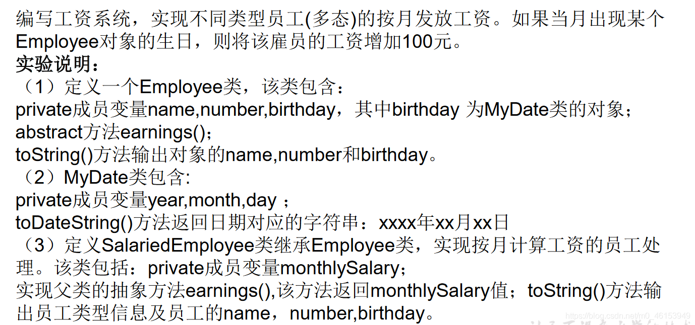

> 1、Employee 类

```java
/*
 * 定义一个 Employee 类，
 * 该类包含：private 成员变量 name,number,birthday，
 * 其中 birthday 为 MyDate 类的对象；
 * abstract 方法 earnings()；
 * toString()方法输出对象的 name,number 和 birthday。
 * 
 */
public abstract class Employee {
	private String name;
	private int number;
	private MyDate birthday;
	
	public Employee(String name, int number, MyDate birthday) {
		super();
		this.name = name;
		this.number = number;
		this.birthday = birthday;
	}

	public String getName() {
		return name;
	}

	public void setName(String name) {
		this.name = name;
	}

	public int getNumber() {
		return number;
	}

	public void setNumber(int number) {
		this.number = number;
	}

	public MyDate getBirthday() {
		return birthday;
	}

	public void setBirthday(MyDate birthday) {
		this.birthday = birthday;
	}

	public abstract double earnings();

	@Override
	public String toString() {
		return "name=" + name + ", number=" + number + ", birthday=" + birthday.toDateString() + "]";
	}
	
}
```

> 2、MyDate 类

```java
/*
 * MyDate 类包含:private 成员变量 year,month,day；
 * toDateString()方法返回日期对应的字符串：xxxx 年 xx 月 xx 日
 */
public class MyDate {
	private int year;
	private int month;
	private int day;
	
	public MyDate(int year, int month, int day) {
		super();
		this.year = year;
		this.month = month;
		this.day = day;
	}

	public int getYear() {
		return year;
	}

	public void setYear(int year) {
		this.year = year;
	}

	public int getMonth() {
		return month;
	}

	public void setMonth(int month) {
		this.month = month;
	}

	public int getDay() {
		return day;
	}

	public void setDay(int day) {
		this.day = day;
	}

	public String toDateString(){
		return year + "年" + month + "月" + day + "日";
	}
}
```

> 3、SalariedEmployee 类

```java
/*
 * 定义 SalariedEmployee 类继承 Employee 类，实现按月计算工资的员工处理。
 * 该类包括：private 成员变量 monthlySalary；实现父类的抽象方法 earnings(),
 * 该方法返回 monthlySalary 值；
 * toString()方法输出员工类型信息及员工的 name，number,birthday。
 * 
 */
public class SalariedEmployee extends Employee{
	private double monthlySalary;	//月工资

	public SalariedEmployee(String name,int number,MyDate birthday) {
		super(name,number,birthday);
	}
	
	public SalariedEmployee(String name, int number, MyDate birthday, double monthlySalary) {
		super(name, number, birthday);
		this.monthlySalary = monthlySalary;
	}

	@Override
	public double earnings() {
		return monthlySalary;		
	}

	@Override
	public String toString() {
		return "SalariedEmployee [" + super.toString() + "]";
	}	
}
```

> 4、HourlyEmployee 类

```java
/*
 * 参照 SalariedEmployee 类定义 HourlyEmployee 类，
 * 实现按小时计算工资的员工处理。该类包括：private 成员变量 wage 和 hour；
 * 实现父类的抽象方法 earnings(),该方法返回 wage*hour 值；
 * toString()方法输出员工类型信息及员工的 name，number,birthday。
 * 
 */
public class HourlyEmployee extends Employee{
	private int wage;	//每小时的工资
	private int hour;	//月工作的小时数
	
	public HourlyEmployee(String name, int number, MyDate birthday) {
		super(name, number, birthday);
	}

	public HourlyEmployee(String name, int number, MyDate birthday, int wage, int hour) {
		super(name, number, birthday);
		this.wage = wage;
		this.hour = hour;
	}

	@Override
	public double earnings() {
		return wage*hour;
	}

	public int getWage() {
		return wage;
	}

	public void setWage(int wage) {
		this.wage = wage;
	}

	public int getHour() {
		return hour;
	}

	public void setHour(int hour) {
		this.hour = hour;
	}
	
	public String toString(){
		return "HourlyEmployee[" + super.toString() + "]"; 
	}
}
```

> 5、PayrollSystem 类

```java
import java.util.Calendar;
import java.util.Scanner;
/*
 * 定义 PayrollSystem 类，创建 Employee 变量数组并初始化，
 * 该数组存放各类雇员对象的引用。利用循环结构遍历数组元素，
 * 输出各个对象的类型,name,number,birthday,以及该对象生日。
 * 当键盘输入本月月份值时，
 * 如果本月是某个 Employee 对象的生日，还要输出增加工资信息。
 * 
 */
public class PayrollSystem {
	public static void main(String[] args) {
		//方式一：
//		Scanner scanner = new Scanner(System.in);
//		System.out.println("请输入当月的月份：");
//		int month = scanner.nextInt();
		
		//方式二：
		Calendar calendar = Calendar.getInstance();
		int month = calendar.get(Calendar.MONTH);//获取当前的月份
//		System.out.println(month);//一月份：0
		
		Employee[] emps = new Employee[2];
		
		emps[0] = new SalariedEmployee("马良", 1002,new MyDate(1992, 2, 28),10000);
		emps[1] = new HourlyEmployee("博西", 2001, new MyDate(1991, 1, 6),60,240);
		
		for(int i = 0;i < emps.length;i++){
			System.out.println(emps[i]);
			double salary = emps[i].earnings();
			System.out.println("月工资为：" + salary);
			
			if((month+1) == emps[i].getBirthday().getMonth()){
				System.out.println("生日快乐！奖励 100 元");
			}
			
		}
	}
}
```

## 6.6 接口 (interface）

### 引言

- 一方面，有时必须从几个类中派生出一个子类，继承它们所有的属性和方法。但是     Java 不支持多重继承 。 有了接口就可以得到多重继承的效果 。
- 另一方面，有时必须从几个类中抽取出一些共同的行为特征，而它们之间又没有 is-a 的关系，仅仅是具有相同的行为特征而已 。例如：鼠标、键盘、打印机、扫描仪、摄像头、充电器、MP3机、手机、数码相机、移动硬盘等都支持 USB 连接 。

- 接口就是规范，定义的是一组规则，体现了现实世界中“如果你是/要则必须能 ......”的思想。`继承是一个“是不是”的关系，而接口实现则是“能不能”的关系。`
- `接口的本质是契约，标准，规范`，就像我们的法律一样。制定好后大家都要遵守。

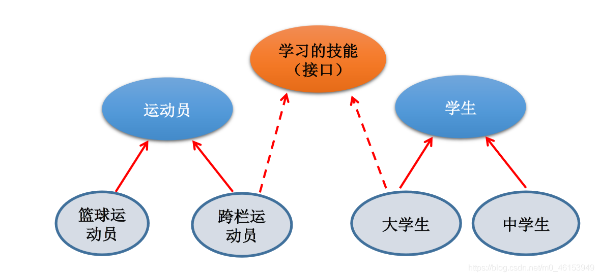

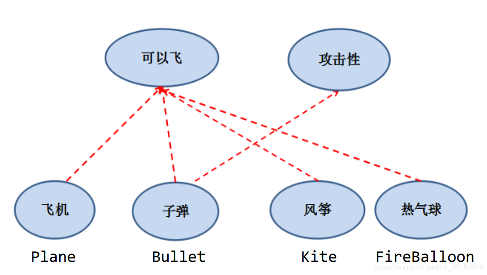


### 接口的定义与使用

1.接口使用 interface 来定义。

定义Java类的语法格式：先写extends，后写implements

2.Java中，接口和类是并列的两个结构，或者可以理解为一种特殊的类。从本质上讲，接口是一种特殊的抽象类。这种抽象类由只包含常量和方法的定义(JDK 7及以前)，而没有变量的方法的实现。

3.如何定义接口：定义接口中的成员

- JDK 7及以前：只能定义全局常量和抽象方法

  全局常量：public static final修饰。但是书写时，可以省略

  抽象方法：public abstract修饰。但是书写时，可以省略

- JDK 8：除了定义全局常量和抽象方法之外，还可以定义静态方法、默认方法

  静态方法：public static修饰。书写时，public可以省略

  默认方法：public default修饰。书写时，public可以省略

 

4.接口中不能定义构造器的！意味着接口不可以实例化。

 

5.Java开发中，接口通过让类去实现(implements)的方式来使用。(面向接口编程)

- 如果实现类覆盖/实现了接口中的所有抽象方法，则此实现类就可以实例化
- 如果实现类没有覆盖/实现接口中所有的抽象方法，则此实现类仍为一个抽象类


6.Java类可以实现多个接口  --->弥补了Java单继承性的局限性

  格式：`class AA extends BB implements CC,DD,EE`

  

7.接口与接口之间可以继承，而且可以多继承

 8.与继承关系类似，接口与实现类之间存在多态性

```java
public class InterfaceTest {
	public static void main(String[] args) {
		System.out.println(Flayable.MAX_SPEED);
		System.out.println(Flayable.MIN_SPEED);
	}
}
//接口
interface Flayable{
	
	//全局变量
	public static final int MAX_SPEED = 7900;	
	int MIN_SPEED = 1;//省略了 public static final 
	
	//抽象方法
	public abstract void fly();
	
	void stop();//省略了 public abstract 
	//Interfaces cannot have constructors
//	public Flayable(){
//		
//	}	
}
interface Attackable{
	void attack();
}
//类实现接口
class Plane implements Flayable{

	@Override
	public void fly() {
		System.out.println("飞机通过引擎起飞");
		
	}

	@Override
	public void stop() {
		System.out.println("驾驶员减速停止");
	}
	
}
abstract class Kite implements Flayable{

	@Override
	public void fly() {
		
	}
}
//类可以实现多个接口
class Bullet extends Object implements Flayable,Attackable,CC{

	@Override
	public void attack() {
		// TODO Auto-generated method stub
		
	}

	@Override
	public void fly() {
		// TODO Auto-generated method stub
		
	}

	@Override
	public void stop() {
		// TODO Auto-generated method stub
		
	}

	@Override
	public void method1() {
		// TODO Auto-generated method stub
		
	}

	@Override
	public void method2() {
		// TODO Auto-generated method stub
		
	}
}

//*********************************
interface AA{
	void method1();
}
interface BB{
	void method2();
}
//接口与接口之间可以继承，而且可以多继承
interface CC extends AA,BB{
	
}
```

### 接口：应用举例

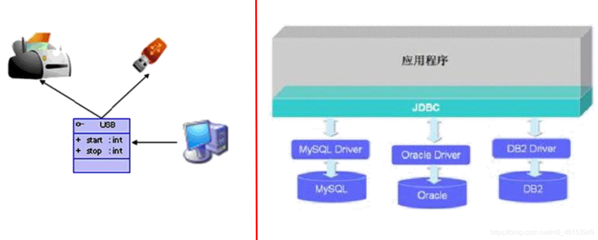


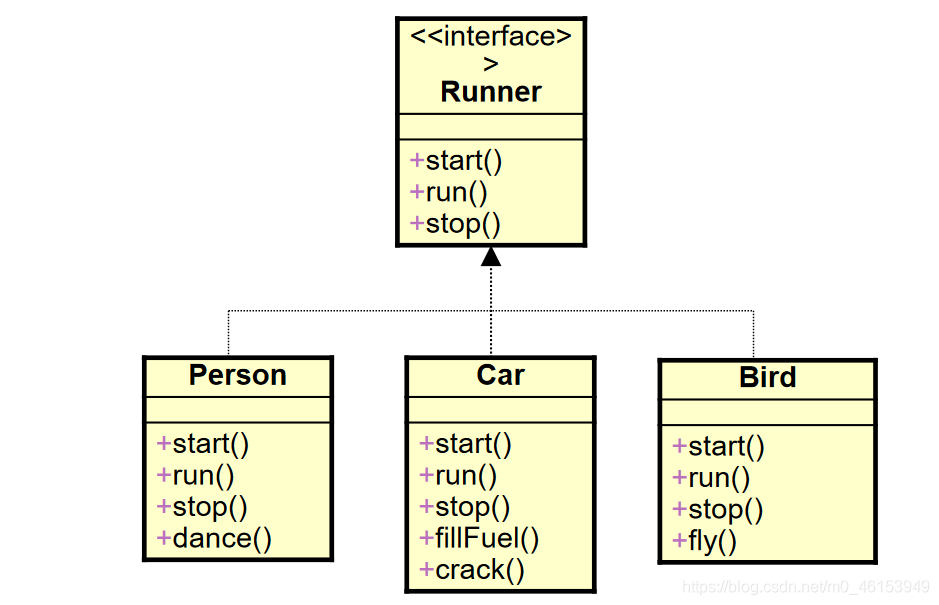

接口的使用

- 接口的具体使用，体现多态性(声明的是接口，传入的是实现类的对象)

- 接口，实际上就是定义了一种规范

- 开发中，体会面向接口编程！ 

### 接口的匿名实现类（及其匿名对象）

```java
public class USBTest {
	public static void main(String[] args) {
		
		Computer com = new Computer();
		//1.创建接口的非匿名实现类的非匿名对象
		Flash flash = new Flash();
		com.transferData(flash); 
		//2. 创建接口的非匿名实现类的匿名对象
		com.transferData(new Printer());
		//3. 创建接口的匿名实现类的非匿名对象
		USB phone = new USB(){

			@Override
			public void start() {
				System.out.println("手机开始工作");
			}

			@Override
			public void stop() {
				System.out.println("手机结束工作");
			}
			
		};
		com.transferData(phone);
		//4. 创建了接口的匿名实现类的匿名对象
		com.transferData(new USB(){
			@Override
			public void start() {
				System.out.println("mp3 开始工作");
			}

			@Override
			public void stop() {
				System.out.println("mp3 结束工作");
			}
		});
	}
}

class Computer{
	
	public void transferData(USB usb){//USB usb = new Flash();
		usb.start();
		
		System.out.println("具体传输数据的细节");
		
		usb.stop();
	}
	
}

interface USB{
	//常量:定义了长、宽
	void start();
	
	void stop();
}
class Flash implements USB{

	@Override
	public void start() {
		System.out.println("U 盘开始工作");
	}

	@Override
	public void stop() {
		System.out.println("U 盘结束工作");
	}
}
class Printer implements USB{
	@Override
	public void start() {
		System.out.println("打印机开启工作");
	}

	@Override
	public void stop() {
		System.out.println("打印机结束工作");
	}
	
}
```

### 面试题：抽象类与接口有哪些异同？

| No.  | 区别点       | 抽象类                                                       | 接口                                            |
| ---- | ------------ | ------------------------------------------------------------ | ----------------------------------------------- |
| 1    | 定义         | 包含抽象方法的类                                             | 主要是抽象方法和全局常量的集合                  |
| 2    | 组成         | 构造方法、抽象方法、普通方法、常量、变量                     | 全局常量、抽象方法、(jdk8.0:默认方法、静态方法) |
| 3    | 使用         | 子类继承抽象类(extends)                                      | 类实现接口(implements)，                        |
| 4    | 关系         | 类实现，多实现接口                                           |                                                 |
| 5    | 继承         | 单继承                                                       | 多继承                                          |
| 6    | 对象         | 都不能实例化，都通过多态性产生实例化对象                     |                                                 |
| 7    | 常见设计模式 | 模板方法                                                     | 简单工厂、工厂方法、代理模式                    |
| 8    | 实际         | 作为一个模板                                                 | 是作为一个标准或是表示一种能力                  |
| 9    | 选择         | 如果抽象类和接口都可以使用的话，优先使用接口，因为避免单继承的局限 |                                                 |


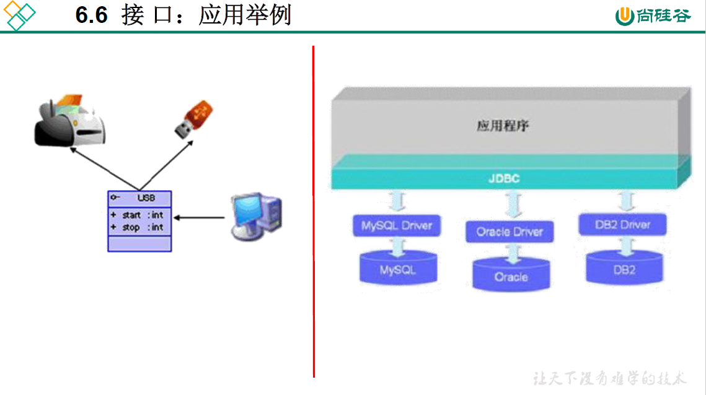

### 接口的应用：代理模式（Proxy）

概述：

代理模式是 Java 开发中使用较多的一种设计模式。代理设计就是为其他对象提供一种代理以控制对这个对象的访问。

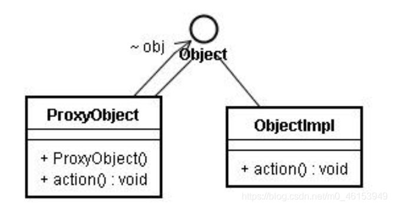

 ```java
 /*
  * 接口的应用:代理模式
  * 
  * 
  */
 public class NetWorkTest {
 	public static void main(String[] args) {
 		
 		Server server = new Server();
 //		server.browse();
 		ProxyServer proxyServer = new ProxyServer(server);
 		
 		proxyServer.browse();
 	}
 }
 interface NetWork{
 	public void browse();
 	
 }
 //被代理类
 class Server implements NetWork{
 
 
 	@Override
 	public void browse() {
 		System.out.println("真实的服务器来访问网络");
 	}
 }
 //代理类
 class ProxyServer implements NetWork{
 	
 	private NetWork work;
 	
 	public ProxyServer(NetWork work){
 		this.work = work;
 	}
 	
 	public void check(){
 		System.out.println("联网前的检查工作");
 	}
 
 	@Override
 	public void browse() {
 		check();
 		
 		work.browse();
 	}
 	
 }
 ```

1.应用场景：

- 安全代理：屏蔽对真实角色的直接访问。

- 远程代理：通过代理类处理远程方法调用（RMI）
- 延迟加载：先加载轻量级的代理对象，真正需要再加载真实对象

比如你要开发一个大文档查看软件，大文档中有大的图片，有可能一个图片有 100MB，在打开文件时，不可能将所有的图片都显示出来，这样就可以使用代理模式，当需要查看图片时，用 proxy 来进行大图片的打开。

2.分类

- 静态代理（静态定义代理类）
- 动态代理（动态生成代理类）
  - JDK 自带的动态代理，需要反射等知识

```java
public class StaticProxyTest {

	public static void main(String[] args) {
		Proxy s = new Proxy(new RealStar());
		s.confer();
		s.signContract();
		s.bookTicket();
		s.sing();
		s.collectMoney();
	}
}

interface Star {
	void confer();// 面谈

	void signContract();// 签合同

	void bookTicket();// 订票

	void sing();// 唱歌

	void collectMoney();// 收钱
}
//被代理类
class RealStar implements Star {

	public void confer() {
	}

	public void signContract() {
	}

	public void bookTicket() {
	}

	public void sing() {
		System.out.println("明星：歌唱~~~");
	}

	public void collectMoney() {
	}
}

//代理类
class Proxy implements Star {
	private Star real;

	public Proxy(Star real) {
		this.real = real;
	}

	public void confer() {
		System.out.println("经纪人面谈");
	}

	public void signContract() {
		System.out.println("经纪人签合同");
	}

	public void bookTicket() {
		System.out.println("经纪人订票");
	}

	public void sing() {
		real.sing();
	}

	public void collectMoney() {
		System.out.println("经纪人收钱");
	}
}

```

### 接口的应用：工厂模式


拓展：[工厂设计模式.pdf](https://www.yuque.com/nizhegechouloudetuboshu/library/mlenxx)

### 面试题

在开发中，常看到一个类不是去继承一个已经实现好的类，而是要么继承抽象类，要么实现接口。

> 排错1

```java
interface A {
	int x = 0;
}
class B {
	int x = 1;
}
class C extends B implements A {
	public void pX() {
//		编译不通过，x 不明确
		System.out.println(x);
//		System.out.println(super.x); //1
//		System.out.println(A.x);//0
	}
	public static void main(String[] args) {
		new C().pX();
	}
}
```

> 排错 2：

```java
interface Playable {
	void play();
}
interface Bounceable {
	void play();
}
interface Rollable extends Playable, Bounceable {
	Ball ball= new Ball("PingPang"); //省略了 public static final
}
public class Ball implements Rollable {
	private String name;
	public String getName() {
		return name;
	}
	public Ball(String name) {
		this.name= name;
	}
	public void play() {
		ball = new Ball("Football"); //The final field Rollable.ball cannot be assigned	
		System.out.println(ball.getName());
	}
}

```

> 练习

### Java 8 中关于接口的改进

- JDK 8：除了定义全局常量和抽象方法之外，还可以定义静态方法、默认方法

  静态方法：public static修饰。书写时，public可以省略

  默认方法：public default修饰。书写时，public可以省略

说明：

1：接口中定义的静态方法，只能通过接口来调用。

2：通过实现类的对象，可以调用接口中的默认方法。

​    如果实现类重写了接口中的默认方法，调用时，仍然调用的是重写以后的方法

3：如果子类(或实现类)继承的父类和实现的接口中声明了同名同参数的默认方法，那么子类在没有重写此方法的情况下，默认调用的是父类中的同名同参数的方法。-->类优先原则

4：如果实现类实现了多个接口，而这多个接口中定义了同名同参数的默认方法，那么在实现类没有重写此方法的情况下，报错。-->接口冲突。这就需要我们必须在实现类中重写此方法

5：如何在子类(或实现类)的方法中调用父类、接口中被重写的方法。见代码

> interface 类

```java
/*
 * JDK8:除了全局常量和抽象方法之外，还可以定义静态方法、默认方法(略)。
 * 
 * 
 */
public interface CompareA {

	//静态方法
	public static void method1() {
		System.out.println("CompareA:西安");
	}
	
	//默认方法
	public default void method2(){
		System.out.println("CompareA:深圳");
	}
	
	default void method3(){
		System.out.println("CompareA:杭州");
	}
}
```

> SubClassTest 类

```java
public class SubClassTest {

	public static void main(String[] args) {
		SubClass s = new SubClass();
//		s.method1();
//		SubClass.method1();
//		知识点 1：接口中定义的静态方法，只能通过接口来调用。
		CompareA.method1();
//		知识点 2：通过实现类的对象，可以调用接口中的默认方法。
//		如果实现类重写了接口中的默认方法，调用时，仍然调用的是重写以后的方法
		s.method2();
//		知识点 3：如果子类(或实现类)继承的父类和实现的接口中声明了同名同参数的默认方           法，那么子类在没有重写此方法的情况下，默认调用的是父类中的同名同参数的方法。--         >类优先原则
//		知识点 4：如果实现类实现了多个接口，而这多个接口中定义了同名同参数的默认方法，
//		那么在实现类没有重写此方法的情况下，报错。-->接口冲突。
//		这就需要我们必须在实现类中重写此方法
		s.method3();
		
	}
}
class SubClass extends SuperClass implements CompareA,CompareB{
	
	public void method2(){
		System.out.println("SubClass：上海");
	}
	
	public void method3(){
		System.out.println("SubClass：深圳");
	}
	
//	知识点 5：如何在子类(或实现类)的方法中调用父类、接口中被重写的方法
	public void myMethod(){
		method3(); //调用自己定义的重写的方法
		super.method3(); //调用的是父类中声明的 super.方法名();
//		调用接口中的默认方法                    接口名.super.方法名();
		CompareA.super.method3();
		CompareB.super.method3();
	}
}
```


```java
/*
 * 练习：接口冲突的解决方式
 */
interface Filial {// 孝顺的
	default void help() {
		System.out.println("老妈，我来救你了");
	}
}

interface Spoony {// 痴情的
	default void help() {
		System.out.println("媳妇，别怕，我来了");
	}
}

class Father{
	public void help(){
		System.out.println("儿子，救我媳妇！");
	}
}

class Man extends Father implements Filial, Spoony {

	@Override
	public void help() {
		System.out.println("我该就谁呢？");
		Filial.super.help();
		Spoony.super.help();
	}
	
}
```


## 6.7 类的内部成员之五：内部类

当一个事物的内部，还有一个部分需要一个完整的结构进行描述，而这个内部的完整的结构又只为外部事物提供服务，那么整个内部的完整结构最好使用内部类。

1.Java中允许将一个类A声明在另一个类B中，则类A就是`内部类`，类B称为`外部类`

 2.内部类的分类

成员内部类（静态、非静态） vs 局部内部类(方法内、代码块内、构造器内)

 

 3.成员内部类：

一方面，作为外部类的成员：

- 调用外部类的结构

- 可以被static修饰

- 可以被4种不同的权限修饰符修饰


另一方面，作为一个类：

- 类内可以定义属性、方法、构造器等

- 可以被 final 修饰，表示此类不能被继承。言外之意，不使用final，就可以被继承

- 可以被 abstract 修饰 


 4.关注如下的3个问题

- 如何实例化成员内部类的对象？

- 如何在成员内部类中区分调用外部类的结构？

- 开发中局部内部类的使用 见《InnerClassTest1.java》

```java
public class InnerClassTest {
	public static void main(String[] args) {
		
		//创建Dog实例(静态的成员内部类)
		Person.Dog dog = new Person.Dog();
		dog.show();
		
		//创建Bird实例(非静态的成员内部类)
//		Person.Bird bird = new Person.Bird();//错误的
		Person p = new Person();
		Person.Bird bird = p.new Bird();
		bird.sing();
		
		System.out.println();
		
		bird.display("喜鹊");
	}
}
class Person{
	String name = "李雷";
	int age;
	
	public void eat(){
		System.out.println("人，吃饭");
	}
	
	//静态成员内部类
	static class Dog{
		String name;
		int age;
		
		public void show(){
			System.out.println("卡拉是条狗");
//			eat();
		}
	}
	
	//非静态成员内部类
	class Bird{
		String name = "杜鹃";
		public Bird(){
			
		}
		
		public void sing(){
			System.out.println("我是一只猫头鹰");
			Person.this.eat();//调用外部类的非静态属性
			eat();
			System.out.println(age);
		}
		
		public void display(String name){
			System.out.println(name);//方法的形参
			System.out.println(this.name);//内部类的属性
			System.out.println(Person.this.name);//外部类的属性
		}
	}
	public void method(){
		//局部内部类
		class AA{
			
		}
	}
	
	{
		//局部内部类
		class BB{
			
		}
	}
	
	public Person(){
		//局部内部类
		class CC{
			
		}
	}
}
```

> InnerClassTest1类

```java
public class InnerClassTest1 {
	
//	开发中很少见
	public void method(){
//		局部内部类
		class AA{
			
		}
	}
	
//	返回一个实现了Comparable接口的类的对象
	public Comparable getComparable(){
		
//		创建一个实现了Comparable接口的类:局部内部类
		//方式一：
//		class MyComparable implements Comparable{
//
//			@Override
//			public int compareTo(Object o) {
//				return 0;
//			}
//			
//		}
//		
//		return new MyComparable();
		
		//方式二：
		return new Comparable(){


			@Override
			public int compareTo(Object o) {
				return 0;
			}
			
		};
		
	}
}
```

### 匿名内部类

```java
/*
 * 1.匿名内部类不能定义任何静态成员、方法和类，只能创建匿名内部类的一个实例。
 * 一个匿名内部类一定是在new的后面，用其隐含实现一个接口或实现一个类。
 * 
 * 2.格式：
 * 		new 父类构造器（实参列表）|实现接口(){
 * 				//匿名内部类的类体部分
 * 		}
 * 
 * 3.匿名内部类的特点
 * 		> 匿名内部类必须继承父类或实现接口
 * 		> 匿名内部类只能有一个对象
 * 		> 匿名内部类对象只能使用多态形式引用
 */
interface Product{
	public double getPrice();
	public String getName();
}
public class AnonymousTest{
	public void test(Product p){
		System.out.println("购买了一个" + p.getName() + "，花掉了" + p.getPrice());
	}
	public static void main(String[] args) {
		AnonymousTest ta = new AnonymousTest();
		//调用test方法时，需要传入一个Product参数，
		//此处传入其匿名实现类的实例
		ta.test(new Product(){
			public double getPrice(){
				return 567.8;
			}
			public String getName(){
				return "AGP显卡";
			}
		});
	}
}
```

### 局部内部类的使用注意

```java
public class InnerClassTest {
	
//	public void onCreate(){
//	
//	int number = 10;
//	
//	View.OnClickListern listener = new View.OnClickListener(){
//		
//		public void onClick(){
//			System.out.println("hello!");
//			System.out.println(number);
//		}
//		
//	}
//	
//	button.setOnClickListener(listener);
//	
//}

	/*
	 * 在局部内部类的方法中(比如:show)如果调用局部内部类所声明的方法(比如：method)中的局部变量(比如：num)的话,
	 * 要求此局部变量声明为final的。
	 * 
	 * jdk 7及之前版本：要求此局部变量显式的声明为final的
	 * jdk 8及之后的版本：可以省略final的声明
	 * 
	 */
	public void method(){
		//局部变量
		int num = 10;
		
		class AA{
			
			public void show(){
//				num = 20;	//Local variable num defined in an enclosing scope must be final or effectively final
				System.out.println(num);
			}
		}
	}
}
```

