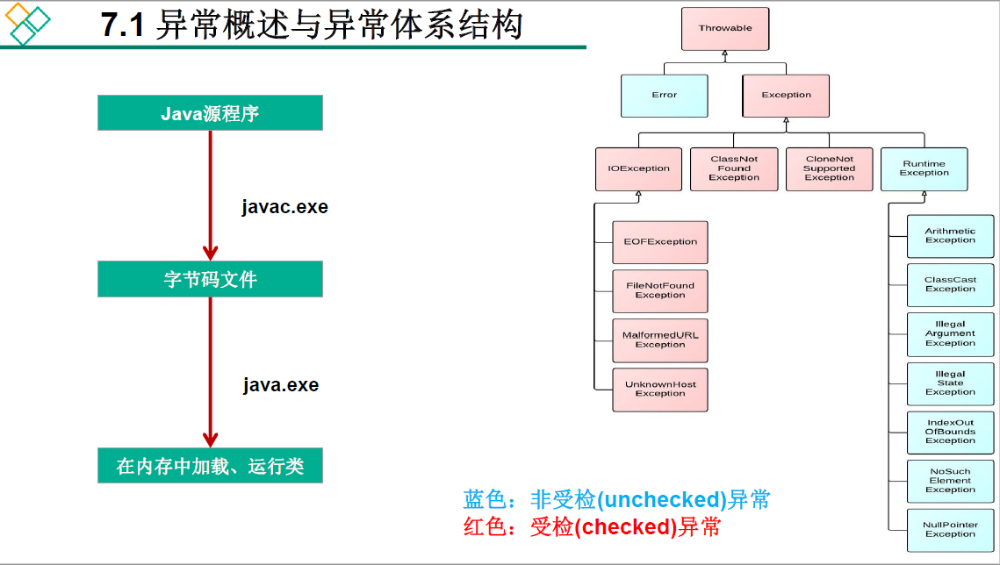
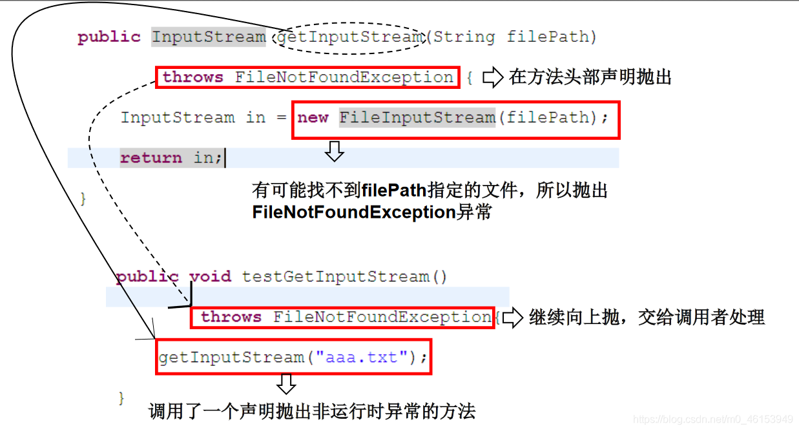

##  7.1 异常概述与异常体系结构

引言：

在使用计算机语言进行项目开发的过程中，即使程序员把代码写得尽善尽美，在系统的运行过程中仍然会遇到一些问题，因为很多问题不是靠代码能够避免的，比如：客户输入数据的格式，读取文件是否存在，网络是否始终保持通畅等等。

异常：

- 在 Java 语言中将程序执行中发生的不正常情况称为“异常”。（开发过程中的语法错误和逻辑错误不是异常）

- Java 程序在执行过程中所发生的异常事件可分为两类：

  - Error：Java 虚拟机无法解决的严重问题 。
     如：JVM系统内部错误、资源耗尽等严重情况 。 比如： StackOverflowError（栈溢出）和 OutOfMemoryError（OOM堆溢出）。 一般不编写针对性的代码进行处理。

    ```java
    public class ErrorTest {
    	public static void main(String[] args) {
    		//1.栈溢出:java.lang.StackOverflowError
    //		main(args);
    		//2.堆溢出:java.lang.OutOfMemoryError
    //		Integer[] arr = new Integer[1024*1024*1024];
    		
    	}
    }
    ```

  - Exception：其它因编程错误或偶然的外在因素导致的一般性问题可以使用针对性的代码进行处理。 

    例如：

    - 空指针访问
    - 试图读取不存在的文件
    - 网络连接中断
    - 数组角标越界

- 对于这些错误 一般有两种解决方法 ：一是遇到错误就终止程序的运行 。 另一种方法是由程序员在编写程序时就考虑到错误的检测、错误消息的提示以及错误的处理 。

 

- 捕获错误最理想的是在编译期间，但有的错误只有在运行时才会发生 。比如：除数为 0 数组下标越界等
  - 分类： `编译时异常` 和 `运行时异常`

 

1. 运行时异常

- 是指编译器不要求强制处置的异常。一般是指编程时的逻辑错误，是程序员应该积极避免其出现的异常。 java.lang.RuntimeException 类及它的子类都是运行时异常。

- 对于这类异常，可以不作处理，因为这类异常很普遍，若全处理可能会对程序的可读性和运行效率产生影响。

2. 编译时异常

- 是指编译器要求必须处置的异常。即程序在运行时由于外界因素造成的一般性异常。 编译器要求 Java 程序必须捕获或声明所有编译时异常。

- 对于这类异常，如果程序不处理，可能会带来意想不到的结果。



## 7.2 常见异常

 java.lang.Throwable

​         |-----java.lang.Error:一般不编写针对性的代码进行处理。

​         |-----java.lang.Exception:可以进行异常的处理

​             |------编译时异常(checked)

​                     |-----IOException

​                         |-----FileNotFoundException

​                     |-----ClassNotFoundException

​             |------运行时异常(unchecked,RuntimeException)

​                     |-----NullPointerException

​                     |-----ArrayIndexOutOfBoundsException

​                     |-----ClassCastException

​                     |-----NumberFormatException

​                     |-----InputMismatchException

​                     |-----ArithmeticException

 

### 面试题：常见的异常都有哪些？举例说明

 ```java
 import java.io.File;
 import java.io.FileInputStream;
 import java.util.Date;
 import java.util.Scanner;
 import org.junit.Test;
 
 public class ExceptionTest {
 
 	// ******************以下是编译时异常***************************
 	@Test
 	public void test7() {
 //		File file = new File("hello.txt");
 //		FileInputStream fis = new FileInputStream(file);
 //		
 //		int data = fis.read();
 //		while(data != -1){
 //			System.out.print((char)data);
 //			data = fis.read();
 //		}
 //		
 //		fis.close();
 	}
 
 	// ******************以下是运行时异常***************************
 	// ArithmeticException
 	@Test
 	public void test6() {
 		int a = 10;
 		int b = 0;
 		System.out.println(a / b);
 	}
 
 	// InputMismatchException
 	@Test
 	public void test5() {
 		Scanner scanner = new Scanner(System.in);
 		int score = scanner.nextInt();
 		System.out.println(score);
 
 		scanner.close();
 	}
 
 	// NumberFormatException
 	@Test
 	public void test4() {
 		String str = "123";
 		str = "abc";
 		int num = Integer.parseInt(str);
 	}
 
 	// ClassCaseException
 	@Test
 	public void test3() {
 		 Object obj = new Date();
 		 String str = (String)obj;
 	}
 
 	// IndexOutOfBoundsException
 	@Test
 	public void test2() {
 		// ArrayIndexOutOfBoundsException
         // int[] arr = new int[10];
 		// System.out.println(arr[10]);
 
 		// StringIndexOutOfBoundsException
         // String str = "abc";
 		// System.out.println(str.charAt(3));
 	}
 
 	// NullPointerException
 	@Test
 	public void test1() {
 		// int[] arr = null;
 		// System.out.println(arr[3]);
 
 		// String str = "abc";
 		// str = null;
 		// System.out.println(str.charAt(0));
 	}
 }
 
 ```


## 7.3 异常处理机制一：try-catch-finally

引言：

在编写程序时，经常要在可能出现错误的地方加上检测的代码，如进行x/y运算时，要检测分母为0，数据为空，输入的不是数据而是字符等。过多的if-else分支会导致程序的代码加长、臃肿，可读性差。因此采用异常处理机制。

Java异常处理：

Java采用的异常处理机制，是将异常处理的程序代码集中在一起，与正常的程序代码分开，使得程序简洁、优雅，并易于维护。

方式一：try-catch-finally

方式二：throws + 异常类型


一、 Java 异常的处理：抓抛模型

1. 过程一："抛"

程序在正常执行的过程中，一旦出现异常，就会在异常代码处生成一个对应异常类的对象，并将此对象抛出。 一旦抛出对象以后，其后的代码就不再执行。这个过程称为抛出（throw）异常。

​         

关于异常对象的产生：

①由虚拟机自动生成 ：程序运行过程中，虚拟机检测到程序发生了问题，如果在当前代码中没有找到相应的处理程序，就会在后台自动创建一个对应异常类的实例对象并抛出自动抛出

②由开发人员手动创建 Exception exception = new ClassCastException(); 创建好的异常对象不抛出对程序没有任何影响，和创建一个普通对象一样

 

2. 过程二："抓"

如果一个方法内抛出异常，该异常对象会被抛给调用者方法中处理。如果异常没有在调用者方法中处理，它继续被抛给这个调用方法的上层方法。这个过程将一直继续下去直到异常被处理 。这一过程称为捕获（catch）异常。如果一个异常回到 main() 方法并且 main() 也不处理则程序运行终止。

程序员通常只能处理 Exception 而对 Error无能为力 。

 

异常的处理方式：① try-catch-finally ② throws

 

 

二、 try-catch-finally的使用

格式：

```java
try{
         //可能出现异常的代码

}catch(异常类型1 变量名1){
         //处理异常的方式1
}catch(异常类型2 变量名2){
         //处理异常的方式2
}catch(异常类型3 变量名3){
         //处理异常的方式3
}
....
finally{
         //一定会执行的代码
}
```

结构：

1. try{…}

捕获异常的第一步是用 try{…} 语句块选定捕获异常的范围,将可能出现异常的代码放在 try 语句块中 。

2. catch(Exceptiontype e){…}

在catch语句块中是对异常对象进行处理的代码 。每个 try 语句块可以伴随一个或多个 catch 语句,用于处理可能产生的不同类型的异常对象。

3. finally

- 捕获异常的最后一步是通过 finally 语句为异常处理提供一个统一的出口，使得在控制流转到程序的其它部分以前，能够对程序的状态作统一的管理。
- 不论在 try 代码块中是否发生了异常事件， catch 语句是否执行， catch 语句是否有异常， catch 语句中是否有 return，finally块中的语句都会被执行。
- 是可选的

 

说明：

1. 使用try将可能出现异常代码包装起来，在执行过程中，一旦出现异常，就会生成一个对应异常类的对象，根据此对象的类型，去catch中进行匹配。
2.  一旦try中的异常对象匹配到某一个catch时，就进入catch中进行异常的处理。一旦处理完成，就跳出当前的try-catch结构(在没有写finally的情况)，继续执行其后的代码。
3. catch中的异常类型如果没有子父类关系，则谁声明在上，谁声明在下无所谓。catch中的异常类型如果满足子父类关系，则要求子类一定声明在父类的上面。否则，报错。

4. 常用的异常对象处理的方式： 

① String getMessage()：获取异常信息，返回字符串

② printStackTrace()：获取异常类名和异常信息，以及异常出现在程序中的位置。返回值 void 。

5. 在try结构中声明的变量，在出了try结构以后，就不能再被调用
6. try-catch-finally结构可以嵌套

 ```java
 import java.io.File;
 import java.io.FileInputStream;
 import java.io.FileNotFoundException;
 import java.io.IOException;
 
 import org.junit.Test;
 
 public class ExceptionTest1 {
 	
 	@Test
 	public void test2(){
 		try{
 			File file = new File("hello.txt");
 			FileInputStream fis = new FileInputStream(file);
 			
 			int data = fis.read();
 			while(data != -1){
 				System.out.print((char)data);
 				data = fis.read();
 			}
 			
 			fis.close();
 		}catch(FileNotFoundException e){
 			e.printStackTrace();
 		}catch(IOException e){
 			e.printStackTrace();
 		}
 	}
 
 	@Test
 	public void test1(){
 		
 		String str = "123";
 		str = "abc";
 		try{
 			int num = Integer.parseInt(str);	
 			
 			System.out.println("hello-----1");
 		}catch(NumberFormatException e){
 //			System.out.println("出现数值转换异常了，不要着急....");
 			//String getMessage():
 //			System.out.println(e.getMessage());
 			//printStackTrace():
 			e.printStackTrace();
 		}catch(NullPointerException e){
 			System.out.println("出现空指针异常了，不要着急....");
 		}catch(Exception e){
 			System.out.println("出现异常了，不要着急....");
 		}
 //		System.out.println(num);
 		
 		System.out.println("hello----2");
 	}
 }
 ```

三、 try-catch-finally中finally的使用：

1. finally是可选的
2. finally中声明的是一定会被执行的代码。即使catch中又出现异常了，try中有return语句，catch中有return语句等情况。
3. 什么情况下我们会把代码写道finally当中？
   像数据库连接、输入输出流、网络编程Socket等资源，JVM是不能自动的回收的，我们需要自己手动的进行资源的释放。此时的资源释放，就需要声明在finally中。

 ```java
 import java.io.File;
 import java.io.FileInputStream;
 import java.io.FileNotFoundException;
 import java.io.IOException;
 
 import org.junit.Test;
 
 public class FinallyTest {
 
 	@Test
 	public void test2() {
 		FileInputStream fis = null;
 		try {
 			File file = new File("hello1.txt");//文件可能不存在，而出现异常
 			fis = new FileInputStream(file);
 
 			int data = fis.read();
 			while (data != -1) {
 				System.out.print((char) data);
 				data = fis.read();
 			}
 
 		} catch (FileNotFoundException e) {
 			e.printStackTrace();
 		} catch (IOException e) {
 			e.printStackTrace();
 		} finally {
 			try {
 				if (fis != null)
 					fis.close();
 			} catch (IOException e) {
 				e.printStackTrace();
 			}
 		}
 	}
 
 	@Test
 	public void testMethod() {
 		int num = method();
 		System.out.println(num);
 	}
 
 	public int method() {
 
 		try {
 			int[] arr = new int[10];
 			System.out.println(arr[10]);
 			return 1;
 		} catch (ArrayIndexOutOfBoundsException e) {
 			e.printStackTrace();
 			return 2;
 		} finally {
 			System.out.println("我一定会被执行");
 			return 3;
 		}
 	}
     //没有出现异常输出结果：    出现异常输出结果
     //                        异常信息
     //我一定会被执行           我一定会被执行
     //3 
 
 	@Test
 	public void test1() {
 		try {
 			int a = 10;
 			int b = 0;
 			System.out.println(a / b);
 		} catch (ArithmeticException e) {
 			// e.printStackTrace();
 
 			int[] arr = new int[10];
 			System.out.println(arr[10]);
 
 		} catch (Exception e) {
 			e.printStackTrace();
 		}
 		// System.out.println("我好慢呀~~~");
 		finally {
 			System.out.println("我好慢呀~~~");
 		}
 	}
 }
 ```


四、 编译时异常与运行时异常的异常处理

- 前面使用的异常都是 RuntimeException 类或是它的子类，这些类的异常的特点是：即使没有使用 try 和 catch 捕获， Java 自己也能捕获，并且编译通过( 但运行时会发生异常使得程序运行终止）。
- 如果抛出的异常是 IOException 等类型的非运行时异常，则必须捕获，否则编译错误 。也就是说，我们必须处理编译时异常，将异常进行捕捉，转化为运行时异常。

 

体会1：使用try-catch-finally处理编译时异常，使得程序在编译时就不再报错，但是运行时仍可能报错。相当于我们使用try-catch-finally将一个编译时可能出现的异常，延迟到运行时出现。

体会2：开发中，由于运行时异常比较常见，所以我们通常不进行异常处理。针对于编译时异常，我们说一定要考虑异常处理。

 

## 7.4 异常处理机制二：throws

五、 throws 的使用

- 声明抛出异常是Java中处理异常的第二种方式
  如果一个方法(中的语句执行时)可能生成某种异常，但是并不能确定如何处理这种异常，则此方法应显示地声明抛出异常，表明该方法将不对这些异常进行处理，而由该方法的调用者负责处理。
- 在方法声明中用throws语句可以声明抛出异常的列表，throws后面的异常类型可以是方法中产生的异常类型，也可以是它的父类。
  
- 格式：throws + 异常类型

- 说明：

写在方法的声明处。指明此方法执行时，可能会抛出的异常类型。一旦当方法体执行时，出现异常，仍会在异常代码处生成一个异常类的对象，此对象满足throws后异常类型时，就会被抛出。异常代码后续的代码，就不再执行！

 ```java
 /*
  * 异常处理的方式二：throws + 异常类型
  * 
  * 1. "throws + 异常类型"写在方法的声明处。指明此方法执行时，可能会抛出的异常类型。
  *     一旦当方法体执行时，出现异常，仍会在异常代码处生成一个异常类的对象，此对象满足throws后异常
  *     类型时，就会被抛出。异常代码后续的代码，就不再执行！
  *
  *     关于异常对象的产生:① 系统自动生成的异常对象
  * 					② 手动生成一个异常对象，并抛出(throw)
  *     
  * 2. 体会：try-catch-finally:真正的将异常给处理掉了。
  *        throws的方式只是将异常抛给了方法的调用者。  并没有真正将异常处理掉。  
  * 
  */
 public class ExceptionTest2 {
 	
 	public static void main(String[] args){
 		try {
 			method2();
 		} catch (IOException e) {
 			e.printStackTrace();
 		}
 		
 		method3();
 	}
 	
 	public static void method3(){
 		try {
 			method2();
 		} catch (IOException e) {
 			e.printStackTrace();
 		}
 	}
 	
 	public static void method2() throws IOException{
 		method1();
 	}
 
 	
 	public static void method1() throws FileNotFoundException,IOException{
 		File file = new File("hello1.txt");
 		FileInputStream fis = new FileInputStream(file);
 		
 		int data = fis.read();
 		while(data != -1){
 			System.out.print((char)data);
 			data = fis.read();
 		}
 		
 		fis.close();
 		
 		System.out.println("hahaha!");
 	}
 }
 ```



六、 try-catch-finally 与 throws

- try-catch-finally：真正的将异常给处理掉了。

- throws的方式只是将异常抛给了方法的调用者，并没有真正将异常处理掉。

 

七、 方法重写的异常处理

方法重写的规则之一：

子类重写的方法抛出的异常类型不大于父类被重写的方法抛出的异常类型

 ```java
 import java.io.FileNotFoundException;
 import java.io.IOException;
 
 /*
  * 方法重写的规则之一：
  * 子类重写的方法抛出的异常类型不大于父类被重写的方法抛出的异常类型
  * 
  */
 public class OverrideTest {
 	
 	public static void main(String[] args) {
 		OverrideTest test = new OverrideTest();
 		test.display(new SubClass());
 	}
 	
 	public void display(SuperClass s){
 		try {
 			s.method();
 		} catch (IOException e) {
 			e.printStackTrace();
 		}
 	}
 	
 }
 class SuperClass{
 	
 	public void method() throws IOException{
 		
 	}
 }
 class SubClass extends SuperClass{
 	public void method()throws FileNotFoundException{
 		
 	}
 }
 
 
 ```

八、开发中如何选择使用 try-catch-finally 还是使用 throws ？

1. 如果父类中被重写的方法没有 throws 方式处理异常，则子类重写的方法也不能使用 throws ，意味着如果子类重写的方法中有异常，必须使用 try-catch-finally 方式处理。
2. 执行的方法a中，先后又调用了另外的几个方法，这几个方法是递进关系执行的。我们建议这几个方法使用throws的方式进行处理。而执行的方法a可以考虑使用try-catch-finally方式进行处理。

 

## 7.5 手动抛出异常

Java 异常类对象除在程序执行过程中出现异常时由系统自动生成并抛出，也可根据需要使用人工创建并抛出 。

1. 先生成异常类对象然后通过 throw 语句实现抛出操作（提交给     Java 运行环境 ）。

IOException e = new IOException();

throw e;

1. 直接通过 throw 语句抛出异常

throw new RuntimeException("您输入的数据非法！");

 

可以抛出的异常必须是 Throwable 或其子类的实例 。 下面的语句在编译时将

会产生语法错误：

throw new String("want to throw");

 

## 7.6 用户自定义异常类

 