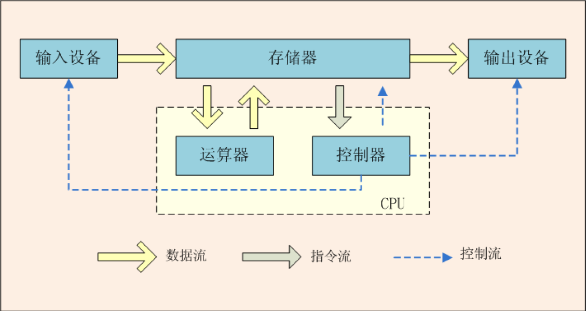
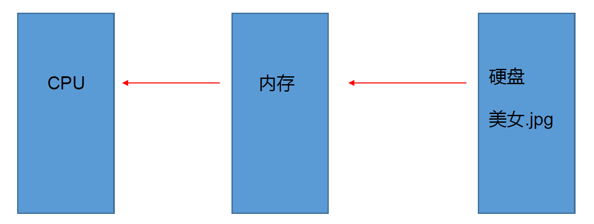
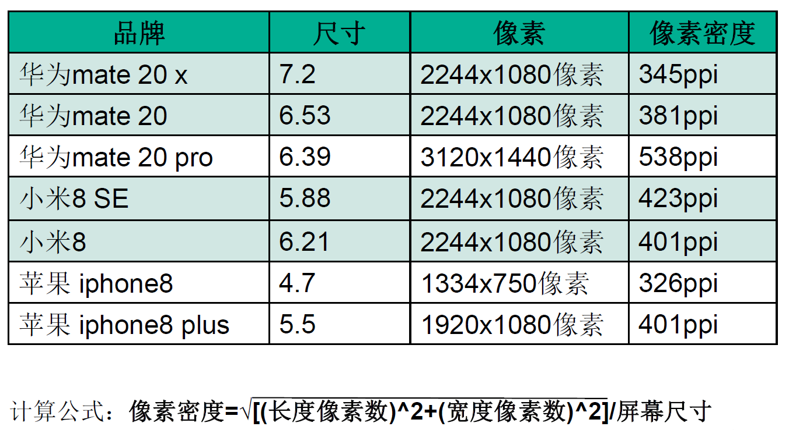

## 0.1 概述

## 0.2 计算机硬件介绍

### 冯·诺伊曼体系结构

### 中央处理器

中央处理器 (Central Processing Unit)

包括：控制单元 (control unit)和算术逻辑单元 (arithmetic/login unit)。

控制单元：用于控制和协调其他组件的动作。

算术逻辑单元： 用于完成数值运算(+,-,*,/) 和逻辑运算(比较)。

### IT定律之计算机行业发展规律

- 摩尔定律 (Moore’s Law)
- 安迪 比尔定律 (Andy and Bill’s Law)
- 反摩尔定律 (Reverse Moore’s Law)

### 存储设备

磁盘驱动器

光盘驱动器 (CD 和 DVD)

USB 闪存驱动器

### 内存

#### 数据如何存储在计算机中

比特(bit) 和字节 (byte)

计算机就是一系列的电路开关。每个开关存在两种状态：关 (off) 和开 (on)。如果电路是开的，它的值是 1 。如果电路是关的，它的值是 0 。

一个 0 或者一个 1 存储为一个比特 (bit),是计算机中最小的存储单位。

计算机中是最基本的存储单元是字节 (byte) 。每个字节由 8 个比特构成。

#### 内存

内存也叫(Random Access Memory, RAM )：由一个有序的字节序列组成，用于存储程序及程序需要的数据 。

每个字节都有一个唯一的地址。见右图。使用这个地址确定字节的位置，以便于存储和获取数据。

读写速度

CPU>>内存>>硬盘

但内存是带电存储的，一旦断电数据就会消失，而且容量有限，所以要长时间储存程序或数据就需要使用硬盘 。

内存在这里起了两个作用：

1.保存从硬盘读取的数据，提供给 CPU 使用

2.保存 CPU 的一些临时执行结果，以便 CPU 下次使用或保存到硬盘

### 输入输出设备

常见的输入设备： 键盘(keyboard)和鼠标(mouse)

常见的输出设备： 显示器(monitor)和打印机(printer)

显示器屏幕分辨率：是指显示设备水平和垂直方向上显示的像素 (px) 数 。

手机尺寸指对角线长度，所以像素密度等于对角线像素除以尺寸

### 通信设备

## 0.3 计算机发展史上的鼻祖

图灵是当之无愧的计算机科学和人工智能之父。重要发明图灵机

冯· 诺依曼是计算机之父和博弈论之父 。

## 0.4 操作系统

## 0.5 万维网

获取网络上的资源，有两种架构

B/S C/S

browser server

client server

