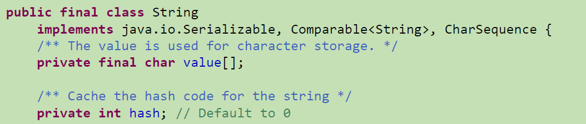
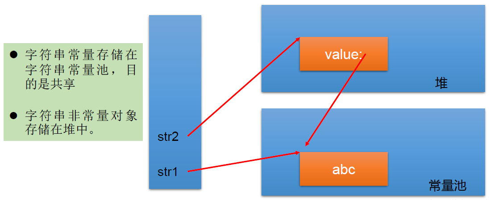
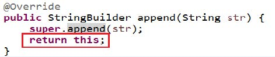

## String类

String的特性

- String 类代表字符串，用""引起来表示。 Java 程序中的所有字符串字面值(如 "abc")都作为此类的实例实现。

- String 是一个 final 类，不可被继承。

- String类实现了Serializable接口：表示字符串是支持序列化的。
  
                           实现了Comparable接口：表示 String 可以比较大小

- String内部定义了 final char[] value 用于存储字符串数据

- String 代表`不可变的字符序列` ，简称：`不可变性`。

- 原因：
  
  >  我们知道被 `final` 关键字修饰的类不能被继承，修饰的方法不能被重写，修饰的变量是基本数据类型则值不能改变，修饰的变量是引用类型则不能再指向其他对象。因此，`final` 关键字修饰的数组保存字符串并不是 `String` 不可变的根本原因，因为这个数组保存的字符串是可变的（`final` 修饰引用类型变量的情况）。
  > 
  > `String` 真正不可变有下面几点原因：
  > 
  > 1. 保存字符串的数组被 `final` 修饰且为私有的，并且`String` 类没有提供/暴露修改这个字符串的方法。
  > 2. `String` 类被 `final` 修饰导致其不能被继承，进而避免了子类破坏 `String` 不可变。
  > 
  > 相关阅读：[如何理解 String 类型值的不可变？ - 知乎提问  (opens new window)](https://www.zhihu.com/question/20618891/answer/114125846)
  > 
  > 补充（来自[issue 675  (opens new window)](https://github.com/Snailclimb/JavaGuide/issues/675)）：在 Java 9 之后，`String` 、`StringBuilder` 与 `StringBuffer` 的实现改用 byte 数组存储字符串。

- 体现：
  
  1.当对字符串重新赋值时，需要重写指定内存区域赋值，不能使用原有的value进行赋值。
  
  2.当对现有的字符串进行连接操作时，也需要重新指定内存区域赋值，不能使用原有的value进行赋值。
  
  3.当调用String的replace()方法修改指定字符或字符串时，也需要重新指定内存区域赋值，不能使用原有的value进行赋值。
  
  5.通过字面量的方式（区别于new）给一个字符串赋值，此时的字符串值声明在字符串常量池中。
  
  6.字符串常量池中是不会存储相同内容的字符串的

源码分析：



### String的不可变性

```java
import org.junit.Test;

/**
 * String的使用
 */
public class StringTest {

    @Test
    public void Test1(){
        String s1 = "abc";//字面量的定义方式
        String s2 = "abc";
        s1 = "hello";

        System.out.println(s1 == s2);//比较s1和s2的地址值，false

        System.out.println(s1);//hello
        System.out.println(s2);//abc

        System.out.println("*********************");

        String s3 = "abc";
        s3 += "def";
        System.out.println(s3);//abcdef
        System.out.println(s2);//abc

        System.out.println("**********************");

        String s4 = "abc";
        String s5 = s4.replace('a', 'm');
        System.out.println(s4);//abc
        System.out.println(s5);//mbc
    }
}
```


### String的两种实例化方式

```java
//方式一：通过字面量定义的方式
String str = "hello";

//方式二：通过new + 构造器的方式
String  s1 = new String(); //本质上this.value = new char[0];

String  s2 = new String(String original);//this.value = original.value;

String  s3 = new String(char[] a);//this.value = Arrays.copyOf(value, value.length);

String  s4 = new String(char[] a,int startIndex,int count);
```

#### 方式一与方式二的内存解析


#### 方式一与方式二的区别

例如：String str1 = “abc”;与String str2 = new String(“abc”);的区别？



#### 面试题

Q：String s = new String("abc");方式创建对象，在内存中创建了几个对象？
A：两个:一个是s对应的堆空间中new结构，另一个是char value[]对应的常量池中的数据："abc"

#### 练习

```java
import org.junit.Test;

/**
 * String的使用
 */
public class StringTest {
    @Test
    public void test2(){
        //通过字面量定义的方式：此时的s1和s2的数据javaEE声明在方法区中的字符串常量池中。
        String s1 = "javaEE";
        String s2 = "javaEE";

        //通过new + 构造器的方式:此时的s3和s4保存的地址值，是数据在堆空间中开辟空间以后对应的地址值。
        String s3 = new String("javaEE");
        String s4 = new String("javaEE");

        System.out.println(s1 == s2);//true
        System.out.println(s1 == s3);//false
        System.out.println(s1 == s4);//false
        System.out.println(s3 == s4);//false

        System.out.println("***********************");
        Person p1 = new Person("Tom",12);
        Person p2 = new Person("Tom",12);

        System.out.println(p1.name.equals(p2.name));//true
        System.out.println(p1.name == p2.name);//true

        p1.name = "Jerry";
        System.out.println(p2.name);//Tom
    }
}
```


### String不同拼接操作的对比

```java
import org.junit.Test;

/**
 * String的使用
 */
public class StringTest {

    @Test
    public void test4(){
        String s1 = "javaEEhadoop";
        String s2 = "javaEE";
        String s3 = s2 + "hadoop";
        System.out.println(s1 == s3);//false

        final String s4 = "javaEE";//s4:常量
        String s5 = s4 + "hadoop";
        System.out.println(s1 == s5);//true

    }

    @Test
    public void test3(){
        String s1 = "javaEE";
        String s2 = "hadoop";

        String s3 = "javaEEhadoop";
        String s4 = "javaEE" + "hadoop";
        String s5 = s1 + "hadoop";
        String s6 = "javaEE" + s2;
        String s7 = s1 + s2;

        System.out.println(s3 == s4);//true
        System.out.println(s3 == s5);//false
        System.out.println(s3 == s6);//false
        System.out.println(s5 == s6);//false
        System.out.println(s3 == s7);//false
        System.out.println(s5 == s6);//false
        System.out.println(s5 == s7);//false
        System.out.println(s6 == s7);//false

        String s8 = s5.intern();//返回值得到的s8使用的常量池中已经存在的“javaEEhadoop”
        System.out.println(s3 == s8);//true
    }
}
```

结论：

1. 常量与常量的拼接结果在常量池。且常量池中不会存在相同内容的常量。
   
   原理：JVM对于字符串常量的"+"号连接，将程序编译期，JVM就将常量字符串的"+"连接优化为连接后的值，拿"a" + 1来说，经编译器优化后在class中就已经是a1。在编译期其字符串常量的值就确定下来。

2. 只要其中有一个是变量，结果就在堆中。

3. 如果拼接的结果调用 intern() 方法，返回值就在常量池中。

#### String使用陷阱

1、

```java
String s1 = “a”;
```

说明：在字符串常量池中创建了一个字面量为"a"的字符串。

2、

```java
s1 = s1 + “b”;
```

说明：实际上原来的“a”字符串对象已经丢弃了，现在在堆空间中产生了一个字符串s1+“b”（也就是"ab")。如果多次执行这些改变串内容的操作，会导致大量副本字符串对象存留在内存中，降低效率。如果这样的操作放到循环中，会极大影响程序的性能。

3、

```java
String s2 = “ab”;
```

说明：直接在字符串常量池中创建一个字面量为"ab"的字符串。

4、

```java
String s3 = “a” + “b”;
```

说明：s3指向字符串常量池中已经创建的"ab"的字符串。

5、

```java
String s4 = s1.intern();
```

说明：堆空间的s1对象在调用intern()之后，会将常量池中已经存在的"ab"字符串赋值给s4。


#### String的一道面试题

Stirng类的不变性

原理：Java中只有值传递，相当于实参拷贝了一份副本，把副本传给了形参。

传入String类型时，赋值操作会导致重新创建一个对象，形参指向该对象。此时实参与形参指向的是不同的对象。

因此实参String的值没有发生改变。

> 相关阅读：https://zhuanlan.zhihu.com/p/102048219
> 
> https://www.cnblogs.com/anliux/p/12641018.html

```java
public class StringTest {
    String str = new String("good");
    char[] ch = { 't', 'e', 's', 't' };

    public void change(String str, char ch[]) {
        str = "test ok";
        ch[0] = 'b';
    }
    public static void main(String[] args) {
        StringTest ex = new StringTest();
        ex.change(ex.str, ex.ch);
        System.out.println(ex.str);//good
        System.out.println(ex.ch);//best
    }
}
```

### [JVM](https://so.csdn.net/so/search?q=JVM&spm=1001.2101.3001.7020)中涉及字符串的内存结构


### String的常用方法

| 返回值      | 方法名（参数列表）                                              | 作用                                                     |
| -------- | ------------------------------------------------------ | ------------------------------------------------------ |
| int      | length()                                               | 返回字符串的长度：return value.length                           |
| char     | charAt(int index)                                      | 返回某索引处的字符：return value[index]                          |
| boolean  | isEmpty()                                              | 判断是否是空字符串：return value.length==0                       |
| String   | toLowerCase()                                          | 使用默认语言环境，将String中的所有字符转换为小写                            |
| String   | toUpperCase()                                          | 使用默认语言环境，将String中的所有字符转换为大写                            |
| String   | trim()                                                 | 返回字符串的副本，忽略前导空白和尾部空白                                   |
| boolean  | equals(Object obj)                                     | 比较字符串的内容是否相同                                           |
| boolean  | equals IgnoreCase(String anotherString)                | 与equals方法类似，忽略大小写                                      |
| String   | concat(String str)                                     | 将指定字符串连接到此字符串的结尾。等价于用“+”                               |
| int      | compareTo(String anotherString)                        | 比较两个字符串的大小                                             |
| String   | substring(int beginIndex)                              | 返回一个新的字符串，它是此字符串的从beginIndex开始截取到最后的一个子字符串。            |
| String   | substring(int beginIndex，int endIndex)                 | 返回一个新字符串，它是此字符串从beginIndex开始截取到endIndex(不包含)的一个子字符串。   |
| boolean  | endsWith(String suffix)                                | 测试此字符串是否以指定的后缀结束                                       |
| boolean  | startsWith(String prefix)                              | 测试此字符串是否以指定的前缀开始                                       |
| boolean  | startsWith(String prefix, int toffset)                 | 测试此字符串从指定索引开始的子字符串是否以指定前缀开始                            |
| boolean  | contains(CharSequence s)                               | 当且仅当此字符串包含指定的 char 值序列时，返回 true                        |
| int      | indexOf(String str)                                    | 返回指定子字符串在此字符串中第一次出现处的索引，未找到返回 -1                       |
| int      | indexOf(String str, int fromIndex)                     | 返回指定子字符串在此字符串中第一次出现处的索引，从指定的索引开始，未找到返回 -1              |
| int      | lastIndexOf(String str)                                | 返回指定子字符串在此字符串中最后一次出现处的索引，未找到返回 -1                      |
| int      | lastIndexOf(String str, int fromIndex)                 | 返回指定子字符串在此字符串中最后一次出现处的索引，从指定的索引开始反向搜索，未找到返回 -1         |
| String   | replace(char oldChar, char newChar)                    | 返回一个新的字符串,它是通过用 newChar 替换此字符串中出现的所有 oldChar 得到的 。     |
| String   | replace(CharSequence target, CharSequence replacement) | 使用指定的字面值替换序列替换此字符串所有匹配字面值目标序列的子字符串 。                   |
| String   | replaceAll(String regex, String replacement)           | 使用给定的 replacement 替换此字符串所有匹配给定的正则表达式的子字符串 。            |
| String   | replaceFirst(String regex, String replacement)         | 使用给定的 replacement 替换此字符串匹配给定的正则表达式的第一个子字符串 。           |
| boolean  | matches(String regex)                                  | 告知此字符串是否匹配给定的正则表达式。                                    |
| String[] | split(String regex)                                    | 根据给定正则表达式的匹配拆分此字符串。                                    |
| String[] | split(String regex, int limit)                         | 根据匹配给定的正则表达式来拆分此字符串，最多不超过limit个，如果超过了，剩下的全部都放到最后一个元素中。 |

length()~substring()

```java
import org.junit.Test;

public class StringMethodTest {
    @Test
    public void test2(){
        String s1 = "HelloWorld";
        String s2 = "helloworld";
        System.out.println(s1.equals(s2));//false
        System.out.println(s1.equalsIgnoreCase(s2));//true

        String s3 = "abc";
        String s4 = s3.concat("def");
        System.out.println(s4);//abcdef

        String s5 = "abc";
        String s6 = new String("abe");
        //源码：字符数组从头往后一个一个去比，不一样就做减法
        System.out.println(s5.compareTo(s6));//-2，涉及到字符串的排序

        String s7 = "江苏省无锡市洛社镇";
        String s8 = s7.substring(3);
        System.out.println(s7);//江苏省无锡市洛社镇
        System.out.println(s8);//无锡市洛社镇

        String s9 = s7.substring(3, 6);
        System.out.println(s9);//无锡市
    }

    @Test
    public void Test1(){
        String s1 = "HelloWorld";
        System.out.println(s1.length());//10
        System.out.println(s1.charAt(0));//h
        System.out.println(s1.charAt(9));//d
//        System.out.println(s1.charAt(10));//StringIndexOutOfBoundsException
//        s1 = "";
        System.out.println(s1.isEmpty());//false

        String s2 = s1.toLowerCase();
        System.out.println(s1);//HelloWorld  s1不可变的，仍然为原来的字符串
        System.out.println(s2);//heeloworld  改成小写以后的字符串

        String s3 = "   he  llo   world   ";
        String s4 = s3.trim();
        System.out.println("-----" + s3 + "-----");//-----   he  llo   world   -----
        System.out.println("-----" + s4 + "-----");//-----he  llo   world-----
    }

}
```

endsWith()~lastIndexOf()

```java
import org.junit.Test;

public class StringMethodTest {
    @Test
    public void test3(){
        String str1 = "helloworld";
        boolean b1 = str1.endsWith("rld");
        System.out.println(b1);//true

        boolean b2 = str1.startsWith("He");
        System.out.println(b2);//false

        boolean b3 = str1.startsWith("ll",2);
        System.out.println(b3);//true

        String str2 = "wor";
        System.out.println(str1.contains(str2));//true

        System.out.println(str1.indexOf("lo"));//3
        System.out.println(str1.indexOf("lol"));//-1

        System.out.println(str1.indexOf("lo",5));//-1

        String str3 = "hellorworld";

        System.out.println(str3.lastIndexOf("or"));//7
        System.out.println(str3.lastIndexOf("or",6));//4

        //什么情况下，indexOf(str)和lastIndexOf(str)返回值相同？
        //情况一：存在唯一的一个str。情况二：不存在str
    }
}
```

replace()~split()

```java
import org.junit.Test;

public class StringMethodTest {
    @Test
    public void test4(){
        String str1 = "三年三月三天三月三年";
        String str2 = str1.replace('三','两');

        System.out.println(str1);//三年三月三天三月三年
        System.out.println(str2);//两年两月两天两月两年

        String str3 = str1.replace("三年", "两年");
        System.out.println(str3);//两年三月三天三月两年

        System.out.println("*************************");
        String str = "12hello34world5java7891mysql456";
        //把字符串中的数字替换成','，如果结果中开头和结尾有','的话去掉
        String string = str.replaceAll("\\d+", ",").replaceAll("^,|,$", "");
        System.out.println(string);

        System.out.println("*************************");
        str = "12345";
        //判断str字符串中是否全部有数字组成，即有1-n个数字组成
        boolean matches = str.matches("\\d+");
        System.out.println(matches);//true
        String tel = "0571-4534289";
        //判断这是否是一个杭州的固定电话
        boolean result = tel.matches("0571-\\d{7,8}");
        System.out.println(result);//true

        System.out.println("*************************");
        str = "hello|world|java";
        String[] strs = str.split("\\|");
        for (int i = 0; i < strs.length; i++) {
            System.out.println(strs[i]);
        }
        System.out.println();
        str2 = "hello.world.java";
        String[] strs2 = str2.split("\\.");
        for (int i = 0; i < strs2.length; i++) {
            System.out.println(strs2[i]);
        }
    }
}
```

### String与基本数据类型包装类的转换

```java
import org.junit.Test;

/**
 * 涉及到String类与其他结构之间的转换
 */
public class StringTest1 {

    /**
     * 复习
     *    String与基本数据类型、包装类之间的转换
     *
     *    String --> 基本数据类型、包装类：调用包装类的静态方法：parseXxx(str)
     *    基本数据类型、包装类 --> String:调用String重载的valueOf(xxx)
     */
    @Test
    public void test1(){
        String str1 = "123";
//        int num = (int)str1;//错误的
        int num = Integer.parseInt(str1);

        String str2 = String.valueOf(num);//123
        String str3 = num + "";//"123"

        System.out.println(str1 == str3);//false
    }

}
```

### String与char[]之间的转换

```java
import org.junit.Test;

/**
 * 涉及到String类与其他结构之间的转换
 */
public class StringTest1 {

    /**
     * String 与 char[]之间的转换
     *
     * String --> char[]:调用String的toCharArray()
     * char[] --> String:调用String的构造器
     */
    @Test
    public void test2(){
        String str1 = "abc123"; //题目： a21cb3

        char[] charArray = str1.toCharArray();
        for (int i = 0; i < charArray.length; i++) {
            System.out.println(charArray[i]);
        }

        char[] arr = new char[]{'h','e','l','l','o'};
        String str2 = new String(arr);
        System.out.println(str2);
    }
}
```

### String与byte[]之间的转换

```java
import org.junit.Test;

import java.io.UnsupportedEncodingException;
import java.util.Arrays;

/**
 * 涉及到String类与其他结构之间的转换
 */
public class StringTest1 {

    /**
     * String 与 byte[]之间的转换
     *
     * 编码：String --> byte[]:调用String的getBytes()
     * 解码：byte[] --> String:调用String的构造器
     *
     * 编码：字符串 -->字节  (看得懂 --->看不懂的二进制数据)
     * 解码：编码的逆过程，字节 --> 字符串 （看不懂的二进制数据 ---> 看得懂）
     *
     * 说明：解码时，要求解码使用的字符集必须与编码时使用的字符集一致，否则会出现乱码。
     *
     */
    @Test
    public void test3() throws UnsupportedEncodingException {
        String str1 = "abc123中国 ";
        byte[] bytes = str1.getBytes();//使用默认的字符编码集,进行转换
        System.out.println(Arrays.toString(bytes));

        byte[] gbks = str1.getBytes("gbk");//使用gbk字符集进行编码。
        System.out.println(Arrays.toString(gbks));

        System.out.println("*****************************");

        String str2 = new String(bytes);//使用默认的字符集，进行解码。
        System.out.println(str2);

        String str3 = new String(gbks);
        System.out.println(str3);//出现乱码。原因：编码集和解码集不一致！

        String str4 = new String(gbks,"gbk");
        System.out.println(str4);//没有出现乱码。原因：编码集和解码集一致！
    }
}
```

### 面试中String算法考查的说明

> 1、模拟一个trim方法，去除字符串两端的空格。

```java
import org.junit.Test;

/*
 * 1.模拟一个trim方法，去除字符串两端的空格。
 * 
 */
public class StringExer {

    // 第1题
    public String myTrim(String str) {
        if (str != null) {
            int start = 0;// 用于记录从前往后首次索引位置不是空格的位置的索引
            int end = str.length() - 1;// 用于记录从后往前首次索引位置不是空格的位置的索引

            while (start < end && str.charAt(start) == ' ') {
                start++;
            }

            while (start < end && str.charAt(end) == ' ') {
                end--;
            }
            if (str.charAt(start) == ' ') {
                return "";
            }

            return str.substring(start, end + 1);
        }
        return null;
    }

    @Test
    public void testMyTrim() {
        String str = "   a   ";
        // str = " ";
        String newStr = myTrim(str);
        System.out.println("---" + newStr + "---");
    }
}
```

> 2、将一个字符串进行反转。将字符串中指定部分进行反转。比如“abcdefg”反转为”abfedcg”

```java
import org.junit.Test;

public class StringDemo {

    /**
     * 将一个字符串进行反转。将字符串中指定部分进行反转。比如“abcdefg”反转为”abfedcg”
     *
     * 方式一：转换为char[]
     */
    public String reverse(String str,int startIndex,int endIndex){

        if(str != null && str.length() != 0) {
            char[] arr = str.toCharArray();
            for (int x = startIndex, y = endIndex; x < y; x++, y--) {
                char temp = arr[x];
                arr[x] = arr[y];
                arr[y] = temp;
            }
            return new String(arr);
        }
        return null;
    }

    /**
     * 方式二：使用String的拼接
     */
    public String reverse2(String str, int startIndex, int endIndex) {
        if(str != null) {
            // 第一部分
            String reverStr = str.substring(0,startIndex);// ab
            // 第二部分
            for (int i = endIndex; i >= startIndex; i--) {
                reverStr += str.charAt(i);
            } // abfedc
            // 第三部分
            reverStr += str.substring(endIndex + 1);

            return reverStr;
        }
        return null;
    }

    //方式三：使用StringBuffer/StringBuilder替换String
    public String reverse3(String str, int startIndex, int endIndex) {
        StringBuilder builder = new StringBuilder(str.length());

        if(str != null) {
            //第一部分
            builder.append(str.substring(0, startIndex));

            //第二部分
            for (int i = endIndex; i >= startIndex; i--) {

                builder.append(str.charAt(i));
            }
            //第三部分
            builder.append(str.substring(endIndex + 1));

            return builder.toString();
        }
        return null;
    }

    @Test
    public void testReverse() {
        String str = "abcdefg";
        String str1 = reverse3(str, 2, 5);
        System.out.println(str1);// abfedcg

    }
}
```

> 3、获取一个字符串在另一个字符串中出现的次数。比如：获取“ ab”在“abkkcadkabkebfkabkskab” 中出现的次数

```java
import org.junit.Test;

public class StringDemo2 {
    /**
     * 获取一个字符串在另一个字符串中出现的次数。
     * 比如：获取“ ab”在“abkkcadkabkebfkabkskab” 中出现的次数
     *
     */

    /**
     * 获取subStr在mainStr中出现的次数
     * @param mainStr
     * @param subStr
     */
    public int getCount(String mainStr,String subStr){
        int mainLength = mainStr.length();
        int subLength = subStr.length();
        int count = 0;
        int index = 0;

        if(mainLength >= subLength){

            //方式一：
//            while((index = mainStr.indexOf(subStr)) != -1){
//                count++;
//                mainStr = mainStr.substring(index + subStr.length());
//            }
            //方式二：对方式一的改进
            while((index = mainStr.indexOf(subStr,index)) != -1){
                count++;
                index += subLength;
            }

            return count;
        }else{
            return 0;
        }
    }

    @Test
    public void testGetCount(){
        String mainStr = "abkkcadkabkebfkabkskab";
        String subStr = "ab";
        int count = getCount(mainStr,subStr);
        System.out.println(count);
    }

}
```

> 4、获取两个字符串中最大相同子串。比如：
> 
> ```
> str1 = "abcwerthelloyuiodef“;str2 = “cvhellobnm”
> ```
> 
> 提示：将短的那个串进行长度依次递减的子串与较长的串比较。

```java
import org.junit.Test;

import java.util.Arrays;

public class StringDemo3 {
    /**
     * 获取两个字符串中最大相同子串。比如：
     * str1 = "abcwerthelloyuiodef“;str2 = "cvhellobnm"
     * 提示：将短的那个串进行长度依次递减的子串与较长的串比较。
     */
    //前提：两个字符串中只有一个最大相同子串
    public String getMaxSameString(String str1,String str2){
        if(str1 != null && str2 != null){
            String maxStr = (str1.length() >= str2.length())? str1 : str2;
            String minStr = (str1.length() < str2.length())? str1 : str2;
            int length = minStr.length();

            for(int i = 0;i < length;i++){
                for(int x = 0,y = length - i;y <= length;x++,y++){
                    String subStr = minStr.substring(x,y);
                    if(maxStr.contains(subStr)){
                        return subStr;
                    }

                }
            }

        }
        return null;
    }

    // 如果存在多个长度相同的最大相同子串
    // 此时先返回String[]，后面可以用集合中的ArrayList替换，较方便
    public String[] getMaxSameString1(String str1, String str2) {
        if (str1 != null && str2 != null) {
            StringBuffer sBuffer = new StringBuffer();
            String maxString = (str1.length() > str2.length()) ? str1 : str2;
            String minString = (str1.length() > str2.length()) ? str2 : str1;

            int len = minString.length();
            for (int i = 0; i < len; i++) {
                for (int x = 0, y = len - i; y <= len; x++, y++) {
                    String subString = minString.substring(x, y);
                    if (maxString.contains(subString)) {
                        sBuffer.append(subString + ",");
                    }
                }
//                System.out.println(sBuffer);
                if (sBuffer.length() != 0) {
                    break;
                }
            }
            String[] split = sBuffer.toString().replaceAll(",$", "").split("\\,");
            return split;
        }

        return null;
    }

    @Test
    public void testGetMaxSameString(){
        String str1 = "abcwerthello1yuiodefabcdef";
        String str2 = "cvhello1bnmabcdef";
        String[] maxSameStrings = getMaxSameString1(str1, str2);
        System.out.println(Arrays.toString(maxSameStrings));

    }

}
```

> 5、对字符串中字符进行自然顺序排序。
> 
> 提示：
> 
> 1）字符串变成字符数组。
> 
> 2）对数组排序，选择，冒泡，Arrays.sort();
> 
> 3）将排序后的数组变成字符串。

```java
import org.junit.Test;
import java.util.Arrays;

/**
 *
 * 5.对字符串中字符进行自然顺序排序。"abcwerthelloyuiodef"
 * 提示：
 *         1）字符串变成字符数组。
 *         2）对数组排序，选择，冒泡，Arrays.sort(str.toCharArray());
 *         3）将排序后的数组变成字符串。
 *
 */

public class StringDemo4 {

    // 第5题
    @Test
    public void testSort() {
        String str = "abcwerthelloyuiodef";
        char[] arr = str.toCharArray();
        Arrays.sort(arr);

        String newStr = new String(arr);
        System.out.println(newStr);
    }
}
```

## StringBuffer和StringBuilder类

### 面试题：String、StringBuffer、StringBuilder三者的异同？

* String(JDK 1.0)：不可变的字符序列；底层使用char[]存储
* StringBuffer(JDK 1.0)：可变的字符序列；线程安全的，效率低；底层使用char[]存储
* StringBuilder(JDK 5.0)：可变的字符序列；jdk5.0新增的，线程不安全的，效率高；底层使用char[]存储

注意：作为参数传递的话，方法内部 String 不会改变其值， StringBuffer 和 StringBuilder会改变其值。

### StringBuffer类

- java.StringBuffer 代表可变的字符序列 JDK1.0 中声明，可以对字符串内容进行增删，此时不会产生新的对象。
- 很多方法与 String 相同。
- 作为参数传递时，方法内部可以改变值


StringBuffer 类不同于 String ，其对象必须使用构造器生成。有三个构造器

- StringBuffer()：初始容量为 16 的字符串缓冲区
- StringBuffer(int size )：构造指定容量的字符串缓冲区
- StringBuffer(String str )：将内容初始化为指定字符串内容

### StringBuffer的源码分析

```java
import org.junit.Test;

/**
 * 关于StringBuffer和StringBuilder的使用
 */
public class StringBufferBuilderTest {
    @Test
    public void test1(){

        //源码分析：
        String str = new String();//char[] value = new char[0];
        String str1 = new String("abc");//char[] value = new char[]{'a','b','c'};

        StringBuffer sb1 = new StringBuffer();
        //char[] value = new char[16];底层创建了一个长度是16的数组。

        System.out.println(sb1.length());//0
        sb1.append('a');//value[0] = 'a';
        sb1.append('b');//value[1] = 'b';
        System.out.println(sb1.length());//2

         StringBuffer sb2 = new StringBuffer("abc");
        //char[] value = new char["abc".length() + 16];底层创建了长度是str.length()+16的数组

        //问题1.System.out.println(sb2.length());//3
         //问题2.扩容问题:如果要添加的数据底层数组盛不下了，那就需要扩容底层的数组。
        //默认情况下，扩容为原来容量的2倍+2，同时将原有数组中的元素复制到新的数组中。

        //意义：开发中建议大家使用：StringBuffer(int capacity) 或 StringBuilder(int capacity),避免          //底层数组扩容要复制数组导致效率变低
    }
}
```

### StringBuffer中的常用方法

| 返回值           | 方法名（参数列表）                               | 作用                               |
| ------------- | --------------------------------------- | -------------------------------- |
| StringBuffer  | append(xxx)                             | 提供了很多的append()方法，用于进行字符串拼接       |
| StringBuffer  | delete(int start,int end)               | 删除指定位置的内容                        |
| StringBuffer  | replace(int start, int end, String str) | 把[start,end)位置替换为str             |
| StringBuffer  | insert(int offset, xxx)：                | 在指定位置插入xxx                       |
| StringBuffer  | reverse()                               | 把当前字符序列逆转                        |
| public int    | indexOf(String str)                     |                                  |
| public String | substring(int start,int end)            | 返回一个从start开始到end索引结束的左闭右开区间的子字符串 |
| public int    | length()                                |                                  |
| public char   | charAt(int n )                          |                                  |
| public void   | setCharAt(int n ,char ch)               |                                  |

 总结：

- 增：append(xxx)
- 删：delete(int start,int end)
- 改：setCharAt(int n ,char ch) / replace(int start, int end, String str)
- 查：charAt(int n )
- 插：insert(int offset, xxx)
- 长度：length();
- 遍历：for() + charAt() / toString()

注意点

- 当 append 和 insert 时，如果原来 value 数组长度不够，可扩容 。
- 如上这些方法支持方法链操作。
- 方法链的原理



```java
import org.junit.Test;

/**
 * 关于StringBuffer和StringBuilder的使用
 */
public class StringBufferBuilderTest {
    @Test
    public void test2(){
        StringBuffer s1 = new StringBuffer("abc");
        s1.append(1);
        s1.append('1');
        System.out.println(s1);//abc11
//        s1.delete(2,4);//ab1
//        s1.replace(2,4,"hello");//abhello1
//        s1.insert(2,false);//abfalsec11,长度为10
//        s1.reverse();//11cba
        String s2 = s1.substring(1,3);
        System.out.println(s1);//abc11
        System.out.println(s1.length());//5
        System.out.println(s2);//bc
    }
}
```

### String、StringBuffer、StringBuilder效率对比

```java
import org.junit.Test;

/**
 * 关于StringBuffer和StringBuilder的使用
 */
public class StringBufferBuilderTest {

    /**
     * 对比String、StringBuffer、StringBuilder三者的效率：
     * 从高到低排列：StringBuilder > StringBuffer > String
     *
     */
    @Test
    public void test3(){
        //初始设置
        long startTime = 0L;
        long endTime = 0L;
        String text = "";
        StringBuffer buffer = new StringBuffer("");
        StringBuilder builder = new StringBuilder("");
        //开始对比
        startTime = System.currentTimeMillis();
        for (int i = 0; i < 20000; i++) {
            buffer.append(String.valueOf(i));
        }
        endTime = System.currentTimeMillis();
        System.out.println("StringBuffer的执行时间：" + (endTime - startTime));

        startTime = System.currentTimeMillis();
        for (int i = 0; i < 20000; i++) {
            builder.append(String.valueOf(i));
        }
        endTime = System.currentTimeMillis();
        System.out.println("StringBuilder的执行时间：" + (endTime - startTime));

        startTime = System.currentTimeMillis();
        for (int i = 0; i < 20000; i++) {
            text = text + i;
        }
        endTime = System.currentTimeMillis();
        System.out.println("String的执行时间：" + (endTime - startTime));

    }
}
```