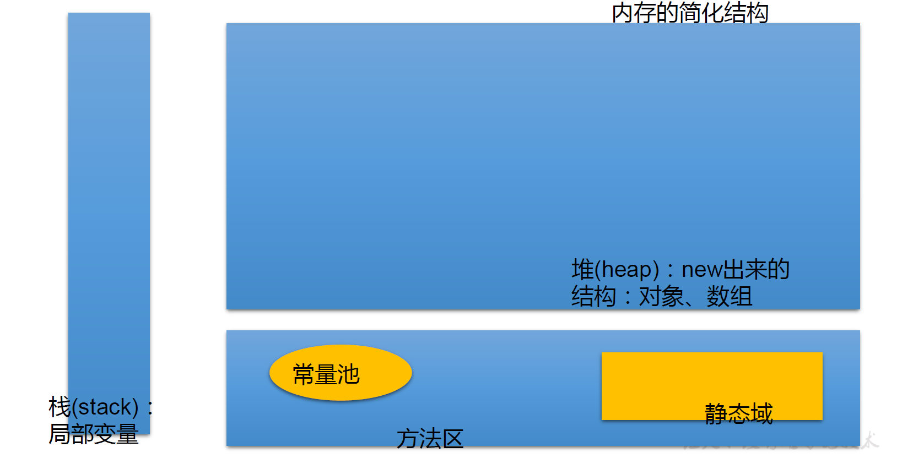
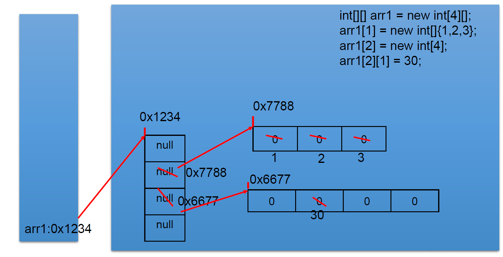

## 3.1 数组的概述

1. 数组的理解：数组 ( Array）是多个**相同类型数据**按**一定顺序排列**的集合，并使用一个名字命名，并通过**编号**的方式对这些数据进行统一管理 。

2. 数组的常见概念

   - 数组名

   - 下标（或索引）

   - 元素

   - 数组的长度：元素的个数

3. 数组的特点

   - 数组是有序排列的

   - 数组属于引用数据类型。数组的元素，既可以是基本数据类型，也可以是引用数据类型。

   - 创建数组对象会在内存中开辟一整块连续的空间，而数组名中引用的是这块连续空间的首地址 。

   - 数组的长度一旦确定就不能修改 。


4. 数组的分类

   - 按照维数：一维数组、二维数组…
   - 按照数组元素的类型：基本数据类型元素的数组、引用数组类型元素的数组


## 3.2 一维数组

一维数组的使用

1. 一维数组的声明和初始化

2. 如何调用一维数组的指定位置的元素

3. 如何获取一维数组的长度

4. 如何遍历一维数组

5. 一维数组元素的默认初始化值

6. 一维数组的内存解析


1. 一维数组的声明和初始化


```Java
		//1. 一维数组的声明和初始化
		int num;	//声明
		num = 10;	//初始化
		int id = 1001;	//声明 + 初始化		

		//声明格式：type var[];或 type[] var;
		int[] ids;
		//初始化
		//静态初始化:数组的初始化和数组元素的赋值操作同时进行
		ids = new int[] {1001,1002,1003,1004};
		//动态初始化:数组的初始化和数组元素的赋值操作分开进行		
		String[] names = new String[5];
		
		//错误的写法：
//		int[] arr1 = new int[];
//		int[5] arr2 = new int[5];
//		int[] arr3 = new int[3] {1,2,3};

		//也是正确的写法：
		int[] arr7 = {1,2,3,5,4};//类型推断
		//也是错误的写法
		ids = new int[] {1001,1002,1003,1004};//类型推断不出来
				
		//2.如何调用数组的指定位置的元素：通过角标的方式调用。
		//数组的角标(或索引)从0开始的，到数组的长度-1结束
		names[0] = "张郃";
		names[1] = "王陵";
		names[2] = "张学良";
		names[3] = "王传志";	//charAt(0)
		names[4] = "李峰";
//		names[5] = "周礼";	//如果数组超过角标会通过编译，运行失败。
		
		//3.如何获取数组的长度
		//属性：length
		System.out.println(names.length);//5
		System.out.println(ids.length);//4
		
		//4.如何遍历数组
//		System.out.println(names[0]);
//		System.out.println(names[1]);
//		System.out.println(names[2]);
//		System.out.println(names[3]);
//		System.out.println(names[4]);
		
		for(int i = 0;i < names.length;i++){
			System.out.println(names[i]);
		}
```

- 注意点：

  - Java 语言中声明数组时不能指定其长度（数组中元素的数） 例如：int a[5]; 非法

  - Java 中使用关键字 new 来创建数组

  - 数组一旦初始化完成，其长度就确定了。

2. 如何调用一维数组的指定位置的元素

   前提：声明并用 new 关键字为数组分配空间后，才可以引用这个数组中的每个元素

   数组元素的引用方式：数组名[数组元素下标] （下标，角标，索引）

   - 数组元素下标可以是整型常量或整型表达式。如a[3] , b[i] , c[6*i]

   - 数组元素下标从 0 开始，到数组长度-1结束；长度为 n 的数组合法下标取值范围 : 0 ——>n-1


3. 如何获取一维数组的长度

   属性：length

4. 如何遍历一维数组

   循环

5. 一维数组元素的默认初始化值

   数组是引用类型，它的元素相当于类的成员变量 ，因此数组一经分配空间，其中的每个元素也被按照成员变量同样的方式被隐式初始化。

| 数组元素的数据类型 | 默认初始化值         |
| ------------------ | -------------------- |
| 整型               | 0                    |
| 浮点型             | 0.0                  |
| 字符型             | 0或'\u0000'，而非'0' |
| 布尔型             | false                |
| 引用数据类型       | null，而非"null"     |

6. 一维数组的内存解析

   


 ```java
 /*
  * 2. 从键盘读入学生成绩，找出最高分，并输出学生成绩等级。
  * 成绩>=最高分-10    等级为’A’   
  * 成绩>=最高分-20    等级为’B’
  * 成绩>=最高分-30    等级为’C’   
  * 其余等级为’D’
  * 提示：先读入学生人数，根据人数创建int数组，存放学生成绩。
  */
 import java.util.Scanner;
 public class ArrayDemo2 {
 	public static void main(String[] args) {
 		//1.使用Scanner，读取学生的个数
 		Scanner scan = new Scanner(System.in);
 		System.out.print("请输入学生人数：");
 		int num = scan.nextInt();
 		
 		//2.创建数组，存储学生成绩，动态初始化
 		int[] str = new int[num];
 		System.out.println("请输入" + num + "个学生成绩");
 				
 		//3.给数组中的元素赋值
 		int maxnum = 0;
 		for(int i = 0;i < str.length;i++){
 			str[i] = scan.nextInt();
 			//4.获取数组元素中的最大值：最高分
 			if(maxnum < str[i]){
 				maxnum = str[i];
 			}
 		}
 		
 		//5.根据每个学生成绩与最高分的差值，得到每个学生的等级，并输出等级和成绩	
 		char Grade;	//成绩等级
 		for(int i = 0;i < str.length;i++){
 			if(maxnum - str[i] <= 10){
 				Grade = 'A';
 			}else if(maxnum - str[i] <= 20){
 				Grade = 'B';
 			}else if(maxnum - str[i] <= 30){
 				Grade = 'C';
 			}else{
 				Grade = 'D';
 			}
 			
 			System.out.println("student " + i + "score is" + str[i] + 
 					" grade is " + Grade);
 		}
 	}
 }
 ```

## 3.3 多维数组

- Java 语言里提供了支持多维数组的语法。
- 对于二维数组的理解，我们可以看成是一维数组array1又作为另一个一维数组array2的元素而存在。**从数组底层的运行机制来看，其实没有多维数组。**


二维数组的使用

1. 二维数组的声明和初始化
2. 如何调用二维数组的指定位置的元素
3. 如何获取二维数组的长度
4. 如何遍历二维数组
5. 二维数组元素的默认初始化值
6. 二维数组的内存解析

 

1. 二维数组的声明和初始化

2. 如何调用二维数组的指定位置的元素

3. 如何获取二维数组的长度

4. 如何遍历二维数组


```java
		//1.二维数组的声明和初始化
		int[] arr = new int[]{1,2,3};//一维数组
		//静态初始化
		int[][] arr1 = new int[][]{{1,2,3},{4,5,6},{7,8,9}};
		//动态初始化1
		String[][] arr2 = new String[3][2];
		//动态初始化2
		String[][] arr3 = new String[3][];
		
		//错误的情况
//		String[][] arr4 = new String[][];
//		String[][] arr5 = new String[][4];
//		String[][] arr6 = new String[4][3]{{1,2,3},{4,5,6},{7,8,9}};
		
		//正确的情况：
		int arr4[][] = new int[][]{{1,2,3},{4,5,12,6},{7,8,9}};
		int[] arr5[] = new int[][]{{1,2,3},{4,5,6},{7,8,9}};
		int[][] arr6 = {{1,2,3},{4,5,6},{7,8,9}};//类型推断		
		
		//2.如何调用数组的指定位置的元素
		System.out.println(arr1[0][1]);	//2
		System.out.println(arr2[1][1]);	//null
		
		arr3[1] = new String[4];//定义arr3的[1]为长度为4的字符数组
		System.out.println(arr3[1][0]);	//没有上句，会报错
		
		//3.获取数组的长度
		System.out.println(arr4.length);	//3
		System.out.println(arr4[0].length);	//3
		System.out.println(arr4[1].length);	//4
		
		//4.如何遍历二维数组
		for(int i = 0;i < arr4.length;i++){
			for(int j = 0;j < arr4[i].length;j++){
				System.out.print(arr4[i][j] + " ");
			}
			System.out.println();
		}
```


5. 二维数组元素的默认初始化值

   - 规定：二维数组分为外层数组的元素，内层数组的元素

     `int[][] arr = new int[4][3];`

     外层元素：`arr[0],arr[1]`

     内层元素：`arr[0][0],arr[1][2]`
   
   - 针对初始化方式一：比如`int[][] arr = new int[4][3];`
   
     - 外层元素的初始化值为：地址值
   
     - 内层元素的初始化值为：与一维数组初始化情况相同
   
   - 针对初始化方式二：`int[][] arr3 = new int[4][];`
   
     - 外层元素的初始化值为：null
   
     - 内层元素的初始化值为：不能调用，否则报错

6. 二维数组的内存解析



练习题：杨辉三角

使用二维数组打印一个 10 行杨辉三角。

```java
/*
 * 【提示】
 * 1. 第一行有 1 个元素, 第 n 行有 n 个元素
 * 2. 每一行的第一个元素和最后一个元素都是 1
 * 3. 从第三行开始, 对于非第一个元素和最后一个元素的元素。
 * 即：yanghui[i][j] = yanghui[i-1][j-1] + yanghui[i-1][j];
 */
public class ArrayEver2 {
	public static void main(String[] args) {
		//1.声明并初始化二维数组
		int[][] arr = new int[10][];
		
		//2.给数组的元素赋值，遍历二维数组
		for(int i = 0;i < arr.length;i++){
			arr[i] = new int[i+1];
			//2.1 给首末元素赋值
			arr[i][0]=arr[i][i]=1;
			//2.2 给每行的非首末元素赋值
			//if(i > 1){
			for(int j = 1;j < arr[i].length-1;j++){
					arr[i][j] = arr[i-1][j-1] + arr[i-1][j];
				}
			//}
		}
	    //3.遍历数组
		for(int i = 0;i < arr.length;i++){
			for(int j = 0;j <arr[i].length;j++){
				System.out.print(arr[i][j] + " ");
			}
			System.out.println();
		}		
	}
}
```

面试题：1、创建一个长度为 6 的 int 型数组，要求取值为 1-30，同时元素值各不相同

```java
//此题只做了解，初学不必精通。
public class ArrayEver3 {
	public static void main(String[] args) {
		// 方式一：
//		int[] arr = new int[6];
//		for (int i = 0; i < arr.length; i++) {// [0,1) [0,30) [1,31)
//			arr[i] = (int) (Math.random() * 30) + 1;
//
//			boolean flag = false;
//			while (true) {
//				for (int j = 0; j < i; j++) {
//					if (arr[i] == arr[j]) {
//						flag = true;
//						break;
//					}
//				}
//				if (flag) {
//					arr[i] = (int) (Math.random() * 30) + 1;
//					flag = false;
//					continue;
//				}
//				break;
//			}
//		}
//
//		for (int i = 0; i < arr.length; i++) {
//			System.out.println(arr[i]);
//		}
		// 方式二：
		int[] arr2 = new int[6];
		for (int i = 0; i < arr2.length; i++) {// [0,1) [0,30) [1,31)
			arr2[i] = (int) (Math.random() * 30) + 1;

			for (int j = 0; j < i; j++) {
				if (arr2[i] == arr2[j]) {
					i--;
					break;
				}
			}
		}

		for (int i = 0; i < arr2.length; i++) {
			System.out.println(arr2[i]);
		}
	}
}    
```

**数据结构**

1. 数据与数据之间的逻辑关系：集合、一对一、一对多、多对多

2. 数据的存储结构：
   - 线性表：顺序表（比如数组）、链表、栈、队列
   - 树形结构：二叉树
   - 图形结构：

**算法**

排序算法：

搜索算法：

 

## 3.4 数组中涉及的常见算法

1. 数组元素的赋值（杨辉三角、回形数等）                   

2. 求数值型数组中元素的最大值、最小值、平均数、总和等      

3. 数组的复制 、反转、查找（线性查找、二分法查找）          
   数组的复制类比文件夹创建快捷方式和复制

4. 数组元素的排序算法


1. 数组元素的赋值（杨辉三角、回形数等）    

```java
import java.util.Scanner;
/*
 * 此题了解！！！
 * 
 * 回形数格式方阵的实现
 * 从键盘输入一个整数（1~20） 
 * 则以该数字为矩阵的大小，把 1,2,3…n*n 的数字按照顺时针螺旋的形式填入其中。例如： 输入数字2，则程序输出： 1 2 
 * 4 3 
 * 输入数字 3，则程序输出：1 2 3 
 * 8 9 4 
 * 7 6 5 
 * 输入数字 4， 则程序输出： 
 * 1   2   3   4
 * 12  13  14  5 
 * 11  16  15  6 
 * 10  9   8   7
 */
public class ArrayTest {
	public static void main(String[] args) {
		Scanner scanner = new Scanner(System.in);
		System.out.println("输入一个数字:");
		int len = scanner.nextInt();
		int[][] arr = new int[len][len];
		int s = len * len;
		/*
		 * k = 1:向右 k = 2:向下 k = 3:向左 k = 4:向上
		 */
		int k = 1;
		int i = 0, j = 0;
		for (int m = 1; m <= s; m++) {
			if (k == 1) {
				if (j < len && arr[i][j] == 0) {
					arr[i][j++] = m;
				} else {
					k = 2;
					i++;
					j--;
					m--;
				}
			} else if (k == 2) {
				if (i < len && arr[i][j] == 0) {
					arr[i++][j] = m;
				} else {
					k = 3;
					i--;
					j--;
					m--;
				}
			} else if (k == 3) {
				if (j >= 0 && arr[i][j] == 0) {
					arr[i][j--] = m;
				} else {
					k = 4;
					i--;
					j++;
					m--;
				}
			} else if (k == 4) {
				if (i >= 0 && arr[i][j] == 0) {
					arr[i--][j] = m;
				} else {
					k = 1;
					i++;
					j++;
					m--;
				}
			}
		}
		// 遍历
		for (int m = 0; m < arr.length; m++) {
			for (int n = 0; n < arr[m].length; n++) {
				System.out.print(arr[m][n] + "\t");
			}
			System.out.println();
		}
	}
}

```


2. 求数值型数组中元素的最大值、最小值、平均数、总和等

```java
/*
 * 算法的考察：求数值型数组中元素的最大值、最小值、平均数、总和等
 * 
 * 定义一个 int 型的一维数组，包含 10 个元素，分别赋一些随机整数，
 * 然后求出所有元素的最大值，最小值，和值，平均值，并输出出来。
 * 要求：所有随机数都是两位数。
 * 
 * [10,99]
 * 公式：(int)(Math.random() * (99 - 10 + 1) + 10)
 */
public class ArrayTest1 {
	public static void main(String[] args) {
		int[] arr = new int[10];
		//数组赋值
		for(int i = 0;i <arr.length;i++){
			arr[i] = (int)(Math.random() * (99 - 10 + 1) + 10);
		}
		
		//遍历
		for(int i = 0;i < arr.length;i++){
			System.out.print(arr[i] + " ");
		}
		System.out.println();
		
		//求数组元素的最大值
		int maxValue = arr[0];
		for(int i = 1;i < arr.length;i++){
			if(maxValue < arr[i]){
				maxValue = arr[i];
			}
		}
		System.out.println("最大值：" + maxValue);
		
		//求数组元素的最小值
		int minValue = arr[0];
		for(int i = 1;i < arr.length;i++){
			if(minValue > arr[i]){
				minValue = arr[i];
			}
		}
		System.out.println("最小值：" + minValue);
		
		//求数组元素的总和
		int sum = 0;
		for(int i = 0;i < arr.length;i++){
			sum += arr[i];
		}
		System.out.println("总和：" + sum);
		
		//求数组元素的平均数
		double avgVales = sum / arr.length;
		System.out.println("平均数：" + avgVales);		
	}
}
```

3. 数组的复制 、反转、查找（线性查找、二分法查找）

```java
/*
 * 算法的考察：数组的复制、反转、查找(线性查找、二分法查找)
 */
public class ArrayTest3 {
	public static void main(String[] args) {
	
		String[] arr = new String[]{"SS","QQ","YY","XX","TT","KK","EE","GG"};
		
		//数组的复制
		String[] arr1 = new String[arr.length];
		for(int i = 0;i < arr1.length;i++){
			arr1[i] = arr[i];
		}
		
		//数组的反转
		//方法一：
//		for(int i = 0;i < arr.length / 2;i++){
//			String temp = arr[i];
//			arr[i] = arr[arr.length - i - 1];
//			arr[arr.length - i - 1] = temp;
//		}
		
		//方法二：
		for(int i = 0,j = arr.length - 1;i < j;i++,j--){
			String temp = arr[i];
			arr[i] = arr[j];
			arr[j] = temp;
		}
		
		//遍历
		for(int i = 0;i < arr.length;i++){
			System.out.print(arr[i] + "\t");
		}
		System.out.println();
		
		//查找（或搜索）
		//线性查找
		String dest = "BB";	//要查找的元素
		dest = "CC";
		
		boolean isFlag = true;
		
		for(int i = 0;i < arr.length;i++){
			if(dest.equals(arr[i])){
				System.out.println("找到了指定元素，位置为：" + i);
				isFlag = false;
				break;
			}
		}
		if(isFlag){
			System.out.println("很遗憾，没找到！");
		}
		
		//二分法查找：
		
	}
}
```


排序算法

排序：

假设含有 n 个记录的序列为 {R1,R2,…,Rn} 其相应的关键字序列为

{K1,K2,…,Kn} 。将这些记录重新排序为 {Ri1, Ri2,…,Rin} 使得相应的关键

字值满足条 Ki1<=Ki2<=...<=Kin, 这样的一种操作称为排序。

通常来说，排序的目的是快速查找。

衡量排序算法的优劣：

1.时间复杂度 ：分析关键字的比较次数和记录的移动次数

2.空间复杂度： 分析排序算法中需要多少辅助内存

3.稳定性： 若两个记录 A 和 B 的关键字值相等，但排序后 A 、 B 的先后次序保

持不变，则称这种排序算法是稳定的。

 

排序算法分类：

内部排序和外部排序 。

内部排序 ：整个排序过程不需要借助于外部存储器（如磁盘等），所有排

序操作都在内存中完成。

外部排序 ：参与排序的数据非常多，数据量非常大，计算机无法把整个排

序过程放在内存中完成，必须借助于外部存储器（如磁盘）。外部排序最

常见的是多路归并排序。可以认为外部排序是由多次内部排序组成。

 

十大内部排序

算法

- 选择排序
  - 直接选择排序、 堆排序

- 交换排序
  - 冒泡排序 、 快速排序

- 插入排序
  - 直接插入排序、 折半插入排序、 Shell 排序

- 归并排序
- 桶式排序
- 基数排序

 ```java
 /*
  * 数组的冒泡排序的实现
  * 
  */
 public class BubbleSortTest {
 	public static void main(String[] args) {
 		
 		int[] arr = new int[]{43,32,76,92,-65,85,71,-42};
 		
 		//冒泡排序
 		for(int i = 0;i < arr.length - 1;i++){
 			
 			for(int j = 0;j < arr.length - 1 - i;j++){
 				
 				if(arr[j] > arr[j+1]){
 					int temp = arr[j];
 					arr[j] = arr[j+1];
 					arr[j+1] = temp;
 				}
 			}
 		}
 		
 		for(int i = 0;i < arr.length;i++){
 			System.out.print(arr[i] + "\t");
 		}
 	}
 }
 ```


## 3.5 Arrays 工具类的使用

 

## 3.6 数组使用中的常见异常