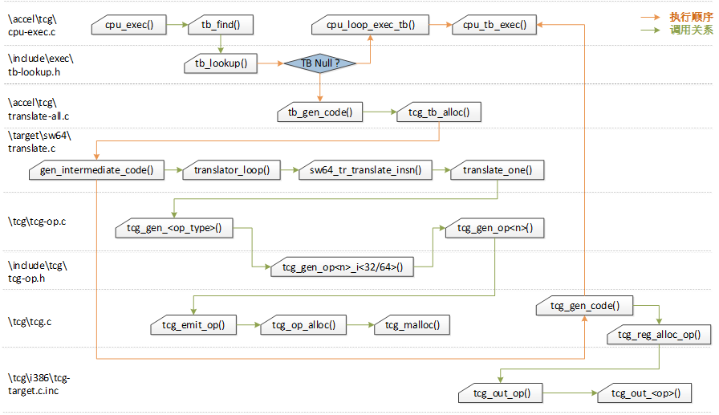

执行模块：
流程：
cpu_exec()开始执行，调用tb_find()去查找下一个翻译好的host codeTB，找到后调用cpu_loop_exec_tb()执行TB。
cpu_exec()执行。调用tb_find()和cpu_loop_exec_tb()。

tb_find()：查找下一个TB。
具体流程：
1)首先根据pc值，通过tb_lookup() 查找是否存在已有TB；
2)如果当前位置找不到已有TB，就调用tb_gen_code() 生成一个新的TB（tb_gen_code()作为TCG翻译的入口函数），并将翻译后的新TB加入cpu->tb_jmp_cache中；
3)若last_tb存在，则调用tb_add_jump() 将上面获得的TB链接到last_tb后面。

tb_lookup()：具体查找TB
1)获取TB的hash：tb_jmp_cache_hash_func() 根据pc值获取存储TB的hash表索引
一级缓存（fast path）；
2)从cpu->tb_jmp_cache获取TB，如果取到，且判断正确，则返回TB；tb_jmp_cache[]是hash table
3)如果一级缓存没能命中有效TB，则进入二级缓存（slow path）查找 -- tb_htable_lookup()，若找到就将结果放入cpu->tb_jmp_cache（即二级缓存中命中的TB都会被直接更新到一级缓存中，以增加一级缓存的TB命中率，从而提高TB查找效率）。

cpu_loop_exec_tb()：执行TB，有一些判断条件，判断下一个TB
cpu_tb_exec()：执行TB
具体流程
4)获取已翻译代码的地址：itb->tc.ptr
5)TCG目标会使用不同的tcg_qemu_tb_exec定义(调用tcg_target_qemu_prologue()生成的prologue.code)
返回Last_tb

前端模块：翻译guest code
tb_gen_code():翻译guest code
get_page_addr_code()：获取phys_pc，即Guest OS PC (Program counter) 的物理内存地址
tcg_tb_alloc()：在TCGContext中给TB分配空间
gen_intermediate_code()：生成中间代码存放在TCGContext中
tcg_gen_code()：将中间代码转换成host code
tb_link_page()：添加新的TB，并将其与物理页表链接

gen_intermediate_code()：调用translator_loop()进行块的中间代码翻译
tanslator_loop()：是架构通用的，依赖目标特定的翻译器操作符，此处是alpha架构对应的alpha_tr_ops。
将alpha架构的操作封装在TranslatorOps ops中，并用ops->func调用。
函数主要有
gen_tb_start()
translate_insn()--translate_one()--tcg_gen_<op>()--tcg_gen_op<n>_i<32/64>()--tcg_gen_op<n>()--tcg_emit_op()

gen_tb_end()--tcg_gen_exit_tb()

TCG后端的主要功能是把中间代码（TCG Operations）转化成Host Code。
tcg_reg_alloc_op():tcg_reg_alloc_op()中根据输入参数、输出参数的有效性进行寄存器分配，之后调用tcg_out_op()进行tcg-target代码的转换。
tcg_out_op()主要功能就是依据TCG操作码，调用对应的转换函数将操作转换成host机器码。

> 问题一：
> 
> cpu_tb_exec()->tcg_qemu_tb_exec 进不去，找不到定义
> 
> 问题二：
> 
> tb_lookup()这个函数sourceinsight找不到啊

- [ ] 问题一：
  
  cpu_tb_exec()->tcg_qemu_tb_exec 进不去，找不到定义
  
  问题二：
  
  tb_lookup()这个函数sourceinsight找不到啊，很多函数都不好找
  
  问题三：
  
  i386的translator_loop在accel/tcg/translator.c
  
  gen_intermediate_code,i386_tr_translate_insn在target/i386/tcg/translate.c

# 源码分析

用户模式user mode

\bsd-user\main.c     main()->cpu_loop

 

## 执行模块

### 流程

> /linux-user/main.c:main

```c
int main(int argc, char **argv)
{
    ...
    cpu_loop(env);//
    ...
}
```

> /linux-user/sw64/cpu_loop.c:cpu_loop

```c
void cpu_loop(CPUSW64State *env)
{
    CPUState *cs = CPU(sw64_env_get_cpu(env));
    int trapnr;
    target_siginfo_t info;
    abi_long sysret;

    while (1) {
        cpu_exec_start(cs);
        trapnr = cpu_exec(cs);//
        cpu_exec_end(cs);
        process_queued_cpu_work(cs);
    ...
}
```

> /accel/tcg/cpu-exec.c:cpu_exec

```c
int cpu_exec(CPUState *cpu)
{
    ...
    tb = tb_find(cpu, last_tb, tb_exit, cflags);//
    cpu_loop_exec_tb(cpu, tb, &last_tb, &tb_exit);//
    ...
}
```

> /accel/tcg/cpu-exec.c:tb_find

```c
static inline TranslationBlock *tb_find(CPUState *cpu,
                                        TranslationBlock *last_tb,
                                        int tb_exit, uint32_t cflags)
{
    CPUArchState *env = (CPUArchState *)cpu->env_ptr;
    TranslationBlock *tb;
    target_ulong cs_base, pc;
    uint32_t flags;

    cpu_get_tb_cpu_state(env, &pc, &cs_base, &flags);

    tb = tb_lookup(cpu, pc, cs_base, flags, cflags);// /include/exec/tb-lookup.h
    if (tb == NULL) {
        mmap_lock();
        tb = tb_gen_code(cpu, pc, cs_base, flags, cflags);//
        mmap_unlock();
        /* We add the TB in the virtual pc hash table for the fast lookup */
        qatomic_set(&cpu->tb_jmp_cache[tb_jmp_cache_hash_func(pc)], tb);
    }
    ...
}
```

main->cpu_loop->cpu_exec

cpu_exec->①tb_find②cpu_loop_exec_tb

tb_find->①tb_lookup②tb_gen_code

cpu_loop_exec_tb->cpu_tb_exec

如果tb_lookup找的到，直接执行cpu_loop_exec_tb执行tb

如果tb_lookup找不到，则调用tb_gen_code生成生成tb

tb_lookup()查找可执行的TranslationBlock（翻译好的host code机器代码），如果找到，执行用cpu_loop_exec_tb()执行TB；如果没有找到开始生成TB，则调用tb_gen_code()生成一个可执行TB。

tcg_tb_alloc()会在TCGContext中分配空间,并执行gen_intermediate_code()翻译guest code成中间代码放在TCGContext中，tcg_gen_code()会将TCGContext中的中间代码翻译成host code。

> 发现生成tb后执行时tb.pc=0x120000510和log上第一个一致。qemu-sw64 -d in_asm,op,out_asm -cpu core3 hello > log 2>&1
> 
> OP:前两行为gen_tb_start内容，后两行为gen_tb_end内容

### 全局变量tcg_ctx

用户级tcg_ctx = &tcg_init_ctx;

系统级有多个线程，不同的处理方式

全局的TCGContext初始化
翻译代码时目前是单线程的，共享同一份的上下文，这样可以确保 同一份target 代码只会生成一份对应的 code cache， 在 tcg_context_init(&tcg_init_ctx); 初始化过程中，初始化 IR指令和helper指令和 TCGContext 的一些内部成员，为后续的指令翻译做准备。

> /tcg/tcg.c

```c
/* code generation context */
TCGContext tcg_init_ctx;
__thread TCGContext *tcg_ctx;
TBContext tb_ctx;
/include/exec/gen-icount.h
void tcg_register_thread(void)
{
    tcg_ctx = &tcg_init_ctx;
}
```

```c
int main(int argc, char **argv)
{
    TaskState *ts;
    CPUArchState *env;//保存cpu相关信息的数据结构，这里就是CPUSW64State
    CPUState *cpu;
    int optind;
    char **target_environ, **wrk;
    char **target_argv;
    int target_argc;
    int i;
    int ret;
    int execfd;
    int log_mask;
    unsigned long max_reserved_va;
    bool preserve_argv0;


    /* Scan interp_prefix dir for replacement files. */
    init_paths(interp_prefix);//库文件路径

    init_qemu_uname_release();//检查内核版本
    ...
    if (cpu_model == NULL) {
        cpu_model = cpu_get_model(get_elf_eflags(execfd));//获取target cpu信息
    }
    ...
    /* init tcg before creating CPUs and to get qemu_host_page_size */
    {
        AccelClass *ac = ACCEL_GET_CLASS(current_accel());

        ac->init_machine(NULL);//tcg功能初始化
        accel_init_interfaces(ac);
    }
    cpu = cpu_create(cpu_type);//创建CPUState对象
    env = cpu->env_ptr;//赋值给env
    cpu_reset(cpu);
    thread_cpu = cpu;
    ...
    /* build Task State */
    ts->info = info;
    ts->bprm = &bprm;
    cpu->opaque = ts;
    task_settid(ts);
    //装载ELF文件
    ret = loader_exec(execfd, exec_path, target_argv, target_environ, regs,
        info, &bprm);//加载应用程序，除此之外还有环境变量，参数
    if (ret != 0) {
        printf("Error while loading %s: %s\n", exec_path, strerror(-ret));
        _exit(EXIT_FAILURE);
    }
}
```

### 重要局部变量CPU，CPUState

要定义所有CPU的基类，需要定义CPU的类的数据结构和CPU的对象的数据结构，然后给对应的TypeInfo中的函数指针赋值即可。其中CPU类的数据结构名为CPUClass、CPU对象的数据结构名为CPUState，它们被定义在include/qom/cpu.h中，而对应的TypeInfo的赋值工作则在qom/cpu.c中进行。这里只说明CPUClass、CPUState数据结构。

> /target/sw64/cpu.h:SW64CPU

```c
struct SW64CPU {
    /*< private >*/
    CPUState parent_obj;
    /*< public >*/
    CPUNegativeOffsetState neg;
    CPUSW64State env;

    uint64_t k_regs[158];
    uint64_t k_vcb[36];
    QEMUTimer *alarm_timer;
    target_ulong irq;
    uint32_t cid;
};
```

CPUState是CPU对象的数据结构，一个CPUState就表示一个虚拟机的CPU（一个cpu核心或者线程）。在QEMU中，任何CPU的操作的大部分都是对以CPUState形式出现的CPU来进行的。*env_ptr;这个数据结构保存该CPU的所有寄存器的状态，也包括段寄存器、通用寄存器、标志寄存器等，也包括FPU等浮点寄存器，以及与KVM状态相关的信息。sw64对应的数据结构是CPUSW64State，读者可在target/sw64/cpu.h中看到。

> /target/sw64/cpu.h:CPUSW64State

```c
typedef CPUSW64State CPUArchState;
typedef SW64CPU ArchCPU;

struct CPUSW64State {
    uint64_t ir[32];//指令寄存器
    uint64_t fr[128];//标志寄存器
    uint64_t pc;//程序计数器
    bool is_slave;

    uint64_t csr[0x100];//控制与状态寄存器
    uint64_t fpcr;//浮点控制寄存器
    uint64_t fpcr_exc_enable;
    uint8_t fpcr_round_mode;
    uint8_t fpcr_flush_to_zero;

    float_status fp_status;

    uint64_t hm_entry;

#if !defined(CONFIG_USER_ONLY)
    uint64_t sr[10]; /* shadow regs 1,2,4-7,20-23 */
#endif

    uint32_t flags;
    uint64_t error_code;
    uint64_t unique;
    uint64_t lock_addr;
    uint64_t lock_valid;
    uint64_t lock_flag;
    uint64_t lock_success;
#ifdef SW64_FIXLOCK
    uint64_t lock_value;
#endif

    uint64_t trap_arg0;
    uint64_t trap_arg1;
    uint64_t trap_arg2;

    uint64_t features;
    uint64_t insn_count[537];

    /* reserve for slave */
    uint64_t ca[4];
    uint64_t scala_gpr[64];
    uint64_t vec_gpr[224];
    uint64_t fpcr_base;
    uint64_t fpcr_ext;
    uint64_t pendding_flag;
    uint64_t pendding_status;
    uint64_t synr_pendding_status;
    uint64_t sync_pendding_status;
    uint8_t vlenma_idxa;
    uint8_t stable;
};
```

> /include/hw/core/cpu.h:CPUState

```c
struct CPUState {
    /*< private >*/
    DeviceState parent_obj;
    /*< public >*/

    int nr_cores;
    int nr_threads;

    struct QemuThread *thread;
#ifdef _WIN32
    HANDLE hThread;
#endif
    int thread_id;
    bool running, has_waiter;
    struct QemuCond *halt_cond;
    bool thread_kicked;
    bool created;
    bool stop;
    bool stopped;

    QemuMutex work_mutex;
    QSIMPLEQ_HEAD(, qemu_work_item) work_list;

    CPUAddressSpace *cpu_ases;
    int num_ases;
    AddressSpace *as;
    MemoryRegion *memory;

    void *env_ptr; /* CPUArchState */
    IcountDecr *icount_decr_ptr;

    /* Accessed in parallel; all accesses must be atomic */
    TranslationBlock *tb_jmp_cache[TB_JMP_CACHE_SIZE];

    struct GDBRegisterState *gdb_regs;
    int gdb_num_regs;
    int gdb_num_g_regs;
    QTAILQ_ENTRY(CPUState) node;

    /* ice debug support */
    QTAILQ_HEAD(, CPUBreakpoint) breakpoints;

    QTAILQ_HEAD(, CPUWatchpoint) watchpoints;
    CPUWatchpoint *watchpoint_hit;

};
```

### ELF装载

## 前端

### DisasContext ，DisasContextBase，TranslationBlock

/target/sw64/translate.h:DisasContext

```c
typedef struct DisasContext DisasContext;
struct DisasContext {
    DisasContextBase base;//上下文头，是架构通用的。

    uint32_t tbflags;

    /* The set of registers active in the current context.  */
    TCGv *ir;

    /* Accel: Temporaries for $31 and $f31 as source and destination.  */
    TCGv zero;
    int mem_idx;
    CPUSW64State *env;//CPUState环境信息
    DisasJumpType (*translate_one)(DisasContextBase *dcbase, uint32_t insn,
            CPUState *cpu);
};
```

```c
typedef struct DisasContextBase {
    const TranslationBlock *tb;
    target_ulong pc_first;
    target_ulong pc_next;
    DisasJumpType is_jmp;
    int num_insns;
    int max_insns;
    bool singlestep_enabled;
} DisasContextBase;
```

```c
struct TranslationBlock {
    target_ulong pc;   /* simulated PC corresponding to this block (EIP + CS base) */
    target_ulong cs_base; /* CS base for this block */
    uint32_t flags; /* flags defining in which context the code was generated */
    uint32_t cflags;    /* compile flags */
#define CF_COUNT_MASK  0x00007fff
#define CF_LAST_IO     0x00008000 /* Last insn may be an IO access.  */
#define CF_MEMI_ONLY   0x00010000 /* Only instrument memory ops */
#define CF_USE_ICOUNT  0x00020000
#define CF_INVALID     0x00040000 /* TB is stale. Set with @jmp_lock held */
#define CF_PARALLEL    0x00080000 /* Generate code for a parallel context */
#define CF_CLUSTER_MASK 0xff000000 /* Top 8 bits are cluster ID */
#define CF_CLUSTER_SHIFT 24

    /* Per-vCPU dynamic tracing state used to generate this TB */
    uint32_t trace_vcpu_dstate;

    /*
     * Above fields used for comparing
     */

    /* size of target code for this block (1 <= size <= TARGET_PAGE_SIZE) */
    uint16_t size;
    uint16_t icount;

    struct tb_tc tc;

    /* first and second physical page containing code. The lower bit
       of the pointer tells the index in page_next[].
       The list is protected by the TB's page('s) lock(s) */
    uintptr_t page_next[2];
    tb_page_addr_t page_addr[2];

    /* jmp_lock placed here to fill a 4-byte hole. Its documentation is below */
    QemuSpin jmp_lock;

    /* The following data are used to directly call another TB from
     * the code of this one. This can be done either by emitting direct or
     * indirect native jump instructions. These jumps are reset so that the TB
     * just continues its execution. The TB can be linked to another one by
     * setting one of the jump targets (or patching the jump instruction). Only
     * two of such jumps are supported.
     */
    uint16_t jmp_reset_offset[2]; /* offset of original jump target */
#define TB_JMP_RESET_OFFSET_INVALID 0xffff /* indicates no jump generated */
    uintptr_t jmp_target_arg[2];  /* target address or offset */

    /*
     * Each TB has a NULL-terminated list (jmp_list_head) of incoming jumps.
     * Each TB can have two outgoing jumps, and therefore can participate
     * in two lists. The list entries are kept in jmp_list_next[2]. The least
     * significant bit (LSB) of the pointers in these lists is used to encode
     * which of the two list entries is to be used in the pointed TB.
     *
     * List traversals are protected by jmp_lock. The destination TB of each
     * outgoing jump is kept in jmp_dest[] so that the appropriate jmp_lock
     * can be acquired from any origin TB.
     *
     * jmp_dest[] are tagged pointers as well. The LSB is set when the TB is
     * being invalidated, so that no further outgoing jumps from it can be set.
     *
     * jmp_lock also protects the CF_INVALID cflag; a jump must not be chained
     * to a destination TB that has CF_INVALID set.
     */
    uintptr_t jmp_list_head;
    uintptr_t jmp_list_next[2];
    uintptr_t jmp_dest[2];
};
```

```c
 struct CPUState {
    /*< private >*/
    DeviceState parent_obj;
    /*< public >*/

    int nr_cores;
    int nr_threads;

    struct QemuThread *thread;
#ifdef _WIN32
    HANDLE hThread;
#endif
    int thread_id;
    bool running, has_waiter;
    struct QemuCond *halt_cond;
    bool thread_kicked;
    bool created;
    bool stop;
    bool stopped;

    /* Should CPU start in powered-off state? */
    bool start_powered_off;

    bool unplug;
    bool crash_occurred;
    bool exit_request;
    bool in_exclusive_context;
    uint32_t cflags_next_tb;
    /* updates protected by BQL */
    uint32_t interrupt_request;
    int singlestep_enabled;
    int64_t icount_budget;
    int64_t icount_extra;
    uint64_t random_seed;
    sigjmp_buf jmp_env;

    QemuMutex work_mutex;
    QSIMPLEQ_HEAD(, qemu_work_item) work_list;

    CPUAddressSpace *cpu_ases;
    int num_ases;
    AddressSpace *as;
    MemoryRegion *memory;

    void *env_ptr; /* CPUArchState */
    IcountDecr *icount_decr_ptr;

    /* Accessed in parallel; all accesses must be atomic */
    TranslationBlock *tb_jmp_cache[TB_JMP_CACHE_SIZE];

    struct GDBRegisterState *gdb_regs;
    int gdb_num_regs;
    int gdb_num_g_regs;
    QTAILQ_ENTRY(CPUState) node;

    /* ice debug support */
    QTAILQ_HEAD(, CPUBreakpoint) breakpoints;

    QTAILQ_HEAD(, CPUWatchpoint) watchpoints;
    CPUWatchpoint *watchpoint_hit;

    void *opaque;

    /* In order to avoid passing too many arguments to the MMIO helpers,
     * we store some rarely used information in the CPU context.
     */
    uintptr_t mem_io_pc;

    int kvm_fd;
    struct KVMState *kvm_state;
    struct kvm_run *kvm_run;

    /* Used for events with 'vcpu' and *without* the 'disabled' properties */
    DECLARE_BITMAP(trace_dstate_delayed, CPU_TRACE_DSTATE_MAX_EVENTS);
    DECLARE_BITMAP(trace_dstate, CPU_TRACE_DSTATE_MAX_EVENTS);

    DECLARE_BITMAP(plugin_mask, QEMU_PLUGIN_EV_MAX);

#ifdef CONFIG_PLUGIN
    GArray *plugin_mem_cbs;
    /* saved iotlb data from io_writex */
    SavedIOTLB saved_iotlb;
#endif

    /* TODO Move common fields from CPUArchState here. */
    int cpu_index;
    int cluster_index;
    uint32_t tcg_cflags;
    uint32_t halted;
    uint32_t can_do_io;
    int32_t exception_index;

    /* shared by kvm, hax and hvf */
    bool vcpu_dirty;

    /* Used to keep track of an outstanding cpu throttle thread for migration
     * autoconverge
     */
    bool throttle_thread_scheduled;

    bool ignore_memory_transaction_failures;

    struct hax_vcpu_state *hax_vcpu;

    int hvf_fd;

    /* track IOMMUs whose translations we've cached in the TCG TLB */
    GArray *iommu_notifiers;
};
```

### gen_intermediate_code()：

声明DisasContext结构体变量dc，调用transloop_loop()把guest code翻译为中间代码。

执行函数

```c
void gen_intermediate_code(CPUState* cpu, TranslationBlock* tb, int max_insns)
{
    DisasContext dc;
    init_transops(cpu, &dc);
    translator_loop(&sw64_trans_ops, &dc.base, cpu, tb, max_insns);
}
```

程序计数器pc =代码段寄存器cs+指令指针寄存器EIP（段地址：偏移地址）

### TranslatorOps

```c
static const TranslatorOps sw64_trans_ops = {
    .init_disas_context = sw64_tr_init_disas_context,
    .tb_start = sw64_tr_tb_start,
    .insn_start = sw64_tr_insn_start,
    .translate_insn = sw64_tr_translate_insn,
    .tb_stop = sw64_tr_tb_stop,
    .disas_log = sw64_tr_disas_log,
};
```

### translator_loop()

void translator_loop(const TranslatorOps *ops, DisasContextBase *db,CPUState *cpu, TranslationBlock *tb, int max_insns)

Ops：架构特定的翻译操作集合，sw64中

Db：反汇编上下文，需要初始化

Cpu：目标cpu信息，执行模块中已经获取，已知

Tb：翻译块，需要生成的

max_insns：最大翻译指令数量

translator_loop

架构通用，依赖于特定的目标架构的翻译操作ops集合（此处为sw64_trans_ops），由 ./include/exec/translator.h中声明结构体TranslatorOps，声明结构体成员函数时，使用函数指针。在/targe/sw64/translate.c中声明每个架构自己的ops结构体变量（将自己定义的架构相关的函数地址赋值给成员的函数指针），translator_loop通过这些TranslatorOps ops结构体变量调用guest平台的对应操作。

(1)、Initialize DisasContext

初始化通用的DisasContextBase变量db，再通过调用ops->init_disas_context()初始化目标特定的DisasContext 变量dc，即调用container_of(dcbase, DisasContext, base)将dc起始地址赋值给Dis  asContext* ctx，并对*ctx成员进行初始化的过程（tbflags）。

static void sw64 _tr_init_disas_context(DisasContextBase*dcbase, CPUState *cpu)

宏函数container_of通过db的地址计算dc的起始地址，赋值给局部变量DisasContext* ctx，并对*ctx成员进行初始化。

(2)  、Start translating

DisasContext*tcg_ctx 反汇编上下文，全局变量

发现没有定义TARGET_INSN_START_WORDS，x86有定义

```c
void translator_loop(const TranslatorOps *ops, DisasContextBase *db,
                     CPUState *cpu, TranslationBlock *tb, int max_insns)
{
    int bp_insn = 0;
    bool plugin_enabled;//插件

    /* Initialize DisasContext */
    db->tb = tb;
    db->pc_first = tb->pc;//tb起始地址，即第一条指令
    db->pc_next = db->pc_first;;//下一条指令
    db->is_jmp = DISAS_NEXT;
    db->num_insns = 0;//已翻译的指令
    db->max_insns = max_insns;//需要翻译的指令
    db->singlestep_enabled = cpu->singlestep_enabled;

    ops->init_disas_context(db, cpu);
    tcg_debug_assert(db->is_jmp == DISAS_NEXT);  /* no early exit */

    /* Reset the temp count so that we can identify leaks */
    tcg_clear_temp_count();

    /* Start translating.  */
    gen_tb_start(db->tb);//注入指令用以检查指令计数和退出条件，创建标签exitreq_label，供gen_tb_end()使用
    ops->tb_start(db, cpu);//sw什么也没有，alpha也没有。arm有，i386没有
    tcg_debug_assert(db->is_jmp == DISAS_NEXT);  /* no early exit */
//宏函数，展开do { if (!(db->is_jmp == DISAS_NEXT)) { __builtin_unreachable(); } } while(0)
    plugin_enabled = plugin_gen_tb_start(cpu, tb,
                                         tb_cflags(db->tb) & CF_MEMI_ONLY);

    while (true) {
        db->num_insns++;//翻译指令先提前加1
        ops->insn_start(db, cpu);//INDEX_op_insn_start微操作
        tcg_debug_assert(db->is_jmp == DISAS_NEXT);  /* no early exit */

        if (plugin_enabled) {
            plugin_gen_insn_start(cpu, db);
        }

        /* Pass breakpoint hits to target for further processing */
        if (!db->singlestep_enabled
            && unlikely(!QTAILQ_EMPTY(&cpu->breakpoints))) {
            CPUBreakpoint *bp;
            QTAILQ_FOREACH(bp, &cpu->breakpoints, entry) {
                if (bp->pc == db->pc_next) {
                    if (ops->breakpoint_check(db, cpu, bp)) {
                        bp_insn = 1;
                        break;
                    }
                }
            }
            /* The breakpoint_check hook may use DISAS_TOO_MANY to indicate
               that only one more instruction is to be executed.  Otherwise
               it should use DISAS_NORETURN when generating an exception,
               but may use a DISAS_TARGET_* value for Something Else.  */
            if (db->is_jmp > DISAS_TOO_MANY) {
                break;
            }
        }

        /* Disassemble one instruction.  The translate_insn hook should
           update db->pc_next and db->is_jmp to indicate what should be
           done next -- either exiting this loop or locate the start of
           the next instruction.  */
        if (db->num_insns == db->max_insns
            && (tb_cflags(db->tb) & CF_LAST_IO)) {
            /* Accept I/O on the last instruction.  */
            gen_io_start();//翻译到最后一条指令时开始IO
            ops->translate_insn(db, cpu);
        } else {
            /* we should only see CF_MEMI_ONLY for io_recompile */
            tcg_debug_assert(!(tb_cflags(db->tb) & CF_MEMI_ONLY));
            ops->translate_insn(db, cpu);//翻译一条指令
        }

        /* Stop translation if translate_insn so indicated.  */
        if (db->is_jmp != DISAS_NEXT) {
            break;
        }

        /*
         * We can't instrument after instructions that change control
         * flow although this only really affects post-load operations.
         */
        if (plugin_enabled) {
            plugin_gen_insn_end();
        }

        /* Stop translation if the output buffer is full,
           or we have executed all of the allowed instructions.  */
        if (tcg_op_buf_full() || db->num_insns >= db->max_insns) {
            db->is_jmp = DISAS_TOO_MANY;
            break;
        }
    }

    /* Emit code to exit the TB, as indicated by db->is_jmp.  */
    ops->tb_stop(db, cpu);
    gen_tb_end(db->tb, db->num_insns - bp_insn);

    if (plugin_enabled) {
        plugin_gen_tb_end(cpu);
    }

    /* The disas_log hook may use these values rather than recompute.  */
    tb->size = db->pc_next - db->pc_first;
    tb->icount = db->num_insns;

#ifdef DEBUG_DISAS
    if (qemu_loglevel_mask(CPU_LOG_TB_IN_ASM)
        && qemu_log_in_addr_range(db->pc_first)) {
        FILE *logfile = qemu_log_lock();
        qemu_log("----------------\n");
        ops->disas_log(db, cpu);
        qemu_log("\n");
        qemu_log_unlock(logfile);
    }
#endif
}
```

```c
static void sw64_tr_translate_insn(DisasContextBase *dcbase, CPUState *cpu)
{
    DisasContext *ctx = container_of(dcbase, DisasContext, base);
    CPUSW64State *env = cpu->env_ptr;
    uint32_t insn;

    insn = cpu_ldl_code(env, ctx->base.pc_next & (~3UL));
    ctx->env = env;
    ctx->base.pc_next += 4;
    ctx->base.is_jmp = ctx->translate_one(dcbase, insn, cpu);

    free_context_temps(ctx);
    translator_loop_temp_check(&ctx->base);
}
```

```c
uint32_t cpu_ldl_code(CPUArchState *env, abi_ptr ptr)
{
    uint32_t ret;

    set_helper_retaddr(1);
    ret = ldl_p(g2h_untagged(ptr));
    clear_helper_retaddr();
    return ret;
}
```

动态翻译基本思想把一条target指令切分成若干条微操作，每条微操作由一段简单的C代码来实现，运行时通过一个动态代码生成器把这些微操作组合成一个函数，最后执行这个函数。

### translate_one()

```c
DisasJumpType translate_one(DisasContextBase *dcbase, uint32_t insn,CPUState *cpu)
{
    int32_t disp5, disp8, disp12, disp13, disp16, disp21, disp26 __attribute__((unused));
    uint8_t opc, ra, rb, rc, rd;
    uint16_t fn3, fn4, fn6, fn8, fn11;
    int32_t i;
    TCGv va, vb, vc, vd;
    TCGv_i32 tmp32;
    TCGv_i64 tmp64, tmp64_0, tmp64_1, shift;
    TCGv_i32 tmpa, tmpb, tmpc;
    DisasJumpType ret;
    DisasContext* ctx = container_of(dcbase, DisasContext, base);

    opc = extract32(insn, 26, 6);
    ra = extract32(insn, 21, 5);
    ....

    fn3 = extract32(insn, 10, 3);
    ....

    disp5 = extract32(insn, 5, 5);
    ....

    switch (opc) {
        ....
        case 0x04:
        /* BR */
        case 0x05:
        /* BSR */
        ret = gen_bdirect(ctx, ra, disp21);
        break;
        ....
    }
}
```

提取函数extract()；从32位的输入指令中提取特定的位域

sextract32：会进行符号扩展

```c
static inline uint32_t extract32(uint32_t value, int start, int length)
{//value:指令 start:起始位数 length:提取长度
    assert(start >= 0 && length > 0 && length <= 32 - start);//判断参数是否合法
    return (value >> start) & (~0U >> (32 - length));
    //取相应位数。value右移start位，0U取反右移32 - length，再按位与           
}
```

声明翻译指令所有可能用到的指令码opcode，偏移量disp，功能域fn，寄存器域rx等。并调用提取函数extract()初始化当前正在翻译的指令的指令码opcode，偏移量disp，功能域fn，寄存器域rx。

声明TCG微操作，跳转类型ret，获取dc首地址赋值给ctx，并在接下来使用ctx代替。

进入switch case结构，根据指令码opcode的值进入对应的翻译流程。

第一条指令:无条件转移指令

转移指令格式

31            26  25           21  20             0

| Opcode | Ra/Fa | disp |
| ------ | ----- | ---- |

目标指令的有效地址计算方法：Vaddr<-PC+4*SEXT(disp)

指令分析：

            opc             ra              disp21

insn=0001 00 | 11 101 | 0 0000 0000 0000 0000 0000  0x13a00000

opc=100                                                                                   0x04

ra=11101                                                                                  0x1d

disp21=                                                                                     0x0

```c
static DisasJumpType gen_bdirect(DisasContext *ctx, int ra, int32_t disp)
{
    uint64_t dest = ctx->base.pc_next + ((int64_t)disp << 2);
    if (ra != 31) {
        tcg_gen_movi_i64(load_gir(ctx, ra), ctx->base.pc_next & (~0x3UL));
    }
    if (disp == 0) {
        return 0;
    } else if (use_goto_tb(ctx, dest)) {
        tcg_gen_goto_tb(0);
        tcg_gen_movi_i64(cpu_pc, dest);
        tcg_gen_exit_tb(ctx->base.tb, 0);
        return DISAS_NORETURN;
    } else {
        tcg_gen_movi_i64(cpu_pc, dest);
        return DISAS_PC_UPDATED;
    }
}
```

dest:目标指令有效地址

64位

tcg_gen_<op>i_<reg size>()

Qemu调用各种微操作来生成IR，所有的微操作都是把操作码和操作数放到全局变量tcg_ctx中，相当于把指令保存到tcg_ctx。

```c
 void tcg_gen_movi_i64(TCGv_i64 ret, int64_t arg)
{
    tcg_gen_mov_i64(ret, tcg_constant_i64(arg));
}
```

```c
static inline void tcg_gen_mov_i64(TCGv_i64 ret, TCGv_i64 arg)
{
    if (ret != arg) {
        tcg_gen_op2_i64(INDEX_op_mov_i64, ret, arg);
    }
}
include/tcg/tcg-op.h
```

```c
void tcg_gen_op2(TCGOpcode opc, TCGArg a1, TCGArg a2)
{
    TCGOp *op = tcg_emit_op(opc);//生成TCG微操作
    op->args[0] = a1;//操作数放进去
    op->args[1] = a2;
}
tcg/tcg-op.c
```

```c
TCGOp *tcg_emit_op(TCGOpcode opc)
{
    TCGOp *op = tcg_op_alloc(opc);//为微操作节点op分配空间
    QTAILQ_INSERT_TAIL(&tcg_ctx->ops, op, link);//插入操作队列尾
    return op;
}
tcg/tcg-op.c
```

```c
typedef enum TCGOpcode {
#define DEF(name, oargs, iargs, cargs, flags) INDEX_op_ ## name,//宏函数，用于定义统一的TCG操作码
#include "tcg/tcg-opc.h"
#undef DEF
    NB_OPS,
} TCGOpcode;
```

将生成的微操作插入队列尾

```c
static inline void tcg_gen_op2_i64(TCGOpcode opc, TCGv_i64 a1, TCGv_i64 a2)
{
    tcg_gen_op2(opc, tcgv_i64_arg(a1), tcgv_i64_arg(a2));//生成TCG微操作
}
include/tcg/tcg-op.h
```

TCG数据结构，定义操作队列节点

```c
typedef struct TCGOp {
    TCGOpcode opc   : 8;        /*  8 */

    /* Parameters for this opcode.  See below.  */
    unsigned param1 : 4;        /* 12 */
    unsigned param2 : 4;        /* 16 */

    /* Lifetime data of the operands.  */
    unsigned life   : 16;       /* 32 */

    /* Next and previous opcodes.  */
    QTAILQ_ENTRY(TCGOp) link;
#ifdef CONFIG_PLUGIN
    QSIMPLEQ_ENTRY(TCGOp) plugin_link;
#endif

    /* Arguments for the opcode.  */
    TCGArg args[MAX_OPC_PARAM];

    /* Register preferences for the output(s).  */
    TCGRegSet output_pref[2];
} TCGOp;
```

```c
struct TCGContext {
TCGTemp temps[TCG_MAX_TEMPS]; /* globals first, temps after */
....
QTAILQ_HEAD(, TCGOp) ops, free_ops;//定义队列头ops
}
```

QTAILQ数据结构/include/qemu/queue.h

```c
//队列头
#define QTAILQ_HEAD(name, type)                                         \
union name {                                                            \
        struct type *tqh_first;       /* first element */               \
        QTailQLink tqh_circ;          /* link for circular backwards list */ \
}
typedef struct QTailQLink {
    void *tql_next;
    struct QTailQLink *tql_prev;
} QTailQLink;
//队列实体
#define QTAILQ_ENTRY(type)                                              \
union {                                                                 \
        struct type *tqe_next;        /* next element */                \
        QTailQLink tqe_circ;          /* link for prev element */       \
}
//初始化队列头
#define QTAILQ_HEAD_INITIALIZER(head)                                   \
        { .tqh_circ = { NULL, &(head).tqh_circ } }

#define QTAILQ_INIT(head) do {                                          \
        (head)->tqh_first = NULL;                                       \
        (head)->tqh_circ.tql_prev = &(head)->tqh_circ;                  \
} while (/*CONSTCOND*/0)
//插入队列尾
#define QTAILQ_INSERT_TAIL(head, elm, field) do {                       \
        (elm)->field.tqe_next = NULL;                                   \
        (elm)->field.tqe_circ.tql_prev = (head)->tqh_circ.tql_prev;     \
        (head)->tqh_circ.tql_prev->tql_next = (elm);                    \
        (head)->tqh_circ.tql_prev = &(elm)->field.tqe_circ;             \
} while (/*CONSTCOND*/0)
QTAILQ_INSERT_TAIL(&tcg_ctx->ops, op, link);
/*tcg_ctx是TCGContext类型指针，结构体定义了一个队列头ops。队列节点op是TCGOp类型指针，结构体定义了一个队列实体link。都是宏定义。
双向链表，*tqe_next没用上，实际用只在队尾，相当于队列。*/
```

做PPT重点

Qemu是什么得介绍下，qemu工作流程、结构得讲一下

Qemu重要的数据结构得讲一下

Elf文件存在哪儿，中间代码放在哪儿，翻译后的host代码放在哪儿

重点，指令提取的图来一张，过程说明一下

指令插入，操作链表，结构可以讲一下，