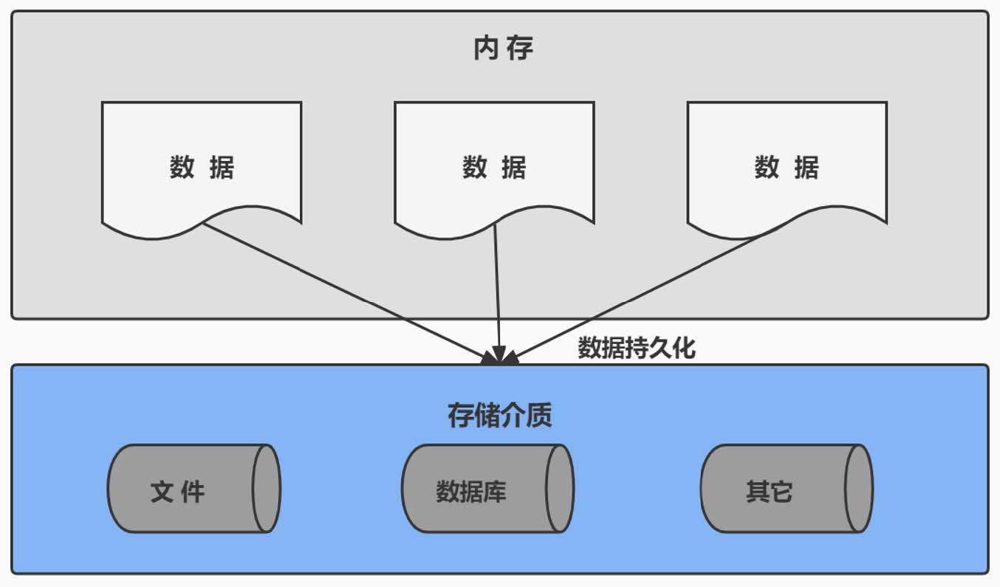
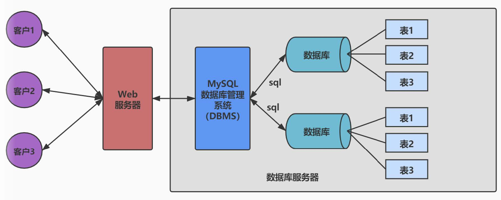
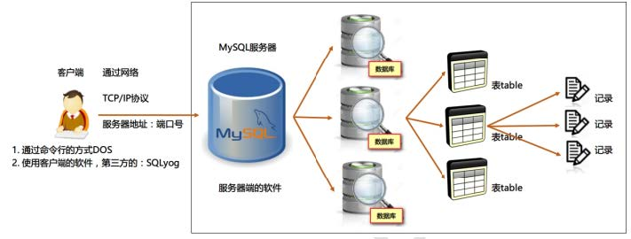
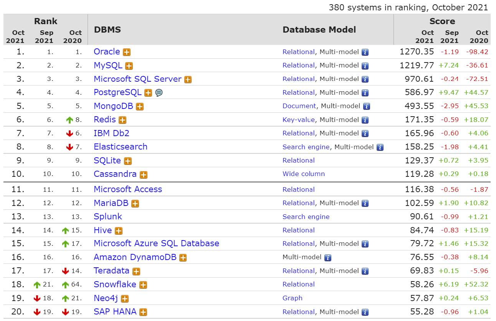
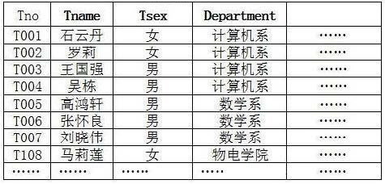
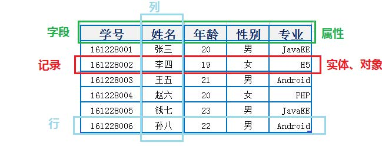
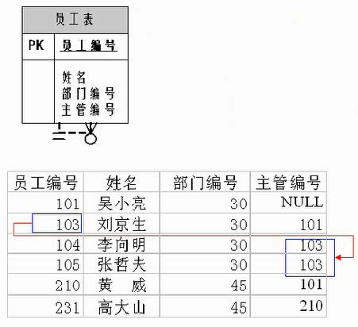

# 数据库概述

## 1. 为什么要使用数据库

- 持久化(persistence)：把数据保存到可掉电式存储设备中以供之后使用。大多数情况下，特别是企业级应用，数据持久化意味着将内存中的数据保存到硬盘上加以”固化”，而持久化的实现过程大多通过各种关系数据库来完成。
- 持久化的主要作用是将内存中的数据存储在关系型数据库中，当然也可以存储在磁盘文件、XML数
  据文件中。



生活中的例子：


## 2. 数据库与数据库管理系统

### 1、数据库的相关概念

| DB：数据库（Database）                                       |
| ------------------------------------------------------------ |
| 即存储数据的“仓库”，其本质是一个文件系统。它保存了一系列有组织的数据。 |
| **DBMS：数据库管理系统（Database Management System）**       |
| 是一种操纵和管理数据库的大型软件，用于建立、使用和维护数据库，对数据库进行统一管理和控制。用户通过数据库管理系统访问数据库中表内的数据。 |
| **SQL：结构化查询语言（Structured Query Language）**         |
| 专门用来与数据库通信的语言。                                 |

### 2、数据库与数据库管理系统的关系

数据库管理系统(DBMS)可以管理多个数据库，一般开发人员会针对每一个应用创建一个数据库。为保存应用中实体的数据，一般会在数据库创建多个表，以保存程序中实体用户的数据。

数据库管理系统、数据库和表的关系如图所示：





### 3、常见的数据库管理系统排名(DBMS)

对应的走势图：（https://db-engines.com/en/ranking_trend）



### 4、常见的数据库介绍

Oracle

1979 年，Oracle 2 诞生，它是第一个商用的 RDBMS（关系型数据库管理系统）。随着 Oracle 软件的名气
越来越大，公司也改名叫 Oracle 公司。
2007年，总计85亿美金收购BEA Systems。
2009年，总计74亿美金收购SUN。此前的2008年，SUN以10亿美金收购MySQL。意味着Oracle 同时拥有了
MySQL 的管理权，至此 Oracle 在数据库领域中成为绝对的领导者。
2013年，甲骨文超越IBM，成为继Microsoft后全球第二大软件公司。
如今 Oracle 的年收入达到了 400 亿美金，足以证明商用（收费）数据库软件的价值。

SQL Server

SQL Server 是微软开发的大型商业数据库，诞生于 1989 年。C#、.net等语言常使用，与WinNT完全集
成，也可以很好地与Microsoft BackOffice产品集成。

DB2

IBM公司的数据库产品,收费的。常应用在银行系统中。

PostgreSQL

PostgreSQL 的稳定性极强，最符合SQL标准，开放源码，具备商业级DBMS质量。PG对数据量大的文本以
及SQL处理较快。

SyBase 

已经淡出历史舞台。提供了一个非常专业数据建模的工具PowerDesigner。

SQLite

嵌入式的小型数据库，应用在手机端。 零配置，SQlite3不用安装，不用配置，不用启动，关闭或者配置
数据库实例。当系统崩溃后不用做任何恢复操作，再下次使用数据库的时候自动恢复。

informix

IBM公司出品，取自Information 和Unix的结合，它是第一个被移植到Linux上的商业数据库产品。仅运行
于unix/linux平台，命令行操作。 性能较高，支持集群，适应于安全性要求极高的系统，尤其是银行，证
券系统的应用。

## 3. MySQL介绍

### 1、概述

开放源代码的关系型数据库管理系统
分为社区版和商业版
MySQL是可以定制的，采用了 GPL（GNU General Public License） 协议，你可以修改源码来开发自己的MySQL系统。
MySQL支持大型数据库，支持5000万条记录的数据仓库，32位系统表文件最大可支持 4GB ，64位系统支持最大的表文件为 8TB 。
MySQL使用 标准的SQL数据语言 形式。

### 2、关于MySQL 8.0

MySQL从5.7版本直接跳跃发布了8.0版本，可见这是一个令人兴奋的里程碑版本。MySQL 8版本在功能上做了显著的改进与增强，开发者对MySQL的源代码进行了重构，最突出的一点是多MySQL Optimizer优化器进行了改进。

不仅在速度上得到了改善，还为用户带来了更好的性能和更棒的体验。

### 3、Why choose MySQL?

开放源代码，使用成本低。
性能卓越，服务稳定。
软件体积小，使用简单，并且易于维护。
历史悠久，社区用户非常活跃，遇到问题可以寻求帮助。
许多互联网公司在用，经过了时间的验证。

### 4、Oracle vs MySQL

Oracle
更适合大型跨国企业的使用，因为他们对费用不敏感，但是对性能要求以及安全性有更高的要求。
MySQL
由于其体积小、速度快、总体拥有成本低，可处理上千万条记录的大型数据库，尤其是开放源码这一特点，使得很多互联网公司、中小型网站选择了MySQL作为网站数据库（Facebook，Twitter，YouTube，阿里巴巴/蚂蚁金服，去哪儿，美团外卖，腾讯）。

## 4. RDBMS 与 非RDBMS

### 4.1 关系型数据库(RDBMS)

#### 4.1.1 实质

- 这种类型的数据库是最古老的数据库类型，关系型数据库模型是把复杂的数据结构归结为简单的**二元关系**（即二维表格形式）。



- 关系型数据库以**行(row)**和列(column)的形式存储数据，以便于用户理解。这一系列的行和列被称为**表(table)**，一组表组成了一个**库(database)**。
- 表与表之间的数据记录有**关系(relationship)**。现实世界中的各种实体以及实体之间的各种联系均用**关系模型**来表示。

- 关系型数据库，就是建立在**关系模型**基础上的数据库。

- SQL 就是关系型数据库的查询语言。

#### 4.1.2 优势

- 复杂查询可以用SQL语句方便的在一个表以及多个表之间做非常复杂的数据查询。
- 事务支持 使得对于安全性能很高的数据访问要求得以实现。

### 4.2 非关系型数据库(非RDBMS)

#### 4.2.1 介绍

非关系型数据库，可看成传统关系型数据库的功能 阉割版本 ，基于键值对存储数据，不需要经过SQL层的解析， 性能非常高 。同时，通过减少不常用的功能，进一步提高性能。

#### 4.2.2 有哪些非关系型数据库

**键值型数据库**

键值型数据库典型的使用场景是作为内存缓存 。 Redis 是最流行的键值型数据库。

**文档型数据库**

此类数据库可存放并获取文档，可以是XML、JSON等格式。在数据库中文档作为处理信息的基本单位，一个文档就相当于一条记录。文档数据库所存放的文档，就相当于键值数据库所存放的“值”。MongoDB是最流行的文档型数据库。此外，还有CouchDB等。

**搜索引擎数据库**

搜索引擎数据库是应用在搜索引擎领域的数据存储形式，由于搜索引擎会爬取大量的数据，并以特定的格式进行存储，这样在检索的时候才能保证性能最优。核心原理是“倒排索引”。典型产品：Solr、Elasticsearch、Splunk 等。

**列式数据库**

列式数据库是相对于行式存储的数据库，Oracle、MySQL、SQL Server 等数据库都是采用的行式存储（Row-based），而列式数据库是将数据按照列存储到数据库中，这样做的好处是可以大量降低系统的I/O，适合于分布式文件系统，不足在于功能相对有限。典型产品：HBase等。

**图形数据库**

利用了图这种数据结构存储了实体（对象）之间的关系。图形数据库最典型的例子就是社交网络中人与人的关系，数据模型主要是以节点和边（关系）来实现，特点在于能高效地解决复杂的关系问题。

### 4.2.3 NoSQL演变

### 小结

## 5. 关系型数据库设计规则

- 关系型数据库的典型数据结构就是数据表，这些数据表的组成都是结构化的（Structured）。
- 将数据放到表中，表再放到库中。
- 一个数据库中可以有多个表，每个表都有一个名字，用来标识自己。表名具有唯一性。
- 表具有一些特性，这些特性定义了数据在表中如何存储，类似Java和Python中“类”的设计。

### 5.1 表、记录、字段

- E-R（entity-relationship，实体-联系）模型中有三个主要概念是： **实体集** 、**属性** 、**联系集**。
- 一个实体集（class）对应于数据库中的一个表（table），一个实体（instance）则对应于数据库表中的一行（row），也称为一条记录（record）。一个属性（attribute）对应于数据库表中的一列（column），也称为一个字段（field）。




ORM思想(Object Relational Mapping)体现：

数据库中的一个表 <—> Java或Python中的一个类

表中的一条数据 <—> 类中的一个对象（或实体）

表中的一个列 <----> 类中的一个字段、属性(field)，字段更精准

### 5.2 表的关联关系

- 表与表之间的数据记录有关系(relationship)。现实世界中的各种实体以及实体之间的各种联系均用关系模型来表示。
- 四种：一对一关联、一对多关联、多对多关联、自我引用

#### 5.1.1 一对一关联（one-to-one）

- 在实际的开发中应用不多，因为一对一可以创建成一张表。
- 举例：设计学生表：学号、姓名、手机号码、班级、系别、身份证号码、家庭住址、籍贯、紧急联系人、...
  - 拆为两个表：两个表的记录是一一对应关系。
  - 基础信息表（常用信息）：学号、姓名、手机号码、班级、系别
  - 档案信息表（不常用信息）：学号、身份证号码、家庭住址、籍贯、紧急联系人、...
- 两种建表原则：
  - 外键唯一：主表的主键和从表的外键（唯一），形成主外键关系，外键唯一。
  - 外键是主键：主表的主键和从表的主键，形成主外键关系。

#### 5.2.2 一对多关系（one-to-many）

- 常见实例场景： 客户表和订单表，分类表和商品表，部门表和员工表。
- 举例：
  - 员工表：编号、姓名、...、所属部门
  - 部门表：编号、名称、简介
- 一对多建表原则：在从表(多方)创建一个字段，字段作为外键指向主表(一方)的主键

#### 5.2.3 多对多（many-to-many）

要表示多对多关系，必须创建第三个表，该表通常称为**联接表**，它将多对多关系划分为两个一对多关
系。将这两个表的主键都插入到第三个表中。

- 举例1：学生-课程

  - 学生信息表：一行代表一个学生的信息（学号、姓名、手机号码、班级、系别...）

  - 课程信息表：一行代表一个课程的信息（课程编号、授课老师、简介...）

  - 选课信息表：一个学生可以选多门课，一门课可以被多个学生选择

    ```java
    学号 课程编号
    1    1001
    2    1001
    1    1002
    ```

- 举例2：产品-订单
  “订单”表和“产品”表有一种多对多的关系，这种关系是通过与“订单明细”表建立两个一对多关系来定义的。一个订单可以有多个产品，每个产品可以出现在多个订单中。

  - 产品表：“产品”表中的每条记录表示一个产品。
  - 订单表：“订单”表中的每条记录表示一个订单。
  - 订单明细表：每个产品可以与“订单”表中的多条记录对应，即出现在多个订单中。一个订单
    可以与“产品”表中的多条记录对应，即包含多个产品。

- 举例3：用户-角色

- 多对多关系建表原则：需要创建第三张表，中间表中至少两个字段，这两个字段分别作为外键指向
  各自一方的主键。

#### 5.3.4 自我引用(Self reference)

